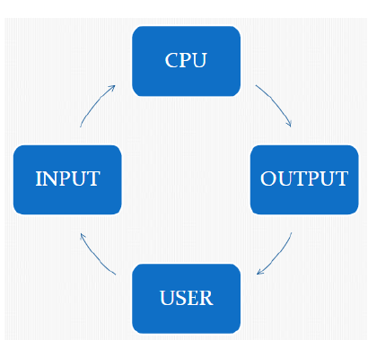

# Perangkat Dasar Komputer

- Komputer adalah : suatu alat elektronik yang dapat membantu manusia untuk menerima, memproses dan menyimpan data serta mnehasilkan informasi yang dibutuhkan.
- Untuk mengaktifkan komputer dibutuhkan 3 komponen utama yaitu
  - Barinware adalah pengguna komputer (user)
  - Hardware adalah perangkat keras yang terdiri dari CPU, Monitorm Keyboard dan perangkat lainnya.
  - Software adalah program yang mendukung untuk oerasional hardware.

## Proses Kerja Komputer

- Dari seorang pengguna komputer (user) memasukan data ke CPU kemudia di CPU data tersebut diolah menjadi suatu informasi yang berguna.
- Setelah selesai diproses, CPU akan dihasilkan *output* (keluaran) yang dapat ditampilkan pada monitor.
- *Output* dapat berupa cetakan apabila dicetak dengan menggunankan printer dan berupa suara keluaran apabila dikeluarkan melalui spearker.

## Perangkat Dasar Komputer

Perangkat komputer secara garis besar terdiri dari 2 bagian paling utama, yaitu:

1. Perangkat lunak (*Software*)
2. Perangkat keras (*Hardware*)

### Perangkat Lunak (Software)

1. Sistem Operasi
  - Program dasar pada komputer yang menghubungkan pengguna dengan hardware komputer. Tugas sistem operasi mengatur eksekusi program diatasnya, koordinasi input, output, pemrosesan, memori, serta instalasi software.
  - Sistem operasi yang bisa digunakan adalah Linux, Windowsm Mac OS, BSD.
2. Sistem Aplikasi
  - Perangkat lunak aplikasi adalah suatu subkelas perangkat lunak komputer yang memanfaatkan kemampuan komputer langsung untuk melakukan suatu tugas yang diinginkan pengguna.
  - Contoh utama perangkat lunak aplikasi adalah perngolah kata, lembar kerja, dan pemuatar media.

### Perangkat Keras (Hardware)

1. Input Device
  - Input device merupakan perangkat koputer yang memiliki fungsi sebagai input atau masukan, baik itu perintah maupun koneksi kedalam sistem komputer. Ada beberapa perangkat yang masuk katergori input device, diantaranya adalah:
    1. ***Keyboard*** dapat berfungsi memasukan huruf, angka, karakter khusus serta sebagai media bagi user (pengguna) untuk melakukan perintah-perintah lainnya yang diperlukan, seperti menyimpan file dan membuka file.
    2. ***Mouse*** adalah salah satu input device yang berfungsi untuk perpindahan pointer atau kursor secara cepat. Selain itu, dapat sebagai perintak praktis dan cepat dibanding dengan keyboard.
    3. ***Touchpad*** digunakan sebagai pengganti mouse pada PC.
    4. ***Microphone*** berfungsi untuk merekam atau memasukan suara yang akan disimpan dalam memori komputer dan untuk berbicara saat sedang chatting.
    5. ***Webcam*** Berfungsi untuk mengambil gambar/video untuk ditrasferkan ke internet.
    6. ***Scanner*** digunakan untuk menyalin / mengambil gambar file dari luar komputer yang hasilnya akan ditampilkan di komputer.
2. Proses Device
  - Perangkat ini merupakan perangkat yang berhubungan dengan fungsi pemrosesan dalam komputer itu sendiri.
    1. ***Motherboard*** merupakan salah satu perangkat dalam komputer yang digunakan sebagai tempat untuk memasang atau meletakan beberapa peralatan lain seperti: Prosesor, memory, kabel-kabel data (penghubung) hardisk, Flopy disk, Card (kartu) seperti VGA Card, NIC (kartu jaringan) dan lain sebagainya.
    2. ***Prosessor*** yaitu sebah Chip yang merupakan otak pemrosesan dan pusat pengendali berbagai perangkat lain sehingga komputer dapat bekerja satu dengan lainnya.
    3. ***RAM*** Adalah singkatan dari *Random Access Memory*, yaitu sebuah komponen komputer yang berfungsi untuk menyimpan data sementara dari suatu program yang sedang kita jalankan dan data-data tersebut bisa diakses secara acak atau random.
    4. ***Video Card*** adalah komponen yang berfungsi untuk menghasilkan output gambar untuk ditampilkan di monitor.
    5. ***Sound Card*** memiliki fungsi sebagai pengolah data berupa audio atau suara dan sebagai penghubun alat input/output suara ke komputer.
3. Output Device
  - Output device merupakan perangkat komputer yang memberikan output/keluaran, baik berupa tampilan visual, suara, maupun tampilan cetak, dan lain sebagainya. Ada pun yang termasik output device adalah:
    1. ***Monitor / LCD Monitor*** berfungsi untukk menampilkan proses komputer dalam bentuk visual / gambar.  2. ***Speaker*** berfungsi untuk mengeluarkan suara dari komputer.
    3. ***Printer*** untuk mencetak pada media kertas, dan sebagainya.
    4. ***Plotter*** Sama fungsinya dengan printer tetapi khusus untuk mencetak gambar. Kertas yang dipergunakan juga lebih besar dari kertas biasa.
4. Storage Device
  - Perangkat keras komputer yang berfungsi sebagai media penyimpanan untuk menyimpan data-data komputer.
    1. ***SSD*** atau bisa dikenal sebagai *Solid State Drive* yang menggunakan integreted circuit untuk menyimpan data seraca terus-menerus, biasanya menggunakan memeori flash
    2. ***Hardisk*** Perangkat penyimpanan utama pada komputer, biasanya tampil di komputer dengan sebutan Drive :C, Drive :D dan setrusnya. Tergantung pembagaian partisinya.
    3. ***Flopy Disk*** Biasanya dikenal dengan sebutan disket, merupakan penyimpanan luar pertama, sangat populer semasa sistem DOS, louts123, sistem komputer jaman dulu, Sekarang sudah jarang dijumpai dan mulai tergantikan dengan CD/DVD dan flash disk.
    4. ***CD/DVD*** penyimpanan eksternal berbentuk piringan yang bisa menyimpan data.
    5. ***Flashdisk*** Perangkat penyimpanan eksternal yang saat ini paling banyak digunakan karena bisa menyimpan banyak digunakan karena bisa menyimpan dan menghapus data.

