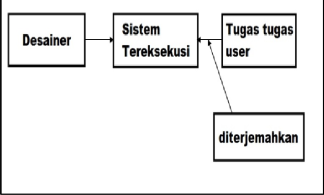
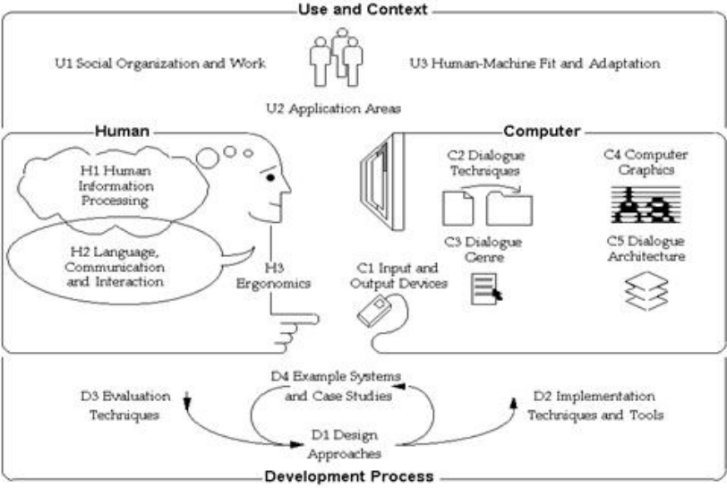
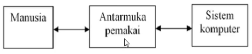
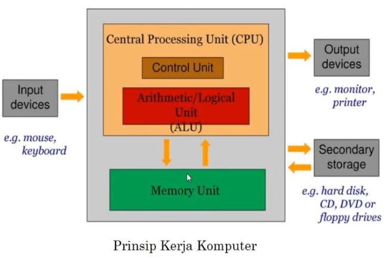
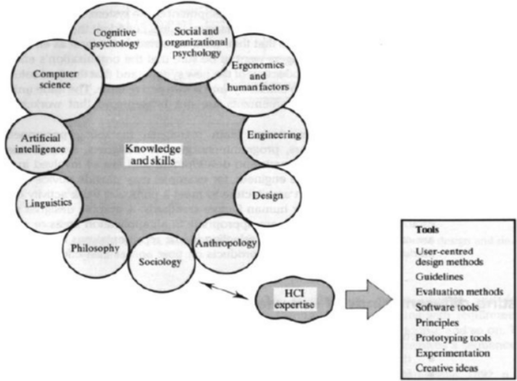

# Interaksi manusia dan Komputer

## Kontrak Kuliah

1. Nilai Akhir = Presensi, Tugas Harian, UTS, dan UAS
2. Presensi Kehadiran = 16x, max Absen 4x
3. Kontak Dosen = 0823-3544-4778, aguspriyadi.0304@outlook.co.id

## Pendahuluan IMK

1. Pengertian IMK
2. Tujuan IMK
3. Perkembangan IMK
4. Ruang Linugkup IMK
5. Antarmuka Manusia dan Komputer
6. Bidang Studi yang Berperan

### Pengertian IMK

- Interaksi merupakan komunikasi anara dua atau lebih objek yang saling mempengaruhi satu sama lain.
- Interaksi manusia dan komputer merupakan komunikasi dua arah antara pengguna *user*  dengan sistem komputer yang saling mendukung untuk mencapai suatu tujuan tertentu.
- **ACM SIGCHI** [1992] mendefinisikan interaksi manusia dan komputer merupakan disiplin ilmu yang mempelajari desain, evaluasi, implementasi dari sistem komputer interaktif untuk dipakai oleh manusia beerta studi tentang faktor-faktor utama dalam lingkungan interaksinya.
- Definisi Interaksi Manusia dan komputer berdasarkan pengertian tersebut adalah disiplin ilmu yang mempelajari komunikasi dua arah yang saling mendukung untuk mencapai tujuan tertentu antara pengguna *User* dengan Komputer *Computer*. 
- Interaksi manusia dan komputer tidak hanya pada tampilan *interface-nya*, tetapi juga memperhatikan aspek-aspek pemakai, implementasi sistem rancangannya dan fenomena lingkungannya. Misalnya, sistem tersebut mudah dioperasikan, dipelajari, dan lain-lain.
- Dalam Proses perancangan sistem, perancang sistem *Designer* perlu mengetahui bagaimana berfikir dalam lingkup tugas pengguna *User* yang sesungguhnya dan menerjemahkan ke dalam sistem.

### Gambar Pola Pikir Perancangan Sistem

### Tujuan IMK

1. Menghasilkan 
  * sistem yang bermanfaat *usable*. Sistem  yang dibuat memiliki manfaat dan mudah dioperasikan baik *user* individu maupun berkelompok.
2. Fungsionalitas.
  * Fungsi-fungsi yang ada dalam sistem yang dibuat sesuai dengan perencanaan dan  kebutuhan user.
3. Keamanan.
  * Semakin meningkatnya teknologi informasi, maka faktor keamanan ini sangat penting untuk ditambahkan dalam sistem yang akan dibuat.
4. Efektifitas dan Edisiensi.
  * Efektif dan eisien sangat berpengaruh pada produktifitas kerja dari penggunanya.

### Sejarah Perkembangan IMK 

- Interaksi manusia dan komputer dimulai pada tahun 1950-an ketika komputer pertama kali diperkenalkan secara komersial. Komputer yang diperkenalkan ini sangat sulit dipakai dan tidak praktis.
  * Faktor Penyebab Sulitnya penggunaan Komputer Generasi Pertama:
  1. Ukuran Komputer Besar.
  2. Harga Mahal.
  3. Membutuhkan ruang yang luas dengan mesin pendingin.
  4. Membutuhkan Listrik dengan daya yang Besar.
  5. Pemprograman On-Line
- Tahun 1970-an komputer mengalami perkembangan penggunaan teknologi ini secara cepat dan mengangumkan ke berbagai penjuru kehidupan (pendidikan, perdanganan, pertahanan, perusahaan, dan sebagainya).
-  Pada pertengahan tahun 1980-an, para peneliti akademis mengenalkan istilah *Human-Computer Interaction HCI*  dan interaksi manusia komputer, dengan fokus yang lebih luas, tidak hanya sekedar perancangan antarmuka secara fisik.

### Evolusi Antarmuka

- Tahun 50an - Antarmuka pada level *hardware untuk teknik*, contoh: *switch panel*  
- Tahun 60-70an - Antarmuka pada level Pemprograman, contoh: *COBOL, FORTRAN*.
- Tahun 80an - Antarmuka pada level dialog interaksi, contoh: *GUI, Multimedia*.
- Tahun 90an - Antarmuka pada level level lingkungan kerja, contoh: *Sistem Network, Groupware*. 
- Tahun 2000an - Antarmuka berkembang dengan luas.

### Konteks IMK

- Interaksi manusia komputer memiliki 3 komponen yaitu manusia, komputer dan interaksi.

 

- Konteks interaksi manusia dan komputer dikenal dengan UHCD yaitu:
- **U merupakan *user* atau konteks tempat *user* berada**.
- **U1**, organisasi sosial dan lingkungan kerja, meliputi aspek sosial dan organisasi, kultur kerja, hierarki organisasi, aktifitas global organisasi dan kebutuhan organisasi.
- **U2**, pengguna yang menggunakan aplikasi komputer untuk memenuhi kebutuhan tertentu.
- **U3**, proses adaptasi manusia dan komputer.
  * adaptasi sistem : kostumisasi sistem.
  * adaptasi pengguna : kenyamanan belajar, metode pelatihan.
  * panduan pengguna : manual pengguna, dokumentasi sistem, maintance sistem dan penanganan error.

---

- **H merupakan *human* (manusia)**
- **H1**, pemrosesan informasi pada manusia
  * Bagaimana agar sistem mudah dipahami, dipelajari dan digunakan.
  * Ingatan, persepsi, perhatian, penyelesaian masalah, pembelajaran dan perolehan kemahiran, motivasi.
- **H2**, penggunaan bahasa, cara komunikasi dan interaksi manusia terhadap mesin.
  * Penggunaan bahasa untuk menciptakan interaksi yang nyaman.
  * Penggunaan bahasa : syntax, semantik, pragmatik.
  * Penggunaan bahasa khusus (symbol, interaksi dalam bentuk grafik, dll)
- **H3**, faktor Ergonomi.
  * Aspek kenyamanan dalam penggunaan sistem.
  * Penyusunan tampilan layar.
  * Sensor dan efek persepsi teknologi tampilan layar.
  * Kognitif dan keterbatasan sensor manusia.
  * Kelelahan dan kesehatan pengguna.

---

- **C merupakan komputer**
- **C1**, piranti masukan dan keluaran Konstruksi teknis peralatan input-output yang menghubungkan manusia dan mesin/komputer
  - Karakteristik, kelebihan dan kekurangan input-output device.
- **C2**, berbagai teknik dialog; interaksi dapat dilihat sebagai dialog antara manusia dan komputer.
- **C3**, model/gaya dialog Penggunan gaya/metode dalam interaksi manusia-komputer Gaya interaksi yang umum dipakai : antar muka baris perintah *command line*, bahasa sehari-hari *natural language*, peranyaan/jawaban dan dialog pertanyaan *query*, **WIMP** *Windows, Icons, Menus, and Pointers*.
- **C4**, komputer grafik; konsep dasar pada tampilan grafis komputer Geometri 2 dan 3 dimensi, transformasi linear, Tapmilan warna
  - Teknik-teknik grafika komputer yang lain.
- **C5**, merancang dialog secara keseluruhan (arsitektur dialog).
  - Multiuser interface architecture Window manager models.

---

- **D merupakan proses pengembangan**
- **D1**, pendekatan desain; penggunaan metode pengembangan software.
- **D2**, teknik dan cara untuk implementasi Metode implementasi, pembuatan prototype, representasi data, dan algoritma Penggunaan tool untuk membantu proses implementasi.
- **D3**, teknik evaluasi Mengevaluasi kualitas software yang dihasilkan. Tes tingkat penggunaan dan fungsionalitas sistem dapat dilakukan dilaboratorium, lapangan, dan dalam kolaborasi dengan pengguna.
  * Evaluasi baik dalam desain dan implementasi.
- **D4**, Contoh sistem dan studi kasus.

## Antarmuka Manusia dan Komputer

 

- Antarmuka pengguna merupakan bagian sistem yang akan dikendalikan oleh pengguna untuk mencapai dan melaksanakan Fungsi-fungsi suatu sistem.
- Antarmuka pengguna ini menggabungkan elemen sistem, elemen pengguna dan interaksi diantara keduanya.
- Tetapi tampilan antarmuka akan berjalan dengan baik apabilaa didukung dengan peralatan yang memadai.
- Hal-hal yang harus diperhatikan dalam membuat interface/antarmuka yaitu:
  * *User fiendly (ramah dengan pengguna)*
  * Ramah dengan pengguna maksudnya antarmuka yang bagus, mudah dioperasikan, mudah dipelajari, dan pengguna merasa nyaman menggunakan interface tersebut.
  * Berkualitas tinggi yang dikagumi oleh orang-orang, beredar luas dan sering ditiru.
  * Pentingnya perancangan antara muka pengguna yang baik, karena:
  * Mengurangi biaya penulisan program.
  * Mempermudah penjualan produk.
  * Meningkatkan kegunaan komputer pada organisasi.
- Dampak antarmuka pengguna yang baik yaitu:
  * Pentingnya produktifitas.
  * Mengurangi biaya pelatihan pegawai.
  * Mencegah pengambil alihan pegawai.
  * Kepuasan pengguna.
  * Produksi hasil dengan kualitas yang lebih baik.
- Strategi pengembangan antarmuka perlu memperhatikan hal-hal berikut:
  * Pengetahuan tentang mekanisme fungsi manusia sebagai pengguna komputer.
  * Berbagai informasi yang berhubungan dengan Karakteristik dialog.
  * Penggunaan prototype yang didasarkan pada spesifikasi dialog formal yang disusun secara bersama-sama antara calon pengguna dan perancang sistem.
  * Teknik evaluasi yang digunakan untuk mengevaluasi hasil prototype yang telah dilakukan.

## Bidang Studi Yang Berperan

Untuk membangun suat interaksi antara manusia dan komputer yang baik diperlukan dukungan pengetahuan bidang studi/ilmu lain, yaitu:

1. Teknik Elektronika/Ilmu Komputer.
  * Bidang ini membantu memahami perangkat keras dan perangkat lunak yang akan digunakan dalam merancang interaksi manusia dan komputer.
2. Psikologi.
  * Bidang ini memberikan pemahaman tentang sifat dan kebiasaan manusia yang berbeda-beda, kemampuan kognitif dalam memacahkan masalah dan ketrampilan motorik pengguna yang beraneka ragam.
3. Perancangan Grafis dan Tipografi.
  * Bidang ini memberikan pemahaman tentang penggunaan rancangan grafis seperti gambar akan lebih bermakna daripada teks/tulisan.
4. Ergonomik.
  * Bidang ini membahas tentang aspek fisik yang mendukung dalam menciptakan lingkungan kerja yang nyaman.
  * Karena manusia yang bekerja di depan komputer memerlukan waktu yang lama. Misal: bentuk *keyboard*, *mouse*, posisi duduk dan lain-lain.
5. Antropologi.
  * Bidang ini memberikan pemahaman tentang cara kerja manusia yang kadang berkelompok baik pada waktu dan tempat yang sama maupun berbeda.
  * Kelompok ini biasanya terdiri dari beberapa orang yang mengerjakan tugas sesuai dengan bidangnya masing-masing.
6. Linguistik.
  * Linguistik merupakan ilmu yang mempelajari tentang bahasa.
  * Bidang ini akan membantu dalam menciptakan suatu dialog yang diperlukan untuk komunikasi yang memadai antara user dan komputer.
  * Dialog disini biasanya menggunakan bahasa khusus; seperti: bahasa grafis, bahasa menu, bahasa perintah, dan lain-lain.
7. Sosiologi.
  * Bidang ini memberikan pemahaman tentang pengaruh interaksi manusia dan komputer dengan aspek sosial masyarakat.
8. Rekayasa perangkat lunak.
  * Faktor ini yang bisa menciptakan suatu program yang efektif, efisien serta user friendly.
9. Kecerdasan buatan.
  * Bagian ilmu komputer yang bertujuan agar komputer dapat melakukan pekerjaan sebaik yang dilakukan manusia.
  * Faktor ini beperan penting untuk menciptakan suatu sistem yang handal, canggih dan menyerupai pola pikir manusia.
10. Multimedia *graphic design*
  * Multimedia digunakan sebagai sarana dialog yang sangat efektif anatara manusia dan komputer.
  * Dengan adanya multimedia ini, tampilan suatu sistem yang dibuat akan lebih menarik dan lebih mudah dimengerti manusia.

