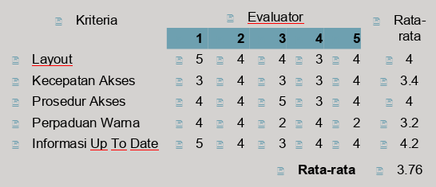

# Tehnik Evaluasi

## Apa itu Evaluasi ?

Evaluasi adalah suatu test atas tingkat penggunaan dan fungsionalitas sistem yang dilakukan di dalam laboratorium, di lapangan/tempat kerja, atau di didalam kolaborasi dengan pengguna

## Apa yang di Evaluasi ?

Didalam IMK yang dievaluasi adalah desain dan implementasinya dengan mempertimbangkan siklus hidup desain, dengan tujuan :

- Melihat seberapa jauh sistem berfungsi
  - fungsionalitas sistem sesuai dan benar-benar berfungsi
  - User lebih mudah dalam melaksanakan tugas
  - Pengukuran untuk kerja dari user pada sistem
- Melihat efek interface bagi pengguna
  - Kemudahan sistem dipelajari
  - Daya guna sistem
  - Perilaku user
- Mengidentifikasikan problem pada sistem
  - Bila suatu konteks memberikan hasil yang tidak diinginkan
  - Tujuan kekacauan diantara user.
  - Daya guna dan fungsionalitas rendah.
  - Hal-hal lain yang merupakan aspek negatif dari desain

## Mengapa Evaluasi dibutuhkan ?

- Desainer tidak dapat berasumsi bahwa orang lain seperti dirinya, dan hanya dengan mengikuti dengan guidlines menjamin bahwa karyanya pasti bagus.
- Evaluasi dibutuhkan untuk memeriksa apakah user dapat menggunakan produk tersebut dengan baik (efektif dan efisien), nyaman dan suka.
- Evaluasi kepuasan penggunaan terhadap sebuah produk dapat dilakukan menggunakan kuesioner dan atau interview

## Kapan Evaluasi dilakukan ?

- Evaluasi dapat dilakukan:
  - Selama proses pembuatn produk tersebut supaya selalu sama dengan yang diminta atau dibutuhkan oleh user. Proses ini biasa disebut _formative evaluations_.
  - Saat produk tersebut telah jadi yaitu melalui _prototype_.
  - Saat produk didistribusikan/dipasarkan melalui _update version_.
- Evaluasi produk dapat dilakukan melalui riset pasar, baik melalui peorangan atau sekelompok user.

## Tujuan Evaluasi

Ada 3 tujuan utama dari evaluasi:

- Melihat seberapa jauh sistem berfungsi.
- Melihat efek interface dari pengguna.
- Mengidentifikasi problem khusus yang terjadi pada sistem.

## Teknik-teknik Evaluasi

- Observing users.
- Asking users their opinions.
- Asking expert their opinions.
- Testing user's performance.
- Modeling user's task performance to predict efficancy of user.

## Hubungan antara paradigma dan teknik evaluasi

### Teknik

- Observing users
- Asking users
- Asking experts
- User Testing
- Modelling user task performance

### Quic and Dirty

- Penting untuk melihat bagaimana user berprilaku dalam lingkungan aslinya.
- Diskusi dengan user yang potensial dala, suatu group atau group khusus.
- Untuk mendapatkan kritik tentang kegunaan sebuah prototype.

### Usability Testing

- melalui video dan catatan, dilakukan analisa identifikasi masalah, investigasi cara kerja software atau menghintung kinerja waktu.
- Dengan menggunakan kuesioner kepuasan sebagai pengumpulan opini user, kadang menggunakan interview untuk opini yang lebih detail.
- Dilakukan di laboratorium/tempat kerja.

### Field Studies

- Dilakukan dilokasi manapun juga. Dalam studi ethnografi, evaluator turut serta dlam lingkungan user.
- Evaluator dapat melakukan interview atau mendikusikan apa yang didlihatnya kepada peserta.

### Predictive

- Seseorang menggunakan patokannya dalam pembuatan desain untuk memprediksi interface.
- Model yang digunakan untuk memprediksi interface atau membandingkan kinerja waktu dengan versinya.

## Skala Likert

- Merupakan skala yang cukup banyak digunakan untuk melakukan evaluasi.
- Ukuran skala melai dari 4 sampai 9.
- Ukuran 4 (1=sangat buruk, 2=buruk, 3=bagus, 4=sangat bagus)
- Ukuran 5 (1=sangat buruk, 2=buruk, 3=cukup/netral, 4=bagus, 5=sangat bagus)
- Ukuran 7 (1=sangat buruk, 2=buruk, 3=agak buruk,4=cukup/netral, 5=agak bagus, 6=bagus, 7=sangat bagus)
- Ukuran 9 (1=sangat penting, 3=sedikit lebih penting, 5=Jelas lebih penting, 7=Sangat jelas lebih penting, 9=Mutlak lebih penting)
- Pada umumnya penelitian menggunakan 5 sekala.

## Contoh Evaluasi

Secara kesuluhan pendapat para evaluator adalah netral karena nilai rata-rata=3.76

Kriteria yang paling bagus adalah informasi _uptodate_, sedangkan yang perlu mendapat perhatian adalah perpaduan warna

## Tehnik-tehnik lain

Evaluasi yang lain sehubungan dengan dsain sebeum implementasi seperti:

- _Congnitive Walkthrough_
- _Heruistic Evaluations_
- _Review Based-Evalutaion_

### Congnitive Walkthrough

- Usaha ini bertujuan untuk mengevaluasi perancangan dengan meilihat seberapa besar dukungan yang diberikan ke pengguna berdasarkan tugas yang diberikan.
- Dalam pendekatan ini beberapa isu yang timbul, seperti:
  - Dampak interaksi yang akan terjadi pada pengguna.
  - Proses kongnitif apa yang dibutuhkan.
  - Masalah pembelajaran apa yang akan terjadi.
- Analisis difokuskan pada tujuan user dan pengetahuan.
- **Cognitive Walkthrough** menunjukan bagaimana interface merujuk ke user uuntuk membangkitkan pelaksanaan tugas/pekerjaan dan aksi yang diinginkan sesuai dengan tugas/pekerjaan dan hasilnya bernar.

### 10 Dasar Evaluasi Herustik

- Visibilitas status sistem
- Kecocokan sistem dengan dunia nyata
- Kontrol user dan kebebasan
- Konsisten dan standard
- Pencegahan kesalahan
- Pengenalan atas penarikan kembali
- Fleksibiltas dan efisiensi
- Desain minimalis dan keindahan
- Bantuan bagi user untuk memperbaiki kesalahan
- Help dan dokumentasi

### Model Evaluasi Dasar

- Dari domain khusus ke umum, misalnya pada daya guna dari tipe menu yang berbeda, pemanggilan nama perintah dan pemilihan icon.
- Pendekatan dengan mengkombinasikan GOMS model, keystroke level model dan desain rasional.
- Evaluasi implementasi sebagai sistem akhir dengan pengguna nyata untuk mendapatkan suatu sistem final yang nbetul-betul baik.

## Analisis Data

- Analisis data dengan pemilihan statistik tergantung dengan jenis data dan informasi yang dibutuhkan.
- Data diskrit (terbatas dari nilai-nilai) dan data kontinyu (sembarang nilai).
- Tiga jenis tes:
  - Parametrik, berdistribusi normal
  - Non parametrik, tidak berdistribusi normal
  - Tabel kontingensi atribut diskrit dan jumlah item tiap kelompok.
