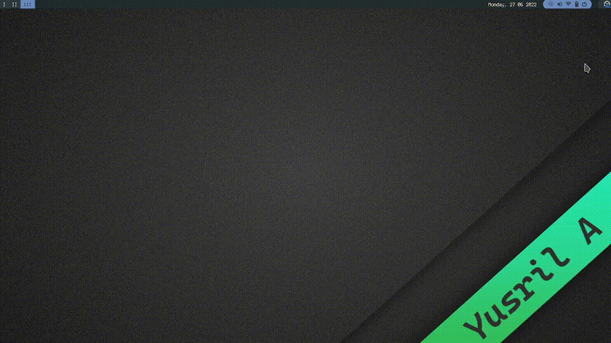

# Visualisasi Informasi

## Pengenalan Visualisasi Informasi

Dunia kita sibuk dengan banyak data. Komputer, internet dan jaringan telah memberikan akses yang lebih mengenai data kepada orang-orang. Masalahnya, bagaimana cara kita memanfaatkan data didalam proses pengambilan keputusan? Salah satu cara mengatasi dengan menggunakan pendekatan visualisasi informasi.

Visualisasi adalah rekayasa dalam pembuatan gambar, diagram atau animasi untuk penampilan satu informasi. Visualisasi dalam bentuk gambar baik yang bersifat abstrak maupun nyata telah dikenal sejak awal dari peradaban manusia. Contoh; lukisan di dinding-diding gua dari manusia pruba. Sekarang visualisasi telah berkembang dan banyak dipakai untuk keperluan, rekayasa, visualisasi disain produk, pendidikan, multimedia interaktif, kedokteran, dan lain-lain.

Animasi pada visualisasi dapat membantu suatu image berpindah, berubah dan berganti pada waktu yang bersamaan. Animasi adalah pergerakan grafik yang merupakan suatu file yang data-datanya mampu menghasilkan gambar 2D dan 3D yang dapat bergerak. Contoh animasi kursor, jam, icon jam gelas untuk menunjukan suatu pekerjaan yang sedang berlangsung, kartun. Pada web page, animasi ini dapat digabungkan dengan animasi lain dengan menggunakan teknik penyutingan HTML, JavaScript dan sebagainya. Kebanyakan animasi yang digunakan pada web page adalah file beresktensikan gif berukuran kecil.

## Visualisasi Informasi

### Prinsip Visualisasi

1. Fokus pada konten.
2. Perbandingan.
3. Inegritas.
4. Resolusi tinggi.
5. Utilisasi konsep terlebih dan teruji melewati waktu.

### Tujuan Visualisasi

1. **Mengekspor** adalah sebuah gambar untuk mengetahui lebih dalam informasi yan tersirat didalamnya.
2. **Menghitung** sebuah gambaran hal perhitungan apapun yang terdapat dalam gambar.
3. **Menyampaian** informasi yang ada dalam gambar tersebut.

### Dukungan Komputer Dalam Proses Visualisasi Informasi

1. **Menyimpan Data Komputer.**
   - Komputer memungkinkan teknik penyimpan data yang lebih murah dibandingkan dengan cara konvensional (menggunakan kertas).
   - Data-data bisa disimpan dalam bentuk digital.
2. **Proses Komputasi.**
   - Komputer dapat meningkatkan kecepatan akses pada data digital yang tersimpan untuk keperluan eksplorasi.
3. **Penyajian Informasi.**
   - Komputer memungkinkan penyajian informasi ke dalam berbagai bentuk yang dapat disesuaikan dengan keinginan.

## Teknik Visualisasi Informasi

1. **Pengumpulan Jumlah**
   - Mengakumulasi elemen individual ke dalam sebuah unit yang lebih besar untuk menghadirkannya seperti sesuatu yang utuh atau lengkap.
2. **Overview dan Detail**
   - Menyediakan baik tinjauan global maupun kemampuan detail zooming.
3. **Fokus dan Konteks**
   - Menunjukkan detail satu atau lebih daerah di dalam sebuah konteks global yang lebih besar.
4. **Drill - Down**
   - Memilih item idividual atau set yang lebih kecil dari sebuah tampilan untuk sebuah pendapat detail atau analisis.
5. **Brushing**
   - Memilih atau menunjuk / menspesifikasi nilai, kemudian melihat item yang tepat di tempat lain pada tampilan.

## Hirarki Visulasi

Hirarki visualisasi merupakan urutan dari item-item dimana item tertentu merupakan induk atau moyang dari item lainnya.

Contoh system berkas

### Bentuk - bentuk visualisasi antara lain:

1. **Tree** (pohon)
   - Akar berada dipuncak, daun-daun berada dipaling bawah (dasar)
2. **Alternative** (ide lain)
   - Cheops, Hiperbolik dan Pohon Kerucut
3. **Treemap** (Representasi isi ruang)

## Audio dan Agent

### Audio

Audio sering disebut sebagai media komunikasi. Audio dalam seistem komunikasi bercirikan video, sinyal elektrik digunakan untuk membawa unsur bunyi. Contohnya pada radio dan televisi.

Audi terbagi 2 yaitu:

1. **Auido Speech**
   - Speech dan interface berguna untuk keadaan : Tangan user sibuk, mata user harus memperhatikan sesuatu kondisi yang tidak memungkinkan menggunakan keyboard.
2. **Audio Non Speech**
   - Audio Non Speech digunakan sebagai alaram dan warning, atau status informasi.
   - Penampilan informasi yang redundan dapat meningkatkan kinerja user.
   - Contohnya, user dapat meningat suara yang mencerminkan icon tertentu, tapi bukan tampilan visualnya.

---

**Perbedan Speech dan Non-Speech**

**Speech**

User harus mendengarkan keseluruhan kalimat sebuah mengerti maksudnya, sehingga membutuhkan waktu yang panjang.

**Non-Speech**

Dapat diasosiasikan dengan kejadian khusus, dan waktu yang dibutuhkan lebih pendek.

---

**AGENT**

Agents adalah sebuah sesuatu yang dapat melihat, mengartikan, mengetahui (perceiving) lingkungannya melalui alat sensor (_sensors_) dan bertindak (_acting_) melalui alat aktuator (_actuators_)

- Manusia sebagai agent : mata, telinga dan organ lainnya sebagai; tangan, kaki, mulut dan bagian tubuh lainnya sebagai actuators.
- Robot sebagai agent : kamera dan pejejak infra merah sebagai sensors; berbagai motor pengerak sebagai actuators.
- Software sebagai agent : Tekanan pada keyboard, isi file dan paket-paket pada jaringan sebagai masukan sensors; tampilan pada layar, penulisan file dan pengiriman paket jaringan keluaran actuators.

---

**Tipe-Tipe Agent**

1. **Goal-based**.
   - Tujuan-tujuan tertentu dapat dicapai dengan cara-cara berbeda.
2. **Unity-based**.
   - Agent membutuhkan tujuan untuk mengetahui situasi mana yang diharapkan.
   - Akan menjadi sulit ketika Urutan yang panjang dari tindakan-tindakan (_actions_) dibutuhkan untuk mencari tujuan.
3. **Learning**.
   - Semua program-progam agent terdahulu mendekripsikan metode untuk memilih tindakan-tindakan (_actions_).

## User Interface Agent

Agent membantu user dalam penggunaan interface. Jenis-jenis agent antara lain:

1. Manipulasi langsung. User tindakan dan menggunakan agent secara langsung.
2. Manajemen tidak langsung. Proses kerja sama dimana manusia dan komputer bersama-sama memulai tindakan.

---

Personal assistant merupakan agent yang termasuk autonomous agent yang yang membantu user untuk menyelesaikan tugas. Sifat personal assistant antara lain:

1. Tingkatannya bisa diubah.
2. Mengingkatkan petunjuk.
3. Menggunakan inisiatif.
