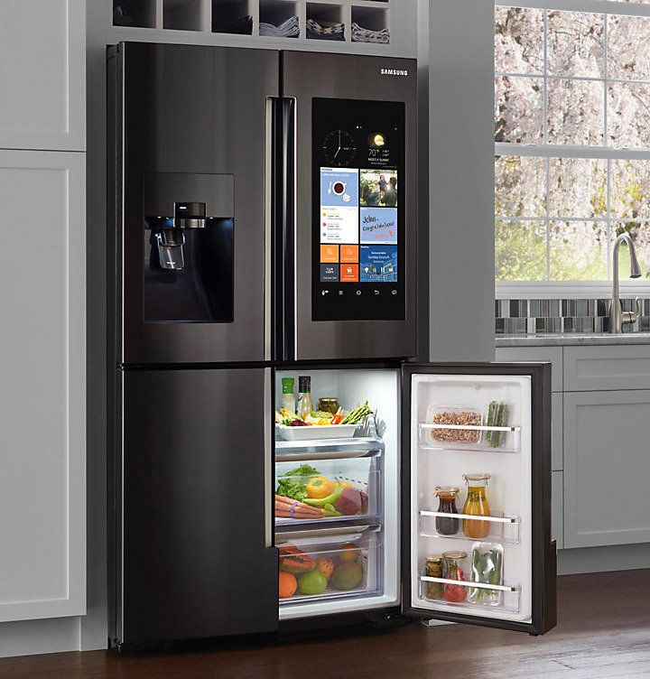

# Antarmuka dimasa depan

## Fase Perkembangan Interaksi Manusia dan Komputer

1. Era Mainframe (1960an) : 1 Komputer banyak pengguna.
2. Era Personal Computer (1980an) : 1 Komputer untuk 1 user.
3. Era Mobile (2000an) : 1 User memiliki beberapa komputer.

## Fase Perkembangan IMK dilihat evolusi Antarmuka

1. Tahun 1950an : Antarmuka tingkat Hardware Contoh : Switch Panel.
2. Tahun 1960an - 1970an : Antarmuka tingkat Pemrograman Contoh : COBOL, FORTRAN.
3. Tahun 1970an - 1990an : Antarmuka tingkat instruksi.
4. Tahun 1980an : Antarmuka tingkat dialog interaksi Contoh : Graphical User Interface (GUI), Multimedia.
5. Tahun 2000an - Sekarang : Antarmuka pada tingkat yang lebih interaktif.

## Contoh Teknologi dimasa depan

1. Holograpic. Teknologi yang menggunakan hologram sebagai output atau keluaran.
   - 
2. Future Gadget. Future gadget adalah pengembangan dari gadget yang telah ada dengan teknologi yang jauh lebih berkembang tentunya.
   - 
3. Teknologi Digital. Pengembangan berbagai teknologi yang sudah ada seperti TV, Kulkas, dan lain sebagainya yang memiliki fungsi lebih dari sekedar fungsi defaultnya. Sebagai contoh saat ini telah berkembang Android TV.
   - 
4. Display Glass. Merupakan teknologi yang mengubah fungsi kaca biasa sehingga dapat digunakan sebagai meda proses input dan output.
   - 
5. 3D Virtual Reality (VR). Teknologi ini sebenarnya sudah dikembangkan dan sudah ada, akan tetapi masih sedikit yang memanfaatkan teknologi ini.
   - 
6. Sensing Affect. Teknologi saat telah sangat berkembang dan banyak dikembangkan teknologi komputer yang berisi sensor untuk membaca kondisi lingkungan, seperti melihat, mendengarkan, mengukur suhu.
7. Sensor Network. Sensor yang diletakkan jauh dari komputer akan tetapi tetap terhubung melalui sebuah jaringan. Sensor dapat mendeteksi vision dan sound yang dilingkungan dimana sensor ditempatkan.

---

## Cyborg

Merupakan aspek dari artifiical intelligent. Perkembangan Interaksi Manusia Dengan Komputer Semakin Meluas, Dimana Komputer Mini yang dimasukkan ke dlaam suatu robot atau syborg sehingga berfungsi sebagaimana mestinya.

## Alat Penerjemahan Bahasa Hewan

Para ilmuan mengembangkan sebuah rancangan alat kecerdasan buatan yang digunakan untuk menganalisa suara dan ekspresi hewan untuk diterjemahkan ke bahasa yang dapat dipahami manusia.

## Emboided Interaction

Ketika user dapat melakukan input hanya dengan sebtuhan tangan atau bagian tubuh lainnya dan tanpa menggunakan mouse atau keyboard.

## Komputer model pena

Komputer model pena disebut P-ISM, yang diambil dari bahasa RUSIA "PISM" berati "TULISAN".

Konsep pembuatan P-ISM ialah paket computer pena dengan 5 fungsi, yaitu:

1. Ponsel berentuk pena dengan cara input data menggunakan tulisan tangan.
2. Memiliki Virtual keyboard.
3. Mempunyai Proyektor dengan ukuran kecil.
4. Terdapat camera scanned.
5. Dilengkapi dengan personal ID PASSWORD yang berfungsi sebagai identik pemilik.

Secara prinsip ciri-ciri komputer masa mendatang adalah lebih canggih, lebih murah, memiliki kemampuan diantaranya melihat, mendengar, berbicara, dan berfikir serta kemampuan membuat kesimpulan seperti manusia.

## Human Interface Using Eye Movement

Dalam bahasa indonesia disebut pengendali pointer lewat gerakan mata. Tujuannya memudahkan pengguna khususnya pada orang-orang yang mengalami difabel fisik terutama bagian tangan. Cara kerja :

1. Menggunakan Sensor gerakan mata.
2. Memanfaatkan sinyal yang dipancarkan oleh bagian mata.
3. Sinyal diolah sehingga dapat dimanfaatkan untuk mengendalikan pointer pada komputer.
4. Alat ini dikoneksikan ke komputer dengan memanfaatkan usb yang biasanya digunakan untuk alat printer.

## Self-Driving CAR

Impian autopilot untuk mobil ini merupakan tantangan yang besar. Situasi dan kondisi jalan yang rumit dengan berbagai jenis kendaraan bahkan pejalan kaki.
Selain itu, rambu-rambu lalu lintas juga turut memperbesar tantangan yang haurs dihadapi oleh Self-Driving CAR dimana mobil ini akan bergantung sepenuhnya kepada komputer dalam mengontrol kemudi mobil.
Tetapi dengan adanya teknologi machine learning dan artifiical intelligent yang semakin maju, impian perusahaan teknologi tersebut akan semakin nyata.

Seperti yang kita tahu beberapa tahun yang lalu google sempat mengembangkan GOOGLE CAR yang sekarang menjadi WAYMO, Starup armada taksi tanpa pengemudi di California.
Selain Google, Tesla produsen mobil milik Elon Musk juga memasukan fitur autopilot pada produk mobilnya yang membuat pengemudi bisa rileks sejenak.
Terlepas dari perbeadaan filosofi teknologi yang mendasari keduanya, secara umum Self-Driving menggunakan proses yang hampir sama seperti :

- **Computer Vision**
- **Sensor Fusion**
- **Localization**
- **Control**
