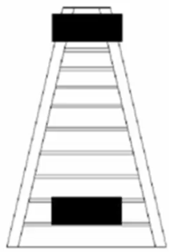
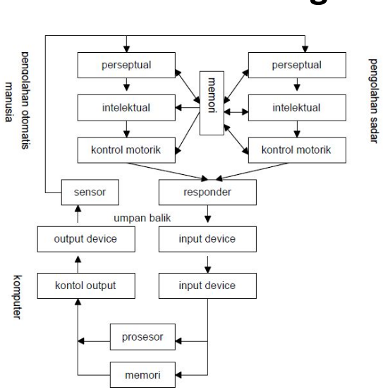
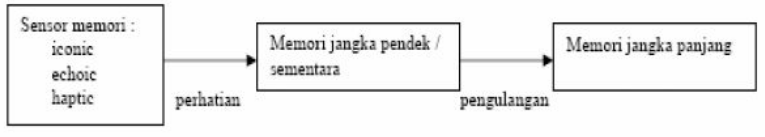

# Faktor Manusia

- Pengelihatan
  * Luminans
  * Kontras & Kecerahan
  * Sudut, Ketajaman dan Medan Pengelihatan
  * Warna
- Pendegaran
- Sentuhan
- Sistem Pengolahan
- Penendalian Motorik
- Kelompok Pengguna

## Pengelihatan

### Luminans

- ***Luminans*** adalah banyaknya cahaya yang dipatulkan permukaan objek.
- Semakin besar *luminans* dari sebuah objek, rincian objekyang dapat dilihat oleh mata juga akan semakin bertambah.
- Besarnya *luminans* sebuah objek atau layar tampilan juga akan menyebabkan mata bertambah *sensitive* terhadap kedipan *filcker*.

### Kontras & Kecerahan

- Kontras hubungan antara cahaya yang dikeluarkan oleh suatu mempunyai kontras negatif atau positif tergantung dari *luminans* objek itu terhadap *luminans* latar belakanya.
- Kecerahan adalah tanggapan subjektif terhadap cahaya, besarnya *luminans* suatu objek dapat berimplikasi pada kecerahan.

### Kisi-kisi Hermann

- kisi-kisi kiri, terlihat kesan titik putih pada perpotongan antara garis vertikal dan horizontal.
- kisi-kisi kanan, terlihat kesan titik hitam pada perpongan antara garis vertikal dan horizontal.
- Tetapi jika mata tepat pada titik perpotongan tersebut, titik hitam/putih tersebut akan lenyap.

### Sudut, Ketajaman dan Medan Pengelihatan

- Sudut pengelihatan *visual angel* adalah sudut yang berhadapan oleh objek pada mata, sudut pengelihatan ini mengindikasikan seberapa banyak area dari pendangan objek yang tertangkap (berhubungan dengan uuran dan jerak dari mata).
- Ketajaman penglihatan adalah kemampuan mata untuk mempersepsikan gambaran detail objek yang dipandang degnan jelas.
- Medan penglihatan adalah sudut yang dibemtuk ketika mata bergerak kekiri terjauh dan kejanan terjauh.

### Medan Penglihatan

- **Penglihatan Binokuler** 
  * Daerah dimana kedua mata mampu melihat sebuah objek dalam keadaan yang sama. Pada daerah ini, mata dapat bergerahh ke kiri dan kekanan sejauh 60° sampai 70°.
- **Penglihatan Monokuler Kiri** 
  * Daerah dimana mata kiri dapat bergerak kesudut paling kiri.
- **Penglihatan Monokuler Kanan** 
  * Daerah dimana mata kanan dapat bergerak kesudut paling kanan.
- **Daerah Buta** 
  * Daerah yang tidak dapat dilihat kedua mata.

### Ilusi Ponzo

- Senua yang dilihat oleh mata diinterpretansikan oleh otak untuk memahami maksud dari apa yan dilihat.
- **Dari kedua blok tersebut, mana yang lebih panjang?** Jelas di jawab blik paling atas.
- Padahal kedua blok tersebut sama panjang. Karena perspektif yang dilihat adalah blok yang terletak pada tangga, maka otak menginterpretasikan blok yang atas lebih panjang.
- 

### Warna

- Warna adalah hasil dari cahaya yang terbentuk dari corak *hue*, intensitas *intensity*, Kejenuhan atau jumlah putih pada warna *saturation*.
- Seseorang yang mempunyai pengelihatan warna normal mampu membedaakan kira-kira 128 warna yang berbeda.
- Dengan warna manusia mampu membedakan suatu objek yang lain, sehingga manusia dapat terbantukan dalam mengolah data menjadi informasi.

### Aspek Penggunaan Warna

- Aspek Psilogi
  * Hindari penggunaan warna tajam secara simulation, Pengaturan cahaya didalam ruangan diperlukan karena warna akan berubah ketika cahaya berubah.
- Aspek Presepsi
  * Secara umum latar belakang dengan warna gelap akan memberikan kenampakan yang lebih baik (informasi lebih jelas) dibanding warna yang lebih cerah.
- Aspek Kognitif
  * Penggunaan warna bertujuan untuk menark perhatian atau pengelompokan informasi, sehingga tidak perlu menggunakan warna warna yang berlebihan.

## Pendengaran

- Pendengaran berkaitan degnan suara dan telinga kita, dalam hal ini adalah suara yang dihasilkan oleh komputer.
- Manusia dan mendeteksi suara dalam kisaran frekuensi 20 Hertz sampai 20 KHertz.
- Selain frekuensi, suara dipengaruhi kebisingan *loudness*:
  * Suara bisikan : tingkat kebisingan 20dB.
  * Percakapan biasa : tingkat kebisingan 50dB sampai 70dB.
  * kebisingan > 140dB dapat menyebabkan kerusakan telinga.
- Suara sebagai salah satu penyampaikan informasi, namun hal itu akan menjadikan cepat bosan, sehingga penggunaan suara dalam antara parlu pemikiran khusus dan seksama.

## Sentuhan

- Sentuhan memberikan umpan balik atas lingkungan dan juga kunci bagi mereka yang mempunyai kekeruangan pada penglihatan.
- Sensitifitas sentuhan berhubungan dnegnan aspek ergonomis dalam sebuah sistem baik melalui media inputan maupun media keluaran.
- Penggunaan ***keyword*** yang harus dilakukan penekanan yang cukup berat atau malah terlalu ringan.
- Penggunaan ***mouse*** juga memiliki karakter yang berbeda-beda. Sedikit saja digerakkan, pointernya sudah melalkukan perpindahan, dan juga sebaliknya.

## Sistem Pengolahan

- Sistem pemrosesan manusia merupakan sistem yang sangat kompleks, sulit dimengerti dan tidak bisa diukur secara akurat atau disajikan secara utuh dalam suatu pemodelan.
- Pendekatan pemodelan memori manusia:
  - Pemrosesan Presepsi *perceptual processing* .
  - Pemrosesan intelektual atau kognitif *intelectual or cognitive processing*.
  - Kontrol motorik *motor control* 

## Pemodelan Sistem Pengolahan

## Pengolahan informasi

- **Pengolahan secara sadar** terjadi ketika rangsangan yang datang dibawa ke bagian intelektual dan memperlukan beberapa waktu untuk menghasilkan tanggapan yang sesuai.
- **Pengolahan secara otomatis** terjadi secara reflek dan hanya memperlukan waktu yang sangat pendek. Aktifitas yang dikejakan sehari-hari telah menjadi otomatis, tanpa harus berfikir (seperti: membaca, menulis, berbicara dalam bahasa ibu, mengendarai sepeda, menggosok gigi, dan lain-lain).

## Memory Manusia

- Proses pengolahan melibatkan memori manusia yang befungsi sebagai tempat penyaringan (sensor), tempat memproses ingatan (memori jangka pendek) dan memori jangka panjang.

- *iconic*, berfungsi menerima rangsangan pengelihatan (visual).
- *Echoic*, berfungsi menerima rangsangan suara.
- *Haptic*, berfungsi menerima rangsangan sentuhan.

## Pengendalian Motorik

- Responder utama pada diri operator manusia adalah dua buah tangan yang berisi 10 jari, dua kaki dan satu suara.
- Pengendalian motorik ini mempengaruhi bagaimana kita bergerak dan berinteraksi dengan komputer.
- Setiap tahapan pemrosesan aksi yang dilakukan, memerlukan waktu yang berbeda-beda (waktu reaksi + waktu gerak).
    * Waktu reaksi *reaction time*, tergantung pada jenis stimulus yaitu pandangan *visual* 200ms, suara *Auditory* 150ms, sakit *pain* 700ms.
    * WAktu pergerakan *movement time* tergantung pada usia.
- Selain kecepatan *speed* yang tergambar dalam waktu reaksi dan pergerakan, alat lain yang dipakai untuk mengukur pergerakan adalah akurasi *accuracy* .
- Keduanya menjadi pertimbangan yang penting dalam mendesain sistem yang interaktif.

