# Interaksi Manusia & Komputer

## Komputer

- Definisi Komputer
- Prinsip Kerja Komputer
- Komponen Komputer
- Peralatan Input
- Peralatan Output

### Definisi Komputer

- Menurut *Hamacher*, komputer adalah 
  - Mesin penghitung elektronik yang cepat dan dapat menerima informasi *input* digital, kemudian memprosesnya sesuai dengan program yang tersimpan di memorinya, dan menghasilkan *output* berupa informasi.
- Secara definisi komputer diterjemahkan sebagai:
  - Sekumpulan alat elektronik yang saling bekerja sama, dapat menerima data (*input*), mengolah data (*proses*) dan memberikan informasi (*output*) serta terkoordinasi dibawah kontrol program yang tersimpan di memorinya.

### Prinsip Kerja Komputer

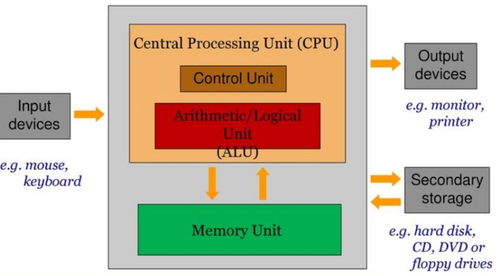

- **Input device** /peralatan *input* ;untuk memasukan data ke dalam komputer.
- **Processor** :perangkat yang mengelola aktifitas komputer.
  - *Control Unit* (CU) :mengontrol perangkat yang terpasang pada komputer.
  - *Arithmetic Logic Unit* (ALU) :mengolah data aritmatika dan data logika.
- **Memori** :media penyimpanan data.
  - *Read Only Memory* (ROM) :memori yang hanya dibaca saja dan sudah diisi oleh pabrik, digunakan untuk membaca sistem operasi di disk.
  - *Random Access Memory* (RAM) :memori yang diakses secara radmon, berfungsi untuk menyimpan data sementara waktu.
- **Output device** /peralatan output :untuk menghasilkan keluaran.

### Komponen komputer

- **Hardware** (Perangkat Keras)
  - Peralatan fisik komputer yang dapat kita lihat dan rasakan.
  - Seperti peralatan *input*/*output*, storage device, monitor, casing unit dan Central Processing Unit (CPU).
- **Software** (Perangkat Lunak)
  - Program komputer untuk menjalankan suatu pekerjaan.
  - Seperti sistem operasi, program utility, program aplikasi, program paket dan bahasa pemrograman.
- **Brainware** (User)
  - Pengguna yang terlibat langsung dalam pemakaian komputer.
  - Seperti sistem analis, programmer, operator, dan lain lain.

#### Hardware Komputer

 

#### Port pada Komputer

- Port/pintu gerbang, yakni sebagai pintu gerbang penghubung input dan output pada komputer.
- Fungsinya sebagai penghubung antara komponen di dalam unit sistem dengan piranti diluar.

### Peralatan Input

#### Peralatan input dapat digolongkan menjadi:

- Alat input langsung yaitu alat yang dimasukan langsung diproses oleh alat pemroses.
  - **Seperti** :papan ketik (keyboard), *pointing device* (mouse, touch screen, light pen, digitizer graphics tablet), scaner, sensor (digitizing camera), voice recognizer (microphone).
- Alat input tidak langsung yaitu input yang dimasukan melalui media ternentu sebelum suatu input diproses oleh alat pemroses,
  - **Seperti** :*keypunch* melalui media *punched card* (kartu plong) dan *key-to-disk* yang merekam data ke media magnetic disk (disket atau harddisk).

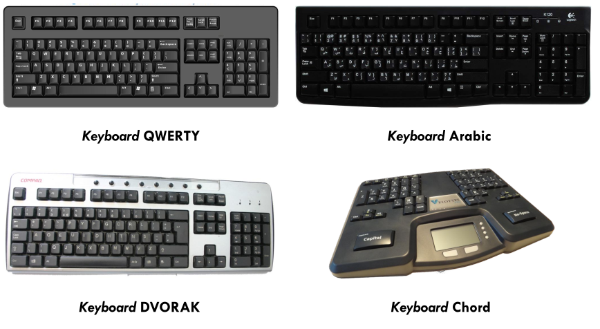 
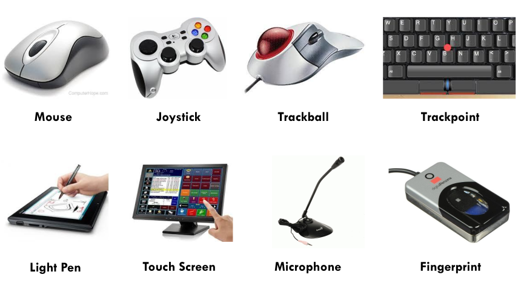 
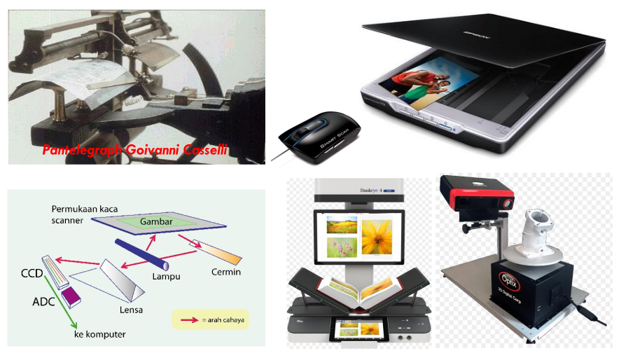 
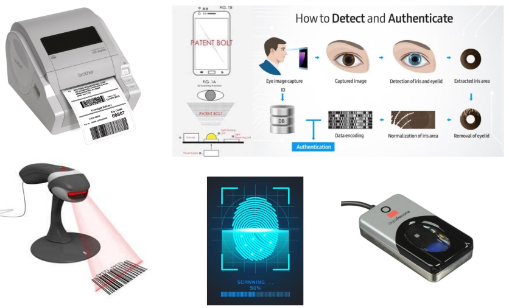 

### Peralatan Output

- *Output* yang dihasilkan komputer berasal dari pengolahan data yang dapat digolongkan menjadi 4 bentuk yaitu:
  - Tulisan terdiri dari huruf, angka, karakter khusus dan symbol.
  - Image dalam bentuk grafik atau gambar.
  - Suara dalam bentuk musik, ucapan atau suara lainnya.
  - Bentuk yang dapat dibaca oleh mesin dalam bentuk simbol yang hanya dapat dibaca dan dimengerti oleh komputer. 

#### Layar Penampil

- Layar penampil adalah sumber utama informasi dan memiliki keterbatasan dibandingkan kertas.
- Layar penampil memiliki 3 komponen utama, yaitu:
  - Pengingat digital (frame buffer).
  - Layar Penampil.
  - Pengendali tampilan (display controller).
- Ada 2 cara menampilkan gambar yaitu:
  - *Vector display*; pengingat digitalnya berisi daftar tampilan dan program tampilan.
  - *Roster display*;garis, karakter, dan bentuk-bentuk lain digambar berdasarkan komponen terkecilnya yaitu titik yang sering disebut pixel.

#### Macam-macam Layar Penampil

- **Cathode Ray Tubes (CRT)** 
  - CRT berupa aliran elektron yang dipancarkan elektron yang kemudian difokuskan dan diarahkan oleh medan magnet, sehingga mengenai layar yang dilapisi fosfor yang membuatnya bersinar.
- **LCD (Liquid Crystal Display) Screen** 
  - LCD menggunakan lebih sedikit energy karena bentuk layarnya pipih, lebih kecil, ringan dan tanpa masalah radiasi. LCD memiliki lapisan cristal cair yang diapit oleh dua lempengan gelas. Lempengan yang atas transparan dan terpolarisasi sedangkan lempengan yang bawah melakukan refleksi. Kelemahan LCD adalah tampilannya kurang jelas apabila dilihat dari samping karena LCD tidak mengeluarkan sinar seperti CRT.
- **Large Display Screen** 
  - Interface dengan tampilan yang memiliki ukuran besar pada tahun 90-an sudah tersedia di pasaran. Tujuan large display adalah agar dapat dilihat oleh banyak user.
  - Jenis large display screen adalah : Liveboard, Smart board, Projection.

##### Cathode Ray Tubes (CRT)

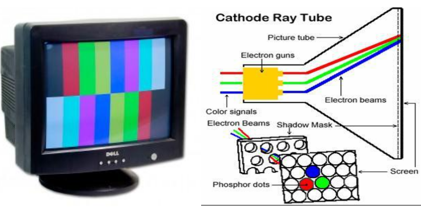 

##### Liquid Crystal Display (LCD)

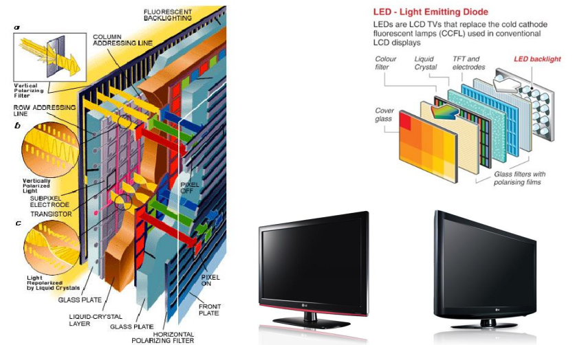 

##### LCD Projector 

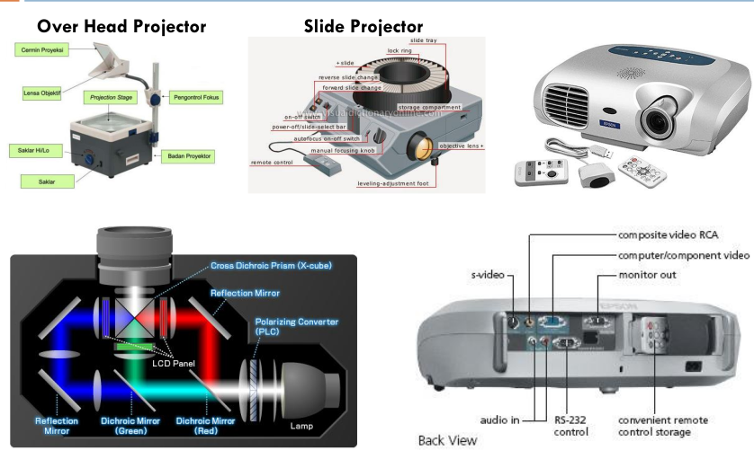 

##### Projection Film

 

#### Printer

- Printer berfungsi untuk mencetak tulisan, gambar dan tampilan lain ke media kertas. 
- Resolusi printer disebut dpi (dot per inchi), jumlah titik dalam area inchi. 
- Semakin tinggi resolusinya maka semakin bagus cetakan yang dihasilkan, sebaliknya semakin rendah resolusinya maka hasil cetakan akan buruk.

#### Jenis Printer

- **Dot Matrix Impact printer** memiliki resulusi 80-120 dpi.
  - Printer ini menggunakan kepala cetak yang berisi sekumpulan jarum besi.
  - Image / karakter dibentuk dengan kombinasi jarum, membentuk pola yang akan dicetak.
  - Pola dari jarum diketukkan ke karbon sehingga membentuk pola di kertas.
- **Inkjet printer** memiliki resolusi 600 dpi.
  - Printer ini membentuk karakter atau grafik dengan suatu kepala cetak yang mempunyai pipa penyemprot kecil (*nozzle*) yang menyemprotkan tinta ke kertas.
  - Supaya mendapatkan hasil yang tepat dan benar, tinta yang disemprotkan diarahkan ke bidang sasaran oleh satu atau lebih electronic deflector yang mengatur posisi horizontal dan vertikal dari tinta yang disemprotkan.
- **Leser Printer** memiliki resolusi 1200 dpi.
  - Printer ini merupakan teknologi gabungan antara teknologi xero graphic yang ditemukan di fotocopy dengan teknologi laser.
  - Dengan sistem ini output digital dari komputer diubah menjadi pulsa sinar laser dan ditembakkan ke suatu drum yang peka terhadap sinar laser.
  - Keuntungan printer ini dapat mencetak kualitas karakter yang baik.

##### Dot Matrix Impact Printer

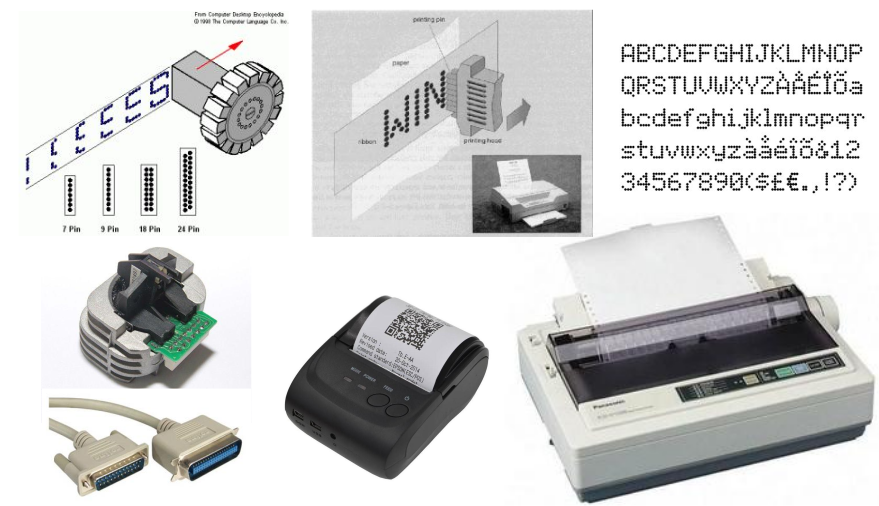 

##### Inkjet Printer

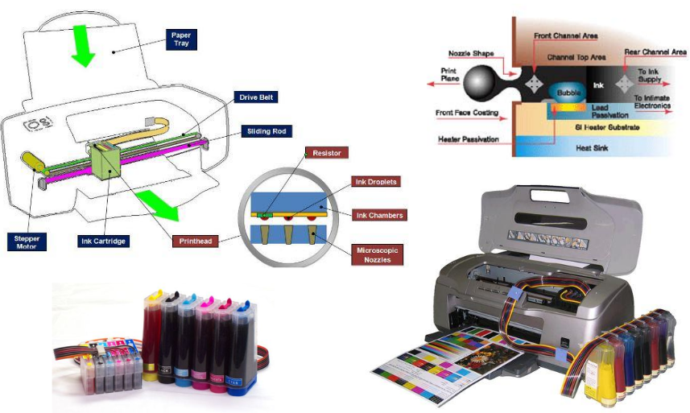 

##### Leser Printer

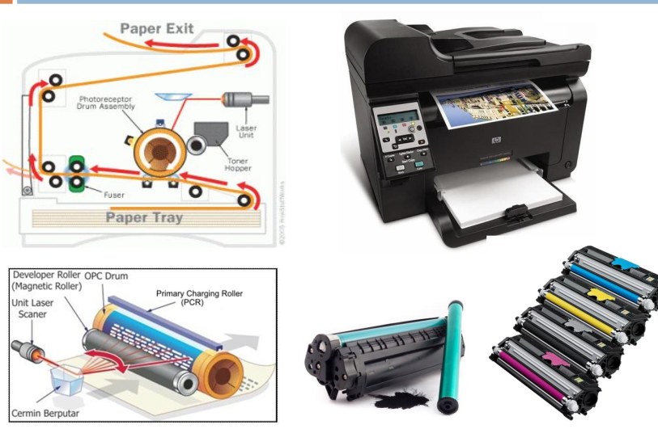 

##### 3D Printer

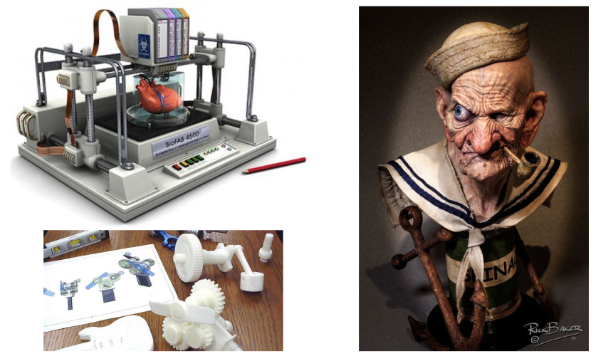 

##### Speaker

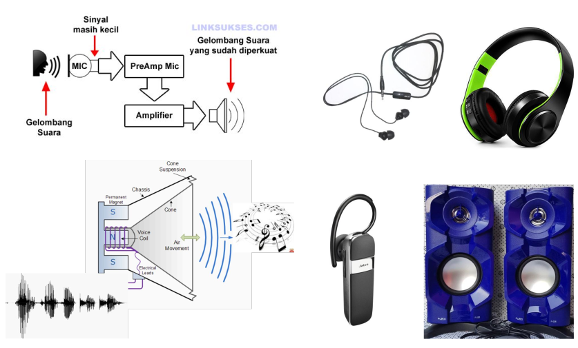 

