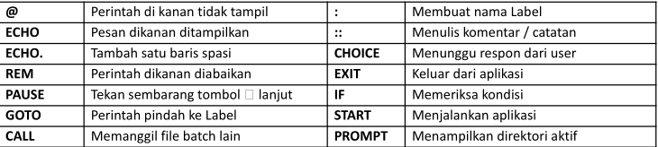
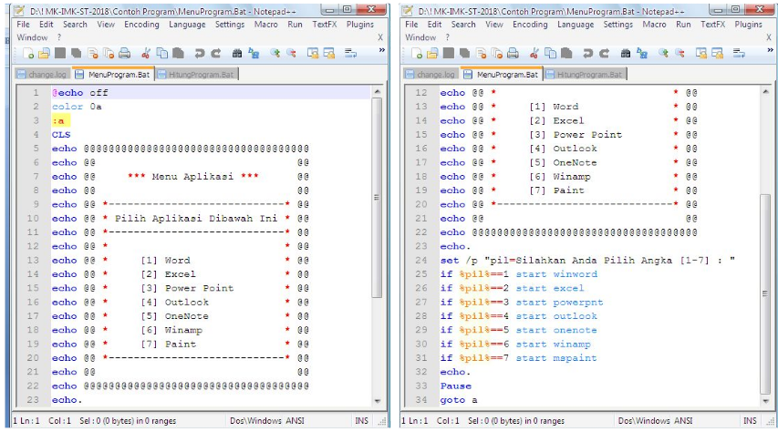
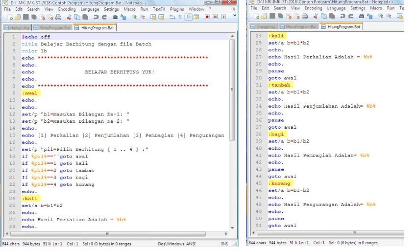

# Ragam Dialog

- Sifat Penting Ragam Dialog
- Dialog Berbasis Perintah Tunggal
  - Perintah DOS (Internal / Eksternal Command.com)
- Dialog Berbasis Ragam Pemrograman
  - Batch File (`*.BAT`)
- Ragam Dialog (*Dialogque Style*) merupakan cara pengorganisasian berbagai teknik dialog interaktif yang memungkinkan terjadinya komunikasi antara manusia dengan komputer.
- Tujuan perancangan antarmuka dengan berbagai dialog pada dasarnya adalah untuk mendapatkan satu kriteria yang sangat penting dalam pengoperasian sebuah program aplikasi, yakni aspek ramah dengan pengguna (*user friendly*).

## Sifat Penting Ragam Dialog

- **Inisiatif**: dapat menentukan tipe-tipe pengguna yang dituju oleh sistem yang dibangun.
  - Inisiatif oleh komputer, pengguna memberikan tanggapan atas prompt yg diberikan computer.
  - Inisiatif oleh pengguna, pengguna diharapkan memahami sekumpulan perintah dgn sintaks tertentu.
- **Keluwesan**: Sistem komputer harus menyesuaikan diri dengan keadaan pengguna, (*constuminzing* sistem).
- **Kompleksitas**: Sistem yang dibuat sesuai dengan yang diperlukan.
- **Kekuatan**: jumlah kerja yg dapat dilakukan oleh sistem untuk setiap perintah yg diberikan pengguna.
- **Beban Informasi**: harus disesuaikan dengan aras pengguna.
- **Konsistensi**: perintah harus mempunyai sintaksis yang terstandarisasi dan urutan parameter harus mempunyai tata letak yang konsisten, format pemasukan data harus kompatibel.
- **Umpan balik**: setiap aksi dari user harus menghasilkan suatu respon yang dapat diterima dengan baik oleh user.
- **Observabilitas**: sistem berfungsi secara benar dan nampak sederhana meskipun sebenarnyapengolahan internalnya sangat rumit.
- **Kontrolabilitas**: sistem selalu berada di bawah kontrol pengguna.
- **Efisiensi**: pengaruh pada waktu tanggap atau laju penampilan sistem.
- **Keseimbangan**: perancang sistem hendaknya mengetahui kemampuan antara manusia dan komputer.

## Macam Ragam Dialog

- Dialog berbasis perintah tunggal
- Dialog berbasis bahasa pemrograman
- Dialog berbasis bahasa alami
- Dialog berbasis pengisian borang
- Dialog berbasis ikon
- Dialog berbasis interaksi grafik
- Perintah-perintah tunggal yang dapat dioperasikan biasanya tergantung dari sistem komputer yang dipakai, dan berada dalam domain yang disebut bahasa perintah (command language).
- Bahasa perintah harus dirancang sedemikian rupa shg mudah dipelajari dan diingat oleh kebanyakan pengguna, Contoh : Perintah-perintah yang dimiliki oleh DOS dan UNIX.

## Perintah DOS

- *Internal command* (perintah ada dalam file COMMAND.com)
  - `C:\> DIR` menampilkan nama berkas yang terdapat pada hardisk C.
  - `C:\> COPY *.DOC A:\NASKAH` perintah membuat salinan semua berkas `*.DOC` dari harddisk C ke dikset pada drive A dan ditempatkan dalam direktori `NASKAH`.
- *External Command* (perintah pada file `*.EXE / *.COM`)
  - `C:\DOS\> FORMAT A:/S` Perintah untuk memformat disket pada drive A sekaligus menyalin sistem ke dalam disket tersebut (perlu file FORMAT.COM)
  - `C:\DOS\> DELTREE C:\NASKAH\SOAL` Perintah untuk menghapus direktori `SOAL` yang berada di dalam direktori `NASKAH` di dalam hardisk C (perlu file `DELTREE.EXE`).

## Dialog Berbasis Bahasa Pemrograman

- Dialog berbasis bahasa pemrograman merupakan ragam dialog yang memungkinkan pengguna untuk mengemas sejumlah perintah kedalam suatu berkas yang sering disebut batch file.
- Perintah yang dituliskan tidak harus menggunakan salah satu bahasa pemrograman baik aras rendah maupun aras tinggi seperti Assembler, Pascal, C, FORTRAN atau BASIC, tetapi tetap harus mengikuti aturan-aturan tertentu.

## Bath File

- Merupakan sekumpulan perintah DOS yg disusun dan disimpan dalam sebuah file yg berekstensi .BAT
- Batch file pada dasarnya merupakan file teks biasa yang berisi perintah-perintah DOS.
- Biasanya dituliskan pada perintah Copy Con, atau file editor Edit.exe, Notepad, atau yg lain.
- Pemrograman batch file tidak lain adalah Unix Shell Programming versi Windows.

### Perintah-perintah Batch

 

**Contoh Batch File Sederhana** 

`C:\> COPY CON Latih1.Bat` Buat file `Latih1.Bat`
`CLS` Bersihkan Layar
`DATE` Tampilkan Tanggal
`DIR` Lihat daftar file
`^Z` (Ctrl + Z) Simpan File

**Batch File - Menu Program**

 

**Batch File - Berhitung** 

 

