# Ragam Dialog (2)

## Dialog Berbasis Bahasa Alami

- Dialog berbasis bahasa alami merupakan dialog yang menggunakan bahasa yang mudah dimengerti oleh manusia.
- Contoh : cetak data mahasiswa yang memiliki ipk > 3.0.
- Kemudian bahasa tersebut, seperti turbo Pascal.

```pascal
begin
  while not eof (T) do
     begin
      if S.lpSem > 3.0 then
        writeln(S,NamaMahasiswa);
     end;
end
```

## Pendahuluan

- **Pascoal** adalah bahasa pemrograman yang pertama kali di buat oleh Profesor **Niklaus Wirth**, seorang anggota International Federation of Information Processing (IFIP) pada tahun 1971.

## Kelebihan Pascal

- **Tipe Data Standar**, tipe-tipe data standar yang telah tersedia pada kebanyakan bahasa pemrograman.
- **User defined Data Types**, Programmer dapat membuet tipe data lain.
- **Strongly-typed**, Programmer harus menentukan tipe data dari suatu variable.
- **Terstruktur**, memiliki sintaks yang memungkinkan penulisan program dipecah menjadi fungsi-fungsi kecil *procedure* dan *function* yang dapat dipergunakan berulang-ulang.
- **Sederhana dan ekspresif**, memiliki struktur yang sederhana dan sangat mendekati bahasa manusia (bahasa inggris) sehingga mudah dipelajari dan dipahami.
- Sebagai standar bahasa pemrogramanbagi tim nasional Olimpiade Komputer Indonesia (TOKI) & IOI (*International Olympiad in Informatics*).

## Bagian-Bagian Pada Pascal

- Kepala Program
- Deklarasi
- Pernyataan/Statement
- Contoh:

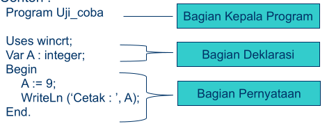 

## Tipe Data pada Pascal

Tipe data dengan nilai bulat *integer*

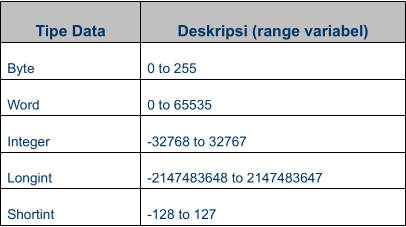 

Tipe data dengan nilai semua karakter ASCII *Char*

Tipe data dengan nilai pecahan *Real*

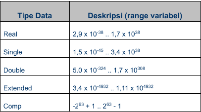 

Tipe data dengan nilai true dan false (*Boolean*)

## User Definied Data Type

- **Subrange** 
  - Suatu range yang menunjukkan nilai terkecil dan nilai terbesar yang dapat dipergunakan.
  - Type `pengenal = kostanta1 .. kostanta 2`
  - Contoh :

```pascal
Type
  tanggal = 1 .. 31;
  bulan = 1 .. 12;
```

- **Enumerated (saklar)**
  - menunjukkan kumpulan dari nilai yang urutannya sudah pasti.
  - Type `bahasa = (delphi, java, c, pascal, basic);`

## Input/Output

### Cara Mencetak suatu variable

- **Tidak perlu tanda petik** 

```pascal
uses wincrt;
var A : integer;

begin
  A := 9;
  writeln(A);
end.
```

- Dengan tanda koma

```pascal
var A : integer;
begin
    A := 9;
    wirteln('Nilai A adalah : ', A);
end.
```

### Write / WriteLn

- Perintah ini digunakan untuk mencetak kata-kata atau variable ke layer komputer.

- Contoh untuk mencetak "Saya Belajar Pascal" `write('Sedang Belajar Pascal');`atau `writeln('Sedang Belajar Pascal');`

- **Jika menggunakan write, setelah mecentak kata-kata atau variable, kursor akan diletakan disamping hasil cetakan. Jika menggunakan perintah writeln, setelah mencetak kata-kata atau variable, kursor akan dipindahkan ke bawah satu baris dengan posisi horizontal pada awal baris**.
  
  

### Read / ReadLn

- Read atau ReadLn digunakan untuk menerima masukan dari user untuk disimpan ke dalam suatu variable.
  
  

```pascal
var A : integer;

begin
    write('Masukan Nilai A:');readln(A);
    writeln('Nilai yang anda masukan adalah: ', A);
end.
```

## Komentar

- Komputer adalah bagian dari program yang tidak akan diproses compiler (Free Pascal)

- Dengan symbol `//` untuk satu baris atau `{ ... }`untuk lebih dari satu baris.

## Unit

- Unit ini menyimpan fungsi dan prosedur standard yang sudah didefinisikan oleh pembuat compiler. Beberapa unit standard yang ada dalam Pascal adalah Ctr, System, Graph, Dos, Printer, dan Overlay.

- Contoh `uses wincrt;`

## Statement If Else

- Struktur percabangan atau sering disebut dengan struktur kontrol ini memungkinkan programmer untuk membuat program yang dapat memilih satu langkah di antara sejumlah langkah untuk dikerjakan

- `if ... then`

- `if ... then ... else ...`

- `if ... then ... else ... if ... then ... else `
  
  

## Statement Case

- `if ... then ... else ... if ... then ... else ... ` bisa digunakan fungsi case

- `case ... of`

- **Contoh:**
  
  

```pascal
uses wincrt;
var pilihan : integer;
begin
    writeln('Ada 1 sampai 5 pilihan ');
    writeln('Pilihan anda adalah ');readln(Pilihan);
    case Pilihan of
        1:writeln('Anda memilih 1');
        2:writeln('Anda memilih 2');
        3:writeln('Anda memilih 3');
        4:writeln('Anda memilih 4');
        5:writeln('Anda memilih 5');
    end;
end.
```

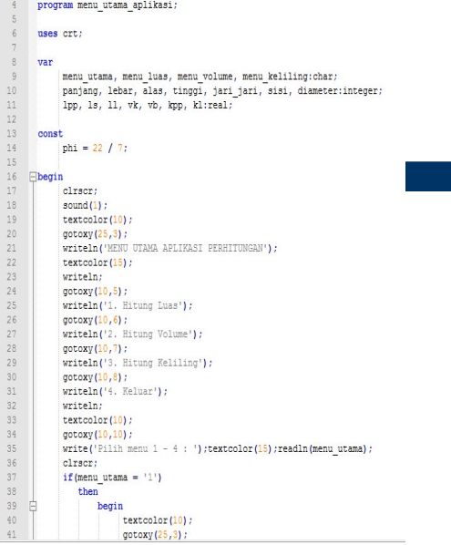 

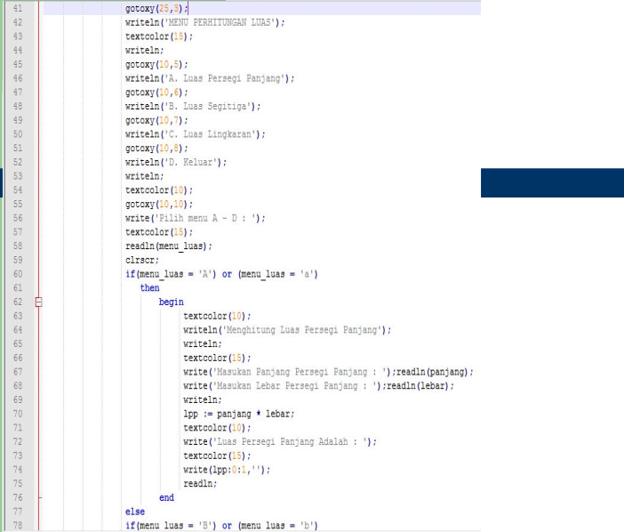 

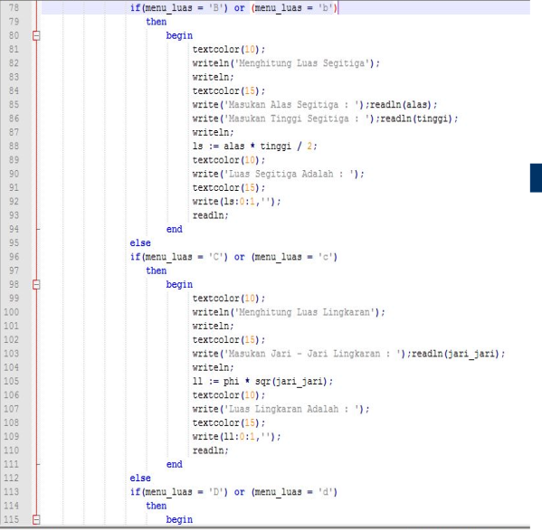 

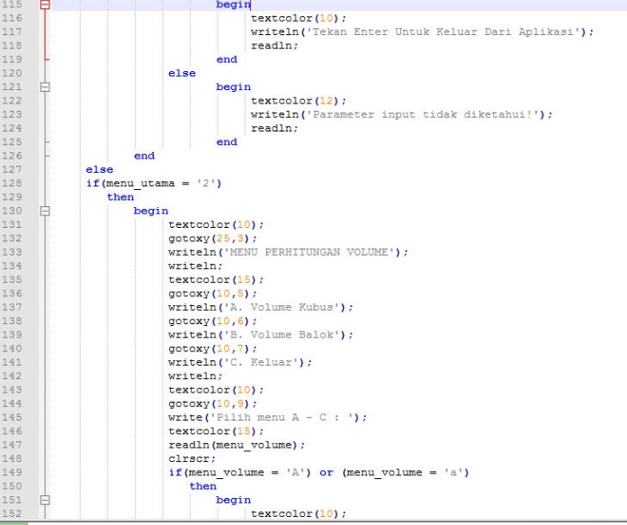 

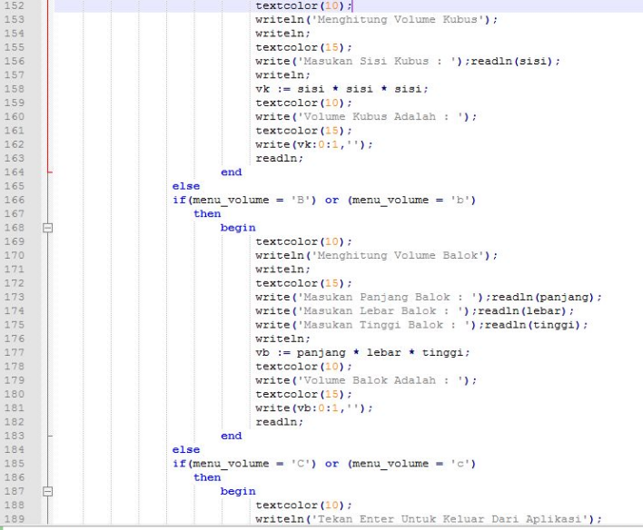 

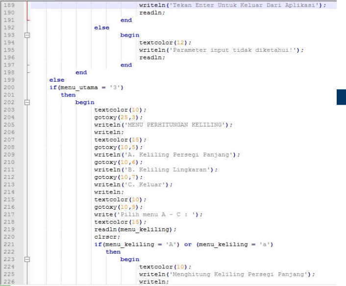 

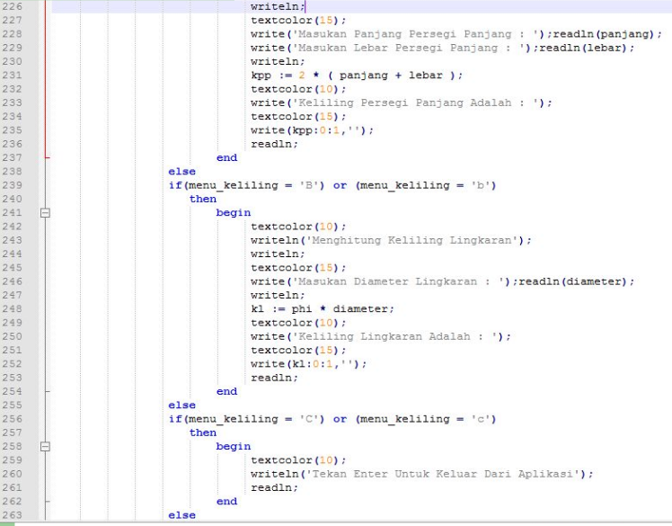 

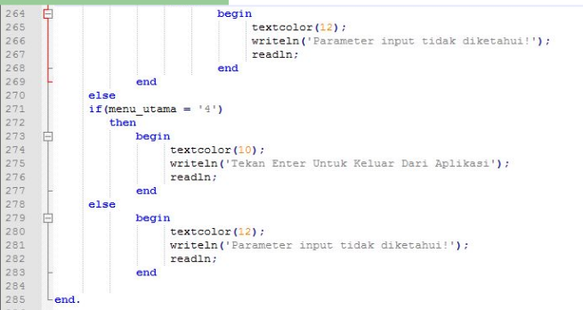 

