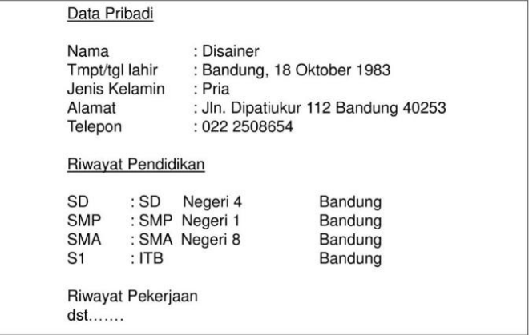
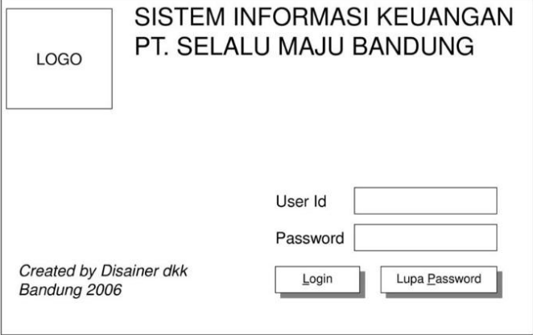
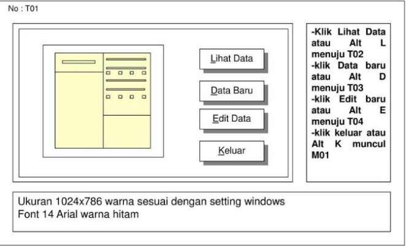
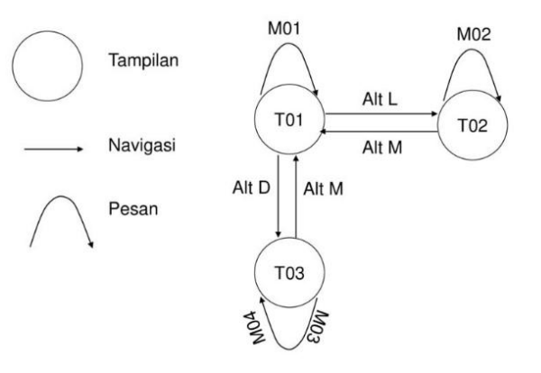

# Perancangan Sistem 

## Jenis Perangkat Lunak

- General Software (*Public Software*)
- Special Purpose Software (*Job Order Software* / *Made Tailor Software*)

## Pendekatan Perancangan

### User-centered design

Perancangan yang melibatkan pengguna dalam pembuatan antarmuka

### User design Approach

Perancangan antarmuka yang dilakukan pengguna

## Prinsip dan petunjuk perancangan empat komponen antarmuka pengguna

1. **Model Pengguna**. Merupakan model konseptual yang diinginkan pengguna dalam memanipulasi informasi dan proses yang dia aplikasikan.
2. **Bahasa Perintah**. Merupakan piranti untuk memanipulasi model.
3. **Umpan Balik**. Merupakan kemampuan program untuk membantu penggna dalam mengoperasikan program.
4. **Penampilan Informasi**. Merupakan petunjuk status informasi atau program ketika penggna melakukan tindakan, perlu dirancangan pesan-pesan yang efektif.

## Perancangan Sistem Interaksi Manusia Komputer

### Urutan Perancangan

1. Penentuan Ragam Dialog
2. Perancangan Struktur Dialog
3. Perancangan Format pesan-pesan
4. Perancangan penanganan kesalahan
5. Perancangan Struktur Data

### Tampilan Berbasis Teks

1. Urutan Penyajian
2. Kelonggaran
3. Pengelompokan
4. Relevansi
5. Konsistensi
6. Kesederhanaan

### Tampilan Berbasis Grafis

1. Ilusi pada obyek-obyek yang dapat dimanipulasi
2. Urutan Visual dan Fokus Pengguna
3. Struktur Internal
4. Kosakata Grafis yang Konsisten dan Sesuai
5. Kesesuaian dengan media

### Waktu Tanggap

Merupakan waktu yang dibutuhkan seatu prosess terjadi

### Penanganan Kesalahan

**2 Jenis Kesalahan**:

- *Compile time error*. Kesalahan sintaksis yang secara langsung dapat diteksi kompeiler.
- *Run time error* atau *fatal error*. Kesalahan logika ketika program dijalankan

Penanganan: buat modul *error trapping* 

## Contoh Contoh

### Contoh Berbasis Teks

 

### Contoh Berbasis Grafis

### Contoh Perancangan

 

### Jaringan Simantik

 

