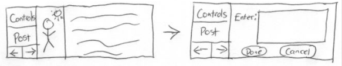
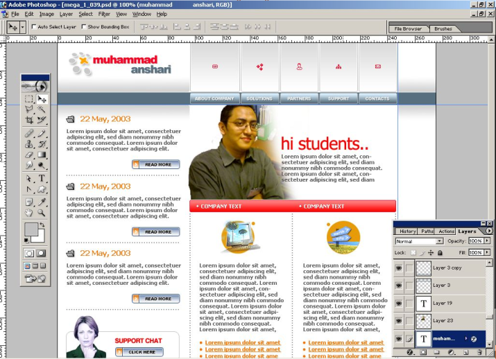
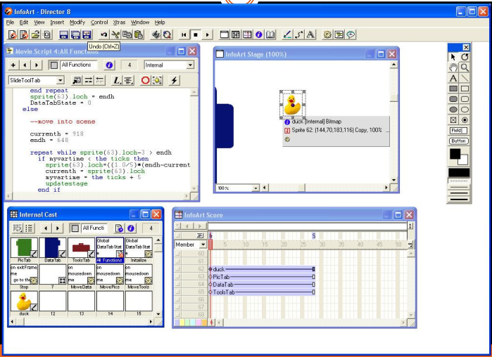
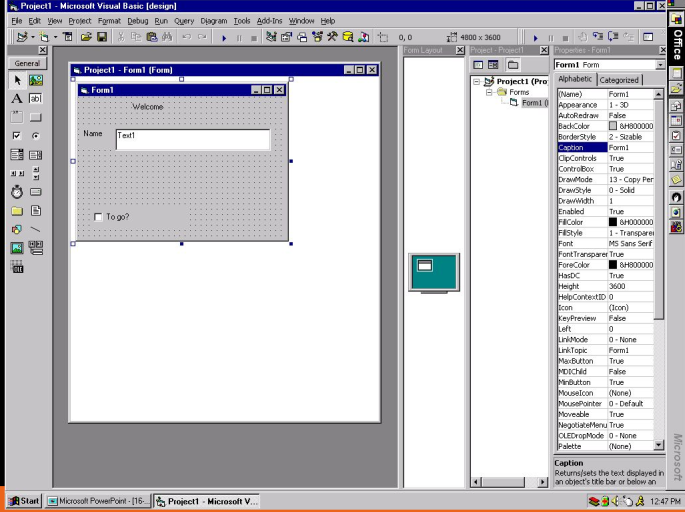

# Prototyping

## Pendahuluan

- Prototipe merupakan simulasi atau animasi dari bakal sistem.
- Prototipe merupakan suatu metode dalam pengembangan sistem yang menggunakan pendekatan untuk membuat suatu program dengan cepat & bertahap sehingga dapat dievaluasi oleh pemakai.
- Prototipe ini memang benar-benar cocok untuk user yang awam IT.
- Dalam pembuatan kita dalam menerapkan **UCD** (*User Centered Design*).

## Tahapan Prototype

**Identifikasi Kebutuhan Pemakai**

- Pengembang & pemakai bertemu.
- Pemakai menjelaskan kebutuhan sistem.

**Membuat Prototipe**

- Pengembang mulai membuat prototipe.

**Menguji Prototipe** 

- Pemakai menguji prototipe & memberikan kritik / saran.

**Memperbaiki Prototipe** 

- Pengemang melakukan modifikasi sesuai dengan masukan pemakai.

**Mengembangkan Versi Produksi** 

- Pengembang merampungkan sistem sesai dengan masukkan terakhir dari pemakai.

## Karakteristik dalam Process UCD

- Memahami user dan kebutuhannya.
- Fokus pada user pada tahap awal desain dan mengevaluasi hasil desain.
- Mengidentifikasi, membuat dokumentasi dan menyetujui kegunaan dan tujuan pengalaman user.
- Perulangan hampir dapat dipastikan. Para perancang tidak pernah berhasil hanya dalam satu kali prosess.

## Keunggulan Prototipe

1. Adabya komunikasi yang baik antara pengembang dan pelanggan.
2. Pengembang dapat bekerja lebih baik dalam menentukan kebutuhan pelanggan.
3. Pelanggan berperan aktif dalam pengembangan sistem.
4. Lebih menghemat waktu dalam pengembangan sistem.
5. Penerapan menjadi lebih mudah karena pemakai mengetahui apa yang diharapkannya.

## Kelemahan Prototipe

1. Pelanggan kadang tidak melihat atau menyadari bahwa perangkat lunak yang ada belum mencantumkan kualitas perangkat lunak secara keseluruhan dan juga belum memikirkan kemampuan pemeliharaan untuk jangka waktu lama
2. Pengembang biasanya ingin cepat menyelesaikan proyek. Sehingga menggunakan algoritma dan bahasa pemrograman yang sederhana untuk membuat prototyping lebih cepat selesai tanpa memikirkan lebih lanjut bahwa program tersebut hanya merupakan cetak biru sistem.
3. Hubungan pelanggan dengan komputer yang disediakan mungkin tidak mencerminkan teknik perancangan yang baik

## Menggapa menggunakan Prototipe ?

- Evaluasi dan feedback pada rancangan interaktif.
- Stakeholder (dalam hal ini user) dapat melihat, menyentuh, berinteraksi dengan prototipe.
- Anggota tim dapat berkomunikasi secara efektif.
- Para perancang dapat mengeluarkan ide-idenya.
- Memunculkan ide-ide secara visual dan mengembangkannya.
- Dapat menjawab pertanyaan / membantu pemilihan diantara alternatif-alternatif.

## Dimensi Prototype

1. Penyajian
  - Bagaimana desain dilukiskan atau diwakili?
  - Dapat berupa uraian tekstual atau dapat visual dan diagram.
2. Lingkup
  - Apakah hanya interface atau apakah mencakup komponen komputasi?
3. Executability (Dapat dijalankan)
  - Dapatkah prototype tersebut dijalankan?
  - Jika dikodekan, akan ada periode saat prototype tidak dapat dijalankan.
4. Maturation (Pematangan) Apakah tahapan-tahapan produk ini mengikuti?
  - Revolusioner: mengganti yang lama.
  - Evolusioner: terus melakukan perubahan pada perancangan yang sebelumnya.

## Metode Pembuatan Prototyping Dengan Cepat

**Non-Computer** 

Biasanya dikerjakan lebih awal dalam prosess pembuatan

**Computer-Based** 

Biasanya dikerjakan kemudian

### Metode Non-Computer (Manual)

**Tujuan**

Ingin menyatakan gagasan desain dan mendapatkan dengan mudah dan cepat pendapat atas sistem.

**Deskripsi Desain** 

Dapat berupa deskripsi tekstual dari suatu desain sistem.

- Kelemahan yang nyata adalah seberapa jauh dari sistem yang sebenarnya.
- Tidak dapat melakukann suatu pekerjaan yang mewaliki aspek dari interface.

**Sketsa, Mock-ups**

- Paper-Based "menggambarkan" interface.
- Baik untuk mengunkapkan pendapat.
- Difokuskan pada orang dengan desain tingkat tinggi.
- Tidak terlalu baik untuk menggambarkan alur dan rinciannya.
- Mudah dan cepat / umpan balik sangat menolong.

**Storyboarding** 

Pensil dan simulasi catatan atau walkthrough dari kemampuan dan tampilan sistem.

- Menggunakan urutan diagram / gambar.
- Menunjukkan kunci snap shots.
- Cepat dan mudah.

**Contoh:** 

 

**Skenario** 

Hipotesis atau imajinasi penggunaan.

- Biasanya menyertakan beberapa orang, peristiwa lingkungan dan situasi.
- Menyediakan konteks operasi.
- Terkadang dalam format naratif, tetapi juga dapat berupa seketsa atau bahkan video.

**Utilitas Skenario** 

- Menjanjikan dan menarik.
- Mengijinkan perancangan untuk melihat masalah dari pandangan orang lain.
- Memudahkan umpan balik dan pendapat.
- Dapat sangat kreatif dan modern.

### Teknik Lain

**Tutorial dan Manual** 

- Mungkin menuliskannya lebih berguna daripada disimpan dalam kepala.
- memaksa perancang untuk membuat keputusan dengan tegas.
- Menulis / meletakkan di atas kertas jauh lebih berharga.

## Metode Komputer

Menirukan lebih banyak kemampuan sistem.

- Pada umumnya hanya baru beberapa aspek atau fitur.
- Dapat berpusat pada lebih banyak detail.
- Bahaya: Para pemakai jadi lebih segan untuk menyarankan perubahan sekali ketika mereka melihat prototype yang lebih realistis.

## Terminologi Prototype

1. Prototype Horizontal
  - Sangat luas, mengerjakan atau menunjukkan sebagian besar interface, tetapi tidak mendalam.
2. Prototype Vertikal
  - Lebih sedikit aspek atau fitur dari interface yang disimulasikan, tetapi dilaksanakan dengan rincian yang sangat baik.
3. Early Prototyping (prototipe cepat)
4. Late Prototyping (prototipe lambat)
5. Low-fidelity Prototyping (prototype dengan tingkat ketepatan yang rendah)
6. Mid-fidelity prototyping (prototype dengan tingkat ketepatan sedang)
  - Form skematik.
  - Navigasi dan fungsi yang disimulasikan biasanya berbasis pada apa yang tampil pada layar atau simulasi layar.
  - Contoh tools yang digunakan: powerpoint, illustrator, dll.
7. High-fidelity prototyping (prototype dengan tingkat ketepatan yang tinggi)
  - Hi-fi prototype seperti sistem akhir.
  - Menggunakan bahan baku yang sama seperti produk akhir.
  - Tools umum yang digunakan: Macromedia Director, Visual Basic, Flash.

### Contoh 1 Storyboard

- Digunakan di awal desain.
- Biasanya digunakan dengan skenario, lebih terinci, dan dapat diputar ulang.
- Kumpulan dari sketsa/frame individual.
- menyajikan urutan inti cerita.
- menunjukkan bagaimana kemungkinan user dapat mengalami peningkatan melalui setiap aktifitas.

### Contoh 2 Sketsa

- Sketsa sangat penting untuk low-fidelity prototyping.
- Jangan takut dengan kemampuan menggambar.
- Menyajikan “tampilan” cepat dari interface, konsep desain, dll.

### Contoh 3 "wizrd of oz"

- Digunakan tampilan maket dan berinteraksi dengan pemakai.
- Baik untuk mensimulasikan sistem yang sulit dibuat.

## Prototyping

### Draw / Paint Program

- Contoh: Photoshop, Coreldraw.
- Menggambar setiap layar, baik untuk dilihat.
- Prototype horisontal, tipis.
- Adobe Photoshop.

 

### Scripted Simulations / Slide Show

- Contoh: Powerpoint, Hypercard, Macromedia Director, HTML.
- Letakkan tampilkan seperti storyboard dengan (animasi) perubahan diantaranya.
- Dapat memberikan user catatan yang sangat spesifik.
- Macromedia Director.

 

### Interface Buliders

- contoh: Visual Basic, Delphi.
- Tools untuk menampilkan jendela, kendali, dan lain-lain dari interface.

 

## Kelebihan

- Mudah dikembangkan dan memodifikasi layar.
- Mendukung jenis interface yang dikembangkan.
- Mendukung berbagai macam device Input/Output.
- Mudah untuk memodifikasi dan menghubungkan layar.
- Mengijinkan memanggil prosedur eksternal dan program.
- Mengijinkan mengimpor teks, grafik, media lain.
- Mudah untuk dipelajari dan digunakan.
- Dukungan yang baik dari vendor.

## Rangkuman

- Prototipe merupakan suatu metode dalam pengembangan sistem yang menggunakan pendekatan untuk membuat sesuatu program dengan cepat dan bertahap
- Tahapan prototipe yaitu identifikasi kebutuhan pemakai, membuat prototipe, menguji prototipe, memperbaiki prototipe, mengembangkan versi produksi.
- Dimensi prototipe terdiri dari penyajian, lingkup, executability dan maturation.
- Metode prototipe dibedakan menjadi metode non-computer dan metode *computer-based*

