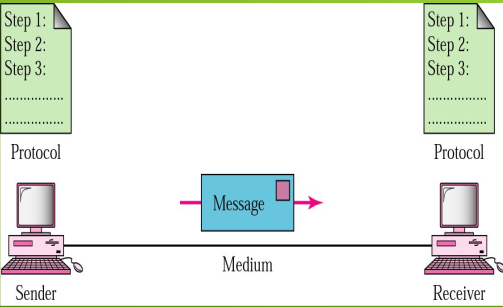
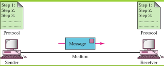
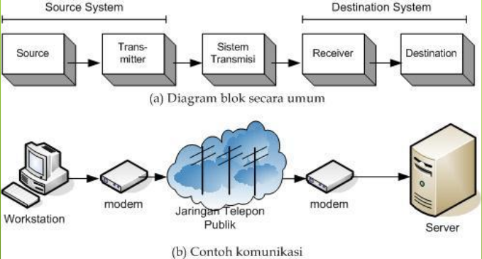
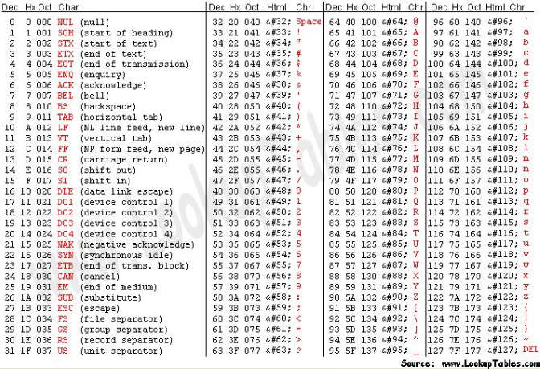
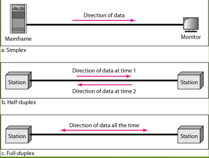

# Komunikasi Data & Jaringan Komputer

## Profile Dosen

- **Nama** : Danang, S.Kom., M.T
- **Lahir** : Kab. Semarang 15 September 1987
- **Alamat** : Jl. Kebonrojo Selatan 1 No 16, Demak
- **Pendidikan** :
  - S1. Sistem Komputer (Universitas Sains dan Teknologi Komputer) 2009-2013
  - S2. Magister Teknik Electro (Universitas Islam Sultan Agung Semarang) 2013-2015
- **Pekerjaan** : Dosen di Universitas STEKOM sejak tahun 2016
- **Pengalaman Kerja** :
  - 2008-2009 = OB di STEKOM
  - 2010-2014 = Teknisi Jaringan Komputer di STEKOM
  - 2016-2020 = Kepala Lab STEKOM
  - 2020-Sekarang = Kepalla LPPM Universitas STEKOM
- **Pengalaman Hibah** :
  - 2013-2020 = Tim Pengelolaan dan Perencanaan dana Hibah DRPM dikti
  - 2018 = Lolos Hibah Pendanaan Tahub 2018
  - 2019 = Lolos Hibah Pendanaan Tahub 2019
  - 2020 = Lolos Hibah Pendanaan Tahub 2020
  - 2021 = Lolos Hibah Pendanaan Tahub 2021

## Materi Sebelum MID

1. Penenalan Komunikasi Data & Jaringan Komputer
2. Klasifikasi Jaringan Komputer berdasarkan metode transmisi dan geografis
3. Model Jaringan Komputer dan Hardware Jaringan Komputer
4. Topologi Jaringan Komputer
5. Masking (Teknik Pembagian Jaringan) dan
6. Routing di Jaringan TCP/IP ke internet implementasi IP Address di internet.
7. Protokol Aplikasi TCP/IP
8. MID SEMESTER

## Materi Sebelum UAS

1. Instalasi Virtual Box, Windows Server 2003
2. Instalasi Active Directory, Setting IP Client dan IP Server
3. User dan Organizational Unit Management
4. Policy Windows Server
5. Disk Management
6. Windows Server 2003 Tools, dan Sharing Data
7. Dokumentasi Shutdown.exe, Rename Domain
8. Ujian UAS

## Pendahuluan

- Komunikasi data adalah proses pengiriman dan penerimaan data/informasi dari dua atau lebih device (alat seperti komputer/laptop/printer/dan alat Komunikasi lain) yang terhubung dalam sebuah jaringan.
- Dasar utama komunikasi data adalah pertukaran bit-bit data (yang diwakili oleh sinyal elektronik antara dua piranti).
- Data yang dikirimkan dapat berupa teks, angka, gambar, audio, dan video.

## 5 Komponen Dalam Komunikasi Data

1. Message / Data
2. Sender (pengirim)
3. Receiver (penerima)
4. Medium (media transmisi)
5. Protocol (protokol/aturan)

## Components

1. Message adalah informasi (data) yang ingin dikirimkan.
2. Sender (pengirim) adalah perangkat/alat yang mengirimkan message. Dapat berupa komputer, workstation, telepon, televisi dan lain-lain.
3. Receiver (penerima) adalah perangkat/alat yang menerima message. Dapat berupa komputer, workstation, telepon, televisi dan lain-lain.
4. Media transmisi adalah medium transmisi dari jalur fisik dimana message dapat berjalan dari pengirim ke penerima. Beberapa contoh dari media transmisi adalah kebel koaksial, kabel UTP, kabel fiber optik, dan gelombang radio.
5. Protokol adalah set aturan yang mengatur dalam pertukaran data.

## Model Komunikasi Data

## Representasi Data (Data Representation)

Informasi dapat berupa teks, angka, gambar, audio, dan video.

### Teks

- Dalam komunikasi data, teks direpresentasikan berupa pola bit, atau susunan urutan bit (0 maupun 1).
- Susunan atau urutan bit-bit yang berbeda satu dengan yang lain dalam mempresentasikan simbol teks disebut kode (code), sedangkan proses dalam merubah menjadi simbol dinamakan coding.
- Sistem pengkodean yang banyak dipakai sekarang adalah kode **ASCII** (_American Standard Code for Information Interchange_) yang mewakili 127 karakter.

### Angka (numbers)

- Angka juga diwakili oleh pola urutan bit.
- ASCII tidak digunakan untuk mewakili angka.
- Angka langsung dikonversikan atau diubah menjadi angka biner untuk memudahkan dlam perhitungan operasi matematika.

### Gambar (images)

- Gambar juga direpresentasikan oleh urutan bit.
- Dalam bentuk yang paling mudah, sebuah gambar terdiri dari matriks yang terdiri dari piksel. (piksel/picture elements), dimana tiap pixel adalah representasi sebuah titik terkecil dalam sebuah gambar yang dihitung per inci.
- Ukuran dari piksel tergantung dari resolusinya.
- _Better representation of the image (better resolution), more memory is needed to store the image_
- Setelah gambar dipecah menjadi beberapa ukuran piksel, tiap pikselnya akan mewakili sebuah pola bit. Ukuran dan nilai dari pola tersebut tergantung dari gambar tersebut.
  - Untuk gambar hitam putih terdiri dari titik hitam dan titik putih, maka 1 buah pola bit cukup untuk mewakili pikssel. Yaitu 0 untuk piksel hitam dan 0 untuk piksel putih. Untuk gambar _grayscale_, akan ada 2 buah pola bit.
    1. Untuk piksel warna hitam diwakili oleh 00,
    2. Untuk warna dark grey diwakili oleh 01,
    3. Untuk warna light grey diwakili oleh 10,
    4. Untuk warna putih diwakili oleh 11,
- Terdapat beberapa metoda untuk mewakili gambar berwarna, salah satu metode yang digunakan adalah RGB, ,disebut demikian karena tiap warna adalah kombinasi dari ketiga warna primer yaitu **Red**, **Green**, **Blue**. Ada metoda yang lain yaitu **YCM**, yaitu mana warna yang dihasilkan adalah kombinasi dari ketiga warna primer yang lain yaitu **Yellow**, **Cyan**, **Magenta**.

### Audio

- Audio adalah rekaman atau penyiaran dari suara atau musik.
- Secara alamiah, audio berbeda dengan teks, angka dan gambar.
- Sifatnya kontinyu, bukan diskrit.
- Micropone -> sebuah _Tranducer_ yang mengubah suara menjadi sinyal listrik.
- Speaker -> sebuah _Tranducer_ yang mengubah sinyal listrik menjadi suara.

### Video

- Video adalah rekaman atau siaran dari sebuah gambar atau film.
- Video juga dapat berupa entitas yang sifatnya kontinu.

## Effectiveness Of Data Communications System Depends On Four Fundamental Characteristics

1. **Delivery**

- _pengiriman_ yaitu bahwa si pengirim haruslah mengirimkan data ke tujuan yang dituju.
- Data haruslah diterima oleh perangkat atau orang (user) yang ditujukan dan hanya diterima oleh perangkat atau orang (user) tersebut.

2. **Accuracy**

- _akurat_ yaitu sistem harus dapat mengirimkan data secara akuran.
- Data yang telah mengalami kesalahan pada saat pengiriman dan dibiarkan salah menjadikan data tersebut tidak dapat digunakan.

3. **Timeliness**

- _sesuai dengan waktu_ yaitu sistem harus dapat mengirimkan data dalam waktu yang tepat.
- Data yang datang mengaami keterlambatan akanlah menjadi sia-sia.

4. **Jitter**

- yaitu variasi dari waktu kedatangan paket.
- ketidaksamaan waktu tunda **delay** dalam pengiriman paket audio dan video.

## Aliran Data (Data Flow)

- Komunikasi diantara dua perangkat dapat berlangsung seacara: simplex, half duplex dan full duplex.

1. **Simplex** : komunikasi hanya satu arah. Hanya ada satu perangkat yang melakukan pengiriman, dan perangkat lain hanya berfungsi sebagai penerima. Contoh: keyboard hanya dapat melakukan input, sedangkan monitor hanya dapat menerima output.
2. **Half-duplex** : masing-masing stasiun dapat berfungsi sebagai pengirim maupan penerima, akan tetapi tidak dalam waktu yang sama. Ketika perangkat tersebut dalam mode mengirim, maka dia tidak dapat menerima, dan begitu pula sebaiknya. Contoh: **Handy Talky**.
3. **Full-duplex** : masing-masing stasiun dapat berfungsi sebagai pengirim dan penerima dalam waktu bersamaan. Contohnya jaringan **Telepon**.

## Pengertian Dasar Jarkom

- Jaringan merupakan sistem yang terdiri atas komputer, perangkat komputer tambahan dan perangkat jaringan lainnya yang saling terhubung dengan menggunakan media tertentu dengan aturan yang sudah ditetapkan.
- Perangkat Komputer:
  - Komputer (di dalam ada perangkat yang menghubungkan dengan jaringan misal **NIC, Modem**).
  - Printer
  - Scanner
- Prangkat Jaringan (akan dibicarakan lebih lanjut)
  - NIC
  - Modem
  - Hub
  - Switch
  - Router
  - Firewall
- Media (akan dibacarakan lebih lanjut)
  - Kabel
  - Non Kabel _wireless_
- Aturan (akan dibicarakan lebih lanjut)
  - Protokol

## Manfaat Jaringan

- **Resource Sharing** (Pembagian sumber daya): berbagai pemakaian printer, CPU, memori, harddisk.
- Komunikasi: surat elektronik, instant messaging, chatting
- Akses informasi: web browsing.
- Membantu mempertahankan informasi agar tetap andal dan up-to-date.
- Sebagai Sistem penyimpanan data terpusat ataupun terdistribusi yang memungkinkan banyak pengguna mengaskes data dari berbagai lokasi yang berbeda serta membatasi akses ke data sewaktu sedang diprose.

