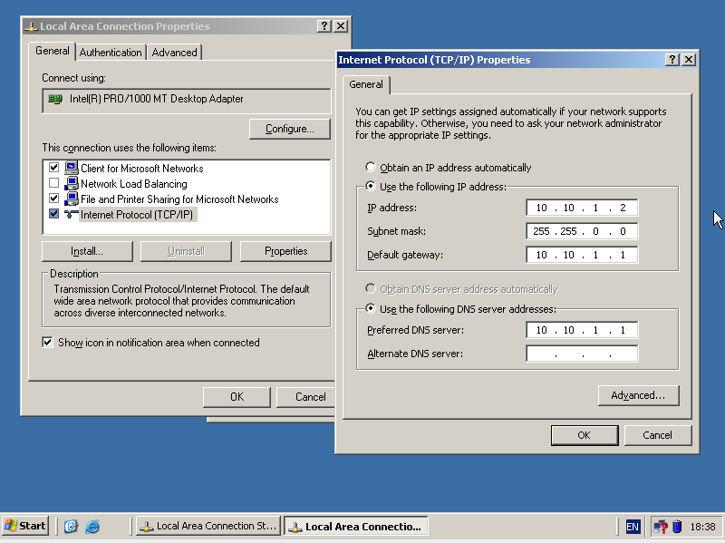
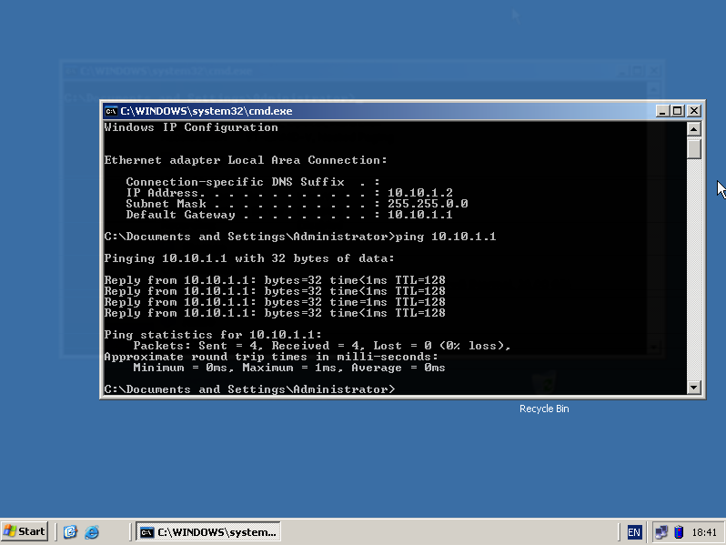

# Setting IP Address Windows Server 2003

1. Pertama Clone Windows Server 2003 digunakan untuk Client Side.
2. Klik kanan pada mesin yang akan di clone 
3. Ganti nama mesin Menjadi Client untuk mudah membedakannya, lalu next. 
4. Clone Type Pilih _Full Clone_ bertujuan untuk membuat virtual harddisk sendiri, lalu klik `clone`. 
5. Tunggu proess Cloneing berjalan.
6. Lalu nyalakan kedua mesin mesin.
7. Pertama Tama Ganti hostname kedua komputer menjadi **Server01** dan **Client01**.
8. Klik start, lalu klik kanan **My Computer** dan klik bagian properties.
   - SERVER 
   
   - CLIENT 

9. Klik Computer Name, lalu klik change, selanjutnya pada Computer name inputkan **Server01** dan **Client01**. 
10. Untuk Setting IP Address Start -> Control Panel -> Network Connection -> Local Area Connection 
11. Klik properties -> Internet Protocol (TCP/IP) -> properties. Lalu inputkan ip address nya
    - Server 
    
    - Clinet 

12. Kemudian restart kedua mesin.
13. Kemudian test dengan menggunakan ping:
- Client 
- Server 
14. Untuk Instalasi **Active Directory**. Type `Start + r` lalu ketikan "DCPROMO" enter. 
15. Untuk domain Tuliskan "STEKOM.com" 
16. Lalu NetBIOS Domain Name "STEKOM" 
17. Pada _Database and Log Folder_ pilih saja default dan next 
18. Sama seperti sebelumnya untuk _Shared System Volume_ pilih saja default 
19. Pada _DNS Regirstration Diagnostics_ pilih yang tengah. 
20. Untuk _Permissions_ pilih saja _Permissions compatible only with Windos 20000 or Windows Server 2003_ 
21. Kemudian masukan password yang kompleks dan kuat untuk security yang bagus 
22. Pastikan masukan file iso yang dibuat instalasi.
23. Tunggu sampai instalasi selesai.
24. Terakhir restart mesin.
