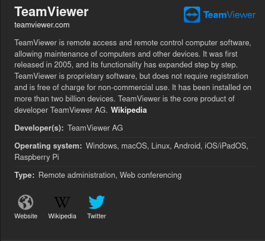
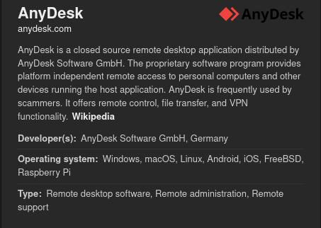
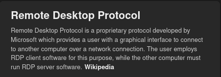

# Remote Desktop

## Team Viewer

### Fungsi Teamviewer

1. Remote Control

- Dengan remote control, kita dapat mengontrol komputer orang lain, tetapi kita perlu mengetahui ID dari mitra TeamViewer di komputer yang ingin anda kontrol.
- Yang harus kita lakukan adalah memasukan ID mitra, lali klik Hubungkan ke mitra dan kita dapat mengakses komputer orang lain dari jarak jauh.

2. File Transfer

- Fungsi ini memiliki fungsi seperti client dan server.
- Anda cukup menggunakan seret dan lepas untuk memindahkan file dari client ke server atau sebaliknya.
- Pemula sangat mudah digunakan sehingga orang tidak mengalami kesulitan.

3. Meeting

- Ada dua kolom di sebelah kiri, dimana penyelenggara menyediakan akses ke pertemuan untuk orang lain dan kita sendiri.
- Kami mengklik pertemuan instan yang dapat kami selenggarakan.
- Karena kami dapat menghadiri sejumlah pertemuan lain, kami hanya dapat memasukkan ID rapat dan sudah bergabung dengan rapat.

## Any Desk

### Pengertian

**AnyDesk** adalah salah satu aplikasi _remote desktop_ lain yang populer. Seperti **TeamViewer**, **AnyDesk** juga mudah digunakan dan menawarkan banyak fasilitas. Begitu pula dengan model penggunaannya; **AnyDesk** bisa digunakan secara gratis untuk penggunaan pribadi, sedangkan untuk penggunaan bisnis harganya adalah $10,99 per bulan di luar pajak untuk satu perangkat dan dibayarkan per tahun. Salah satu perbedaan antara **AnyDesk** dengan **TeamViewer** adalah ukuran berkas **AnyDesk** yang kecil, hanya sekitar 3,2 MB dan bukan 25,7 MB seperti **TeamViewer**, dan bisa dijalankan tanpa perlu di install terlebih dahulu.

## Apa itu RDP ?

### Remote Desktop

**Apa itu Remote Desktop** Remote Desktop merupakan salah satu fitur yang bisa ditemukan di dalam sistem operasi Microsoft Windows XP, Windows Vista, Windows Server 2003, dan Windows Server 2008, yang berguna untuk mengizinkan user terkoneksi ke sebuah komputer yang berada jauh seolah olah si user ini sedang duduk di depan komputer tersebut.
_Remote Desktop Protocol_ (**RDP**) dan akan secara default berjalan di TCP port 3389.

## Tugas Praktikum

Membuat Tutorial remote desktop menggunakan 3 aplikasi:

- Team Viewer.
- Any Desk.
- RDP
