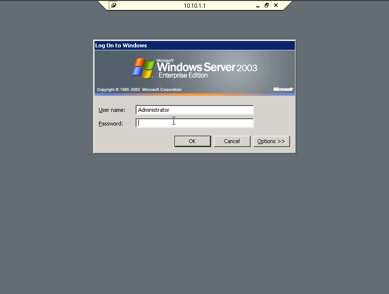

# Tugas Praktikum

## RDP

1. Aktifkan dulu RDP bagian Server dengan klik start -> klik kanan my computer -> properties 
2. Pilih remote dan check semua nya lalu ok. 
3. Pertama ping terlebih dahulu ip address yang akan di remote (server) 
4. Selanjutnya Dibagian Client klik start -> All Program -> Accessories -> Communication -> Remote Desktop Connection. 
5. Pada bagian Desktop masukan ip address yang akan di remote (server), lalu klik connect
6. Lali masukan password komputer yang di remote (server) 
7. Setelah itu kamu sudah meremote komputer server 

## AnyDesk

1. Pertama install [AnyDesk](https://anydesk.com/en)
2. Nyalakan AnyDesk di sisi server dan catat addressnya 
3. Pada sisi client masukan address server pada input _Remote Desk_ 
4. Accept pada sisi server 
5. Lalu klik yes untuk mensetujui remote desktop 
6. Client sudah remote server 

## Team Viewer

1. Pertama Install [Team Viewer](https://www.teamviewer.com/en/)
2. Accept 
3. Masukan ID dari server ke Client 
