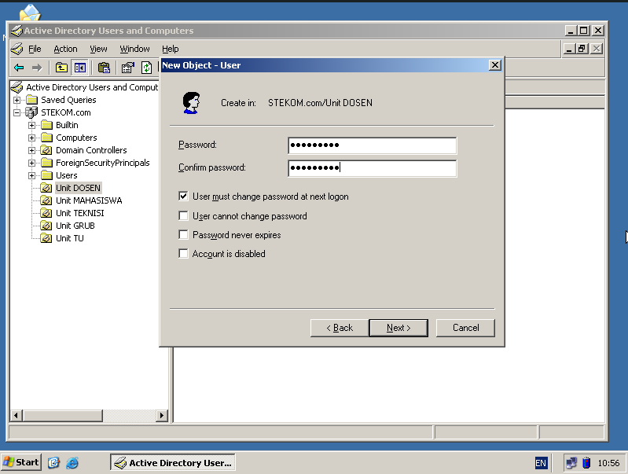

# Management User dan Uint

## Unit

1. Click Start menu -> Programs -> Administrative Tools -> Active Directory User and Computers
   - 
2. Kemudian Klik `STEKOM.com` dan klik kanan ke area, lalu pilih new kemudian Organization Unit.
   - 
3. Masukan Nama Unit Kemudian Ok.
   - 
4. Lalukan berulang dengan nama seperti berikut.
   - 
   - 

## Grub

1. Pada `Unit Grub` Klik kanan -> new -> pilih Grub.
   - 
2. Masukan Nama Grub, kemudian ok.
   - 
3. Ulangi Langkah langkah tersebut dengan nama sebagai berikut:
   - 
   - 

## User

1. Di Windows Server 2003 untuk bisa buat user yang passwordnya pendek harus diubah dibagian `Domain Security Setting`
2. Click Start -> Programs -> Administrative Tools -> Domain Security Setting.
   - 
3. Kemudian Kilk Account Policies -> Password Policy.
   - 
4. Configurasi Password Seperti ini.
   - 
5. Selanjutnay pada Active Directory Kita buat User dengan cara, Pada `Unit DOSEN` Klik kanan -> new -> User.
   - 
6. Masukan Nama Dan Username untuk Login, kemudian next.
   - 
7. Masukan Password, ingat passwordnya kombinasi antara angka dan huruf.
   - 
8. Lalukan Membuat user dengan aturan sebagai berikut:
   - 
