# Active Directory Windows Server 2003

1. Buat folder yang akan disharing 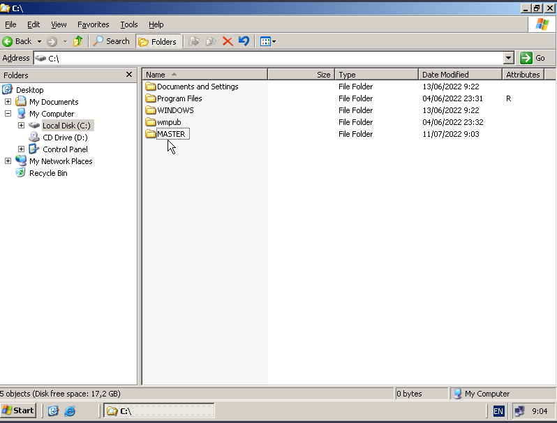
2. Kemudian klik kanan lalu `sharing and security` 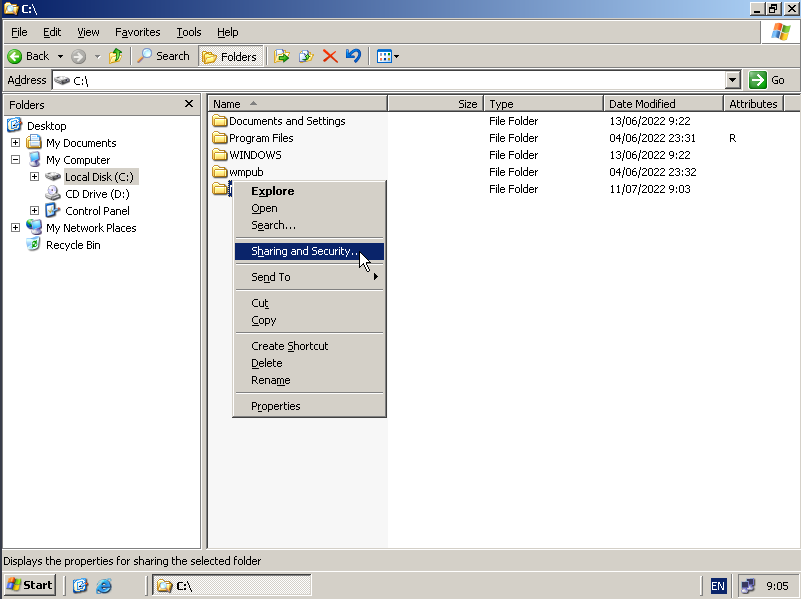
3. Lalu klik `Shere this folder` kemudian apply 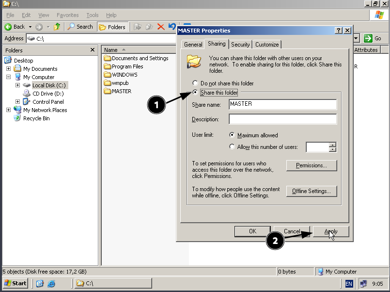
4. Kemudian klik `Permissions` lalu add `Unit DOSEN` dan `Unit TEKNISI` 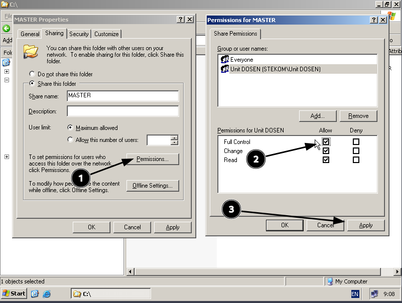 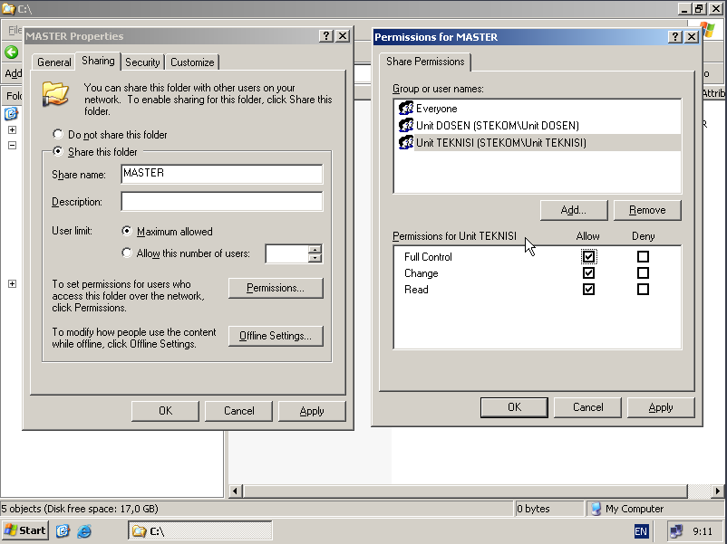
5. Lalu klik tab `Security` kemudian klick `Advanced` 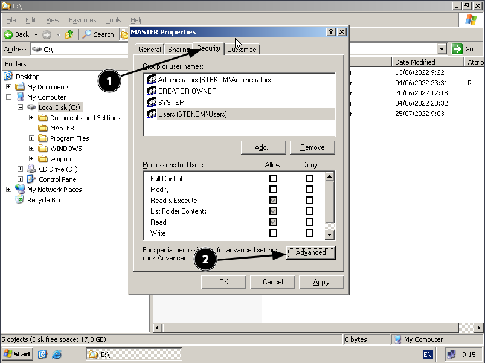
6. Uncheck `Allow inheritable permissions` kemudian klik `Remove` lalu apply 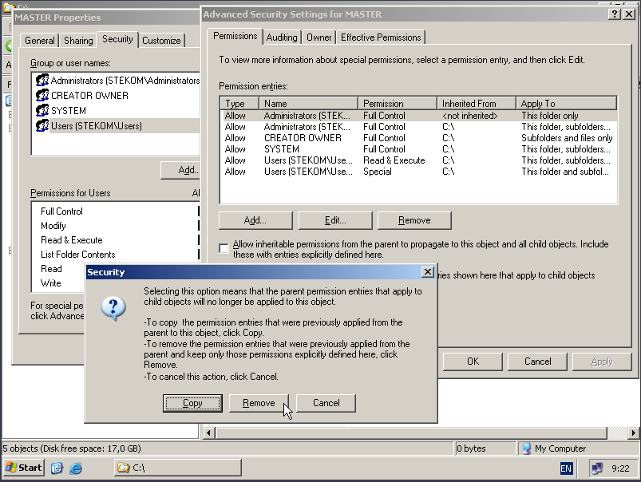
7. Lalu klik `Add` dan klik `Advanced` 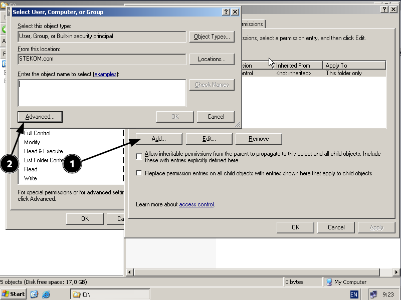
8. Kemudian pada inputan `Name` diisi `Unit` lalu klik `Find Now` kemudian klik `Unit DOSEN` dan `OK` 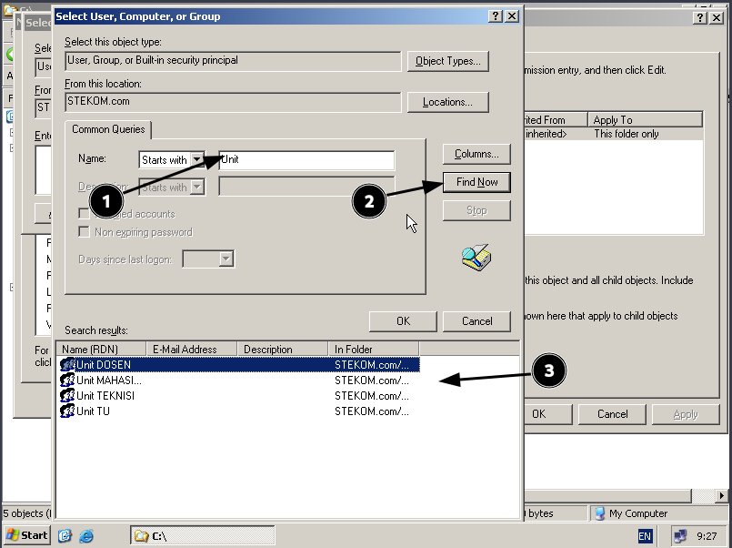
9. Pada `Unit DOSEN` allow Semua kemudian `OK` sama juga `Unit TEKNISI` 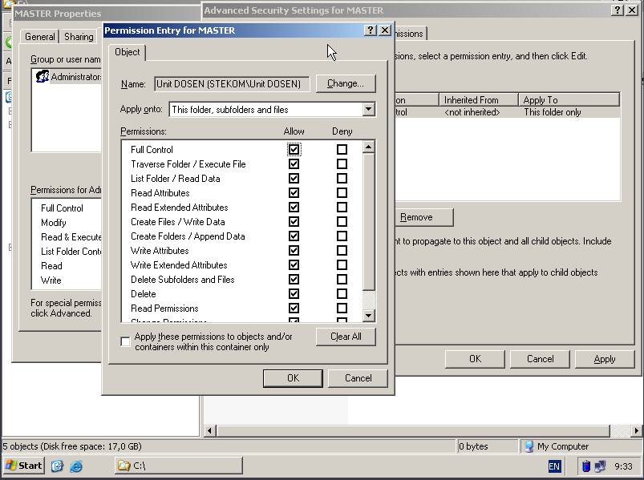 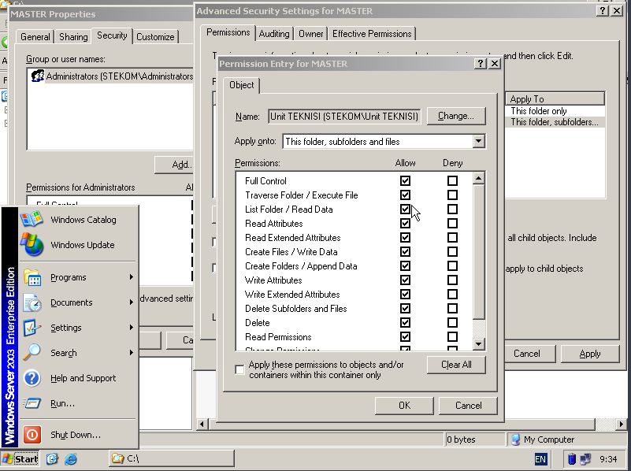
10. Pada `Unit MAHASISWA`, `Unit TU` seperti ini 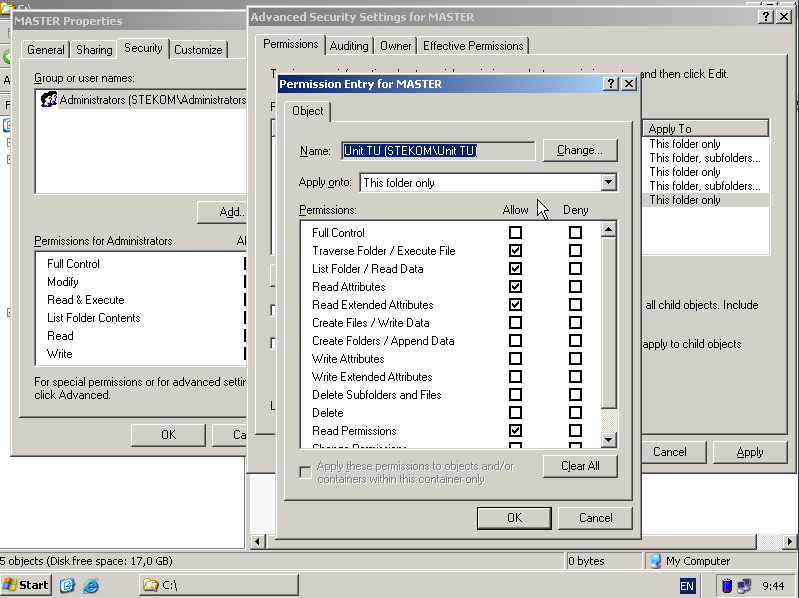
