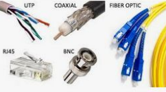
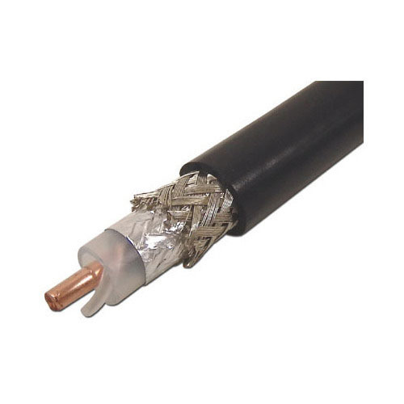
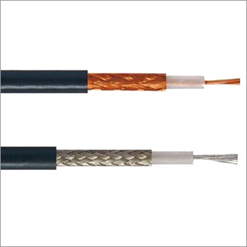
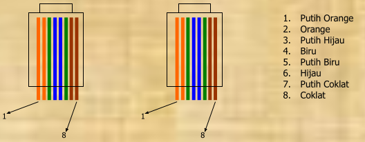
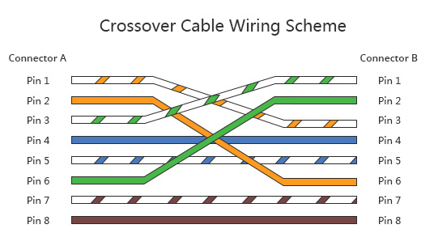
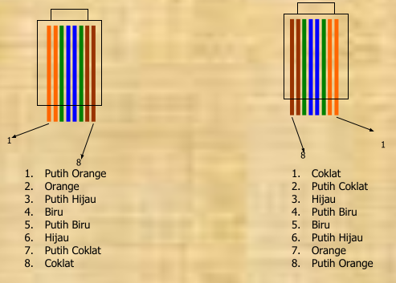
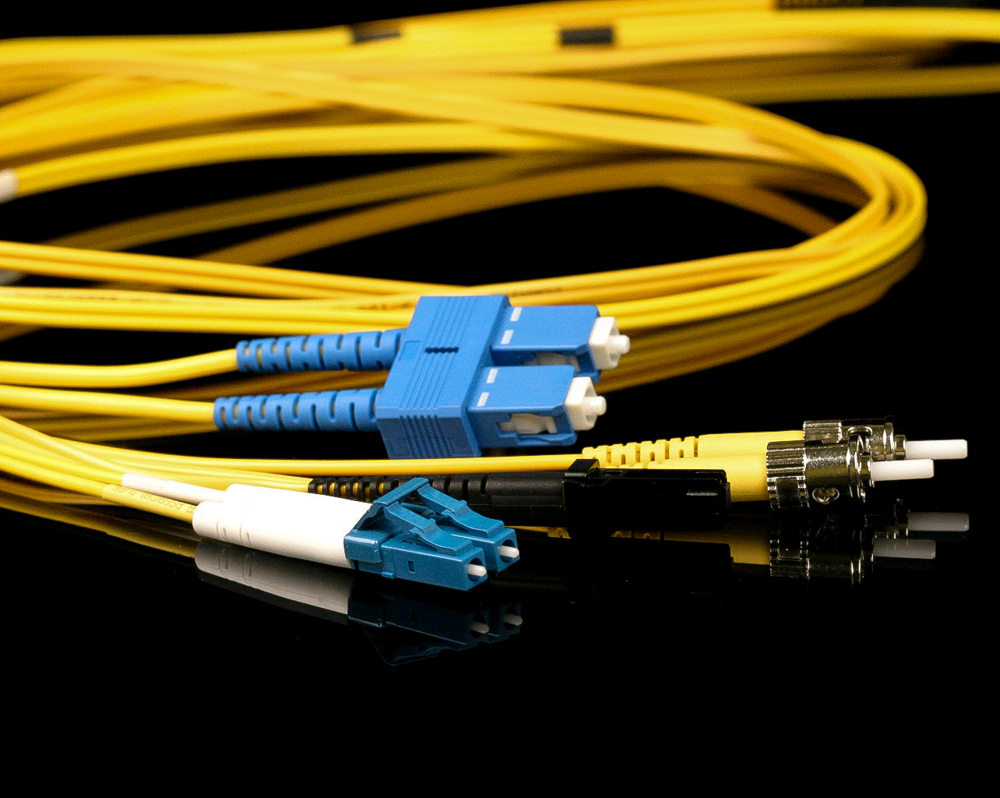

# Jaringan Komputer

## Uraian dan Sesaran

**Uraian:** \
  Mata Kuliah ini memberiakan pengetahuan mahasiswa mengenai Hardware jaringan Komputer.

**Sasaran:** \
  Mahasiswa mampu menguasai teknik pengkabelan dan Hardware jaringan Komputer.

## Hardware Jaringan

- Kabel
- Ethernet Card (NIC)
- Hub & Switch
- Repeater
- Router

### Kabel

- Ada beberapa jenis kabel yang banyak digunakan dan menjadi standard dalam penggunaannya unuk kompunikasi data dalam jaringan komputer.
- Setiap jenis kabel mempunyai kemampuan dan spesifikasi yang berbeda.
- Ada 3 jenis kabel yang secara umum sering dipakai, yaitu:
  - Coaxial.
  - Twisted pair.
  - Fiber Optic.

 

#### Coaxial

- Thick Coaxial
  - Diameter rata-rata 12mm.
  - Disebut standart ethernet/thick ethernet/yellow cable.
- Thin Coaxial
  - Diameter rata-rata 5mm warna hitam.
  - Banyak dipergunakan di kalangan radio amatir, terutama untuk transciever yang tidak memerlukan output daya yang besar.
  - Setiap perangkat dihubungkan dengan BNC (Bayonet-Neill-aConcelmn) T Connector.
  - Disebut Thin ethernet/Thin Net.

##### Thick Coaxial

Spesifikasi jaringan:

- Setiap ujung harus diterminasi dengan terminator 50 Ohm 1 watt.
- Maksimum 3 segment dengan peralatan terhubung atau berupa populated segments.
- Setiap kartu jaringan mempunyai pemancar tambahan.
- Setiap segment maksimum berisi 100 perangkat jaringan, termasuk repeaters.
- Max panjang kabel per segment adalah 1640 feet (± 500 meter) .
- Max jarak antar segment adalah 4920 feet (± 1500 meter).
- Setiap segment harus diberi ground.
- Jarak Max antara tap atau pencabangan dari kabel utama ke perangkat adalah 16 feet (± 5 meter).
- Jarak Min antar tap adalah 8 feet (± 2,5 meter).

 

##### Thin Coaxial

- Setiap ujung diberi terminator 50 Ohm. 
- Maksimum 3 segment terhubung satu sama lain (populated segments). 
- Kartu jaringan cukup menggunakan transciever yang onboard, tidak perlu tambahan transciever, kecuali untuk repeater.
- Setiap segment maksimal berisi 30 perangkat jaringan.
- Max panjang kabel adalah 606.8 feet (± 185 meter).
- Max panjang kabel antar segment adalah 1818 feet (± 555 meter).
- Setiap segment harus diberi ground.
- Panjang min antar T Connection adalah 1,5 feet (± 0.5 meter).

#### Twisted Pair Cable

- UTP (Unshielded Twisted Pair)
- STP (Shielded Twisted Pair)
- Terdiri dari 4 pasang kabel yang terpilih
- Dari 8 buah kabel yang ada, hanya 4 buah yang digunakan untuk mengirim dan menerima data.
- Perangkat lain yang berkenaan dengan penggunaan kabel jenis ini adalah konektor RJ-45 dan hub/Switch.
- Ada dua jenis pemasangan kabel UTP yang umum digunakan, ditambah satu jenis pemasangan khusus untuk cisco router yaitu:
  - Straight Through Cable.
  - Cross Over Cable.
  - Roll Over Cable.

##### Straight Through Cable

- Digunakan untuk menghubungkan beberapa unit komputer melalui perantara HUB/Switch, yang berfungsi sebagai konsetrator maupun repeater.
- Penggunaan kabel UTP model Straight Through pada jaringan local biasanya akan membentuk topologi star atau tree dnegna hub/switch sebagai pusatnya.
- Penggnaan hub/switch harus sesuai dengan kecepatan dari NIC. Karena perbedaan kecepatan NIC & Hub/Switch berati kedua perangkat tersebut tidak dapat berkomunikasi secara maksimal. 

##### Cross Over Cable

- Berbeda dengan Straight Through, penggunaan Cross cable ini digunakan untuk berkomunikasi antar komputer (tanpa HUB), atau dapat juga digaunakan untuk meng-cascade HUB jika diperlukan.

 

##### Roll Over Cable

- Digunakan untuk menghubungkan terminal dan modem ke Cisco Router seri 2500 Access Server

 

#### Fiber Optic Cable

- Kabel yang memiliki serat kaca sebagai saluran untuk menyalurkan sinyal antar terminal sering dipakai sebagai saluran **BACKBONE** karena kehandalanya yang tinggi dibandingkan dengan coaxial cable atau kabel UTP. Kabel ini tidak terpengaruh oleh cuaca dan panas.

### Ethernet Card (NIC)

- Cara kerja Ethernet Card berdasarkan broadcast network, dimana setiap node dalam suatu jaringan menerima setiap transmisi data yang dikirim oleh suatu node yang lain.
- Setiap Ethernet mempunyai alamat sepanjang 48 bit yang dikenal sebagai Ethernet address (MAC Address). 
- Alamat tersebut telah ditanam ke dalam setiap rangkaian kartu jaringan (NIC) yang dikenali sebagai Media Access Control (MAC) atau lebih dikenal dengan hardware istilah hardware address. 24 bit atau 3 byte awal merupakan kode yang telah ditentukan oleh IEEE. 
- NIC model 10Base umumnya telah menyediakan port koneksi untuk kabel coaxial ataupun kabel UTP. 
- Jika didesain untuk kabel coaxial maka konektornya adalah BNC. 
- Jika didesain untuk kabel UTP maka konektornya adalah RJ-45. 

### Hub & Switch

- Hub & Switch biasanya disebut konsentrator. 
- Sebuah konsentrator adalah sebuah perangkat yang menyatukan kabel-kabel network dari setiap workstation, server atau perangkat lain.
- Dalam topologi star, kabel UTP datang dari sebuah workstation masuk ke dalam hub atau switch. 
- Menggunakan konektor RJ-45.
- Beberapa jenis hub dapat dipasang bertingkat (stackable) hingga 4 susun, dan biasanya memiliki libah sebanyak 4, 8, 16 dan 24 buah.
- Switch merupakan konsentrator yang memiliki kemampuan manajemen trafic data lebih baik daripada Hub.
- Jenis Switch manageable, selain dapat mengatur traffic data juga dapat diberi IP address.

### Repeater

- Fungsi Utama adalah memperkuat sinyal dengan cara menerima sinyal dari suatu segmen kabel LAN lalu memancarkan kembali dengan kekuatan yang sama dengan sinyal asli pada segmen kabel yang lain.
- Denan cara ini jarak kabel dapat diperjauh.

### Bridge

- Fungsinya sama dengan repeater, tetapi lebih fleksibel dan lebih cerdas daripada repeater. 
- Bridge dapat menghubungkan jaringan yang menggunakan metode transmisi yang berbeda.
- Bridge mampu memisahkan sebagaian dari trafic karena mengimplementasikan mekanisme frame filtering.
- Mekanisme ini umumnya sebagai store and forward.
- Bridge dapat digunakan untuk mengkoneksikan network yang menggunakan tipe kabel yang berbeda ataupun topologi yang berbeda pula.
- Bridge dapat mengetahui alamat masing-masing komputer di masing-masing sisi jaringan.

### Router

- Router mampu mengirimkan data/ informasi dari satu jaringan ke jaringan lain yang berbeda.
- Router hampir sama seperti bridge, tapi tidak sepintar dan fleksibel bridge.
- Router akan mencari jalur terbaik untuk mengirimkan sebuah pesan yang berdasarkan atas alamat tujuan dan alamat asal.
- Router mengetahui alamat masing-masing komputer di lingkungan jaringan lokal, alamat bridges dan router lainnya.
- Router dapat mengetahui keseluruhan jaringan dengan melihat sisi mana yang paling sibuk dan bisa menarik data dari sisi yang sibuk sampai sisi tersebut bersih.

- Dapat menerjemahkan informasi dari LAN dan INTERNET.
- Mencarikan alternatif jalur yang terbaik untuk mengirimkan data melewati internet.
- Mengatur jalur sinyal secara efisien dan dapat mengatur data yang mengalir di antara dua buah protokol.
- Dapat mengatur aliran data di antara topologi jaringan linear bus dan star.
- Dapat mengatur aliran data melewati kabel fiber optic, kabel coaxial dan kabel UTP

