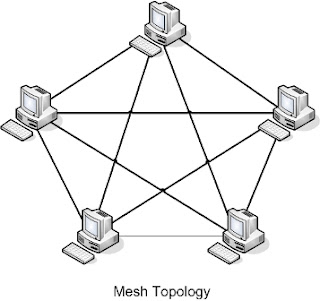

# Praktek Pengkabelan & Topologi

## Uraian dan Sasaran

- **Uraian:**
  - Mata kuliah ini memberikan pengetahuan kepada mahasiswa mengenai Topologi Jaringan Komputer.
- **Sasaran:** 
  - Mahasiswa mampu memahami konsep dan contoh dari Topologi 

## Terminal LAN

- Dari definisi, LAN terbatas hanya pada suatu area lokal.
- Lan pertama -> Jarak terjauh dari titik central = 185 Meter dan tidak lebih dari 30 komputer terkoneksi
-  
- **Workgroup:**
  - Kesimpulan dari beberapa individu yang melakukan sharing file dan database bersama melalui sebuah LAN (mis: Baigan Marketing, Bagian Personalia, Teknik Komputer, dll)

## Komponen Utama pada Jaringan

- **Workstation** Komputer jaringan yang bisa meminta resource dari jaringan, yang digunakan oleh setiap individu untuk melakukan sesuatu pekerjaan.Bisa juga menyatakan sebuah software (cth: Windows NT Workstation)
- **Server**  Menyediakan *resource* tuntuk *client* pada jaringan. Server biasanya dipersialisasikan untuk menyediakan suatu service saja, tetapi tidak menutup kemungkinan banyak service terdapat dalam satu server.
  - Beberapa  server yang didedikasikan untuk satu service:
  - File Server: Menyimpan dan mendistribusikan file.
  - Print Server : Mengontrol atau mengatur satu atau lebih printer pada suatu jaringan.
  - Proxy Server : Melakukan fungsi atas nama komputer lain.
  - Application Server : Menyimpan dan mengerjakan suatu aplikasi jaringan.
  - Web Server : Menyimpan dan memberikan halaman web atau isi lain menggunakan Hypertext Transfer Protocol (HTTP).
  - Mail Server : Menyimpan dan saling menurkan e-mail.
  - Remote Access Server : Menyediakan modem untuk permintaan koneksi dengan dial-up melalui jalur telepon.
- Dengan tidak memperdulikan fungsinya sebuah server harus mempunyai:
  - Hardware/Software untuk intergritas data (mis: Backup).
  - Kemampuan untuk mendukung banyak client.
- **Host** :istilah ini sering digunakan pada saat membicarakan suatu fungsi atau service pada protocol TCP/IP -> Setiap peralatan jaringan yang mempunyai alamat jaringan TCP/IP. Server, Workstation dan peralatan jaringan lain bisa dikategorikan sebagai Host.

## Arisitektur Peer to Peer & Client Server

- Tujuan jaringan adalah untuk sharing resource. Cara mencapai tujuan tersebut tergantung dari software sistem operasi jaringan.
- Tipe jaringan biasanya dikategorikan sebagai peer to peer dan client server.
- Sulit membedakan secara fisik jaringan yang menggunakan tipe peer to peer atau Client Server.

**Peer to Peer** 

- Tidak terdapat wewenang central dalam jaringan. Semua komputer mempunyai tingkatain wewenang yang sama.
- Jika seseorang user ingin mengakses suatu resource pada komputer lain, yang melakukan security check dan memberikan hak akses adalah komputer yang mempunyai resource.
- Setiap komputer pada jaringan bisa menjadi client (meminta resource) sekaligus menjadi server (menyediakan resource).

 

**Arisitektur Client Server** :

- Menggunakan sistem operasi yang didesain untuk memanage seluruh jaringan secara central, contoh :Windows NT dengan Domain Controller, Windows 2000 dengan Active Directory, Linux Redhat dengan NIS (Network Information Service).
- Client meminta akses resource dan server merspon dengan informasi atau akses ke sebuah resource.
- Inforasi username dan password disimpan pada suatu database yang sama dari sebuah server -> 1 user mempunyai 1 username dan 1 password yang bisa digunakan pada jaringan tersebut.

 

## Topologi Jaringan

- **Topologi Fisik** :Merupakan map (peta) dari jaringan atau merupakan layout dari pengkabelan dan workstation jaringan yang mendeskripsikan lokasi semua komponen jaringan -> Visible.
- **Topologi Logic** :Mendefinisikan mekanisme aliran data atau informasi dalam jaringan -> invisible.
- Beberapa topologi fisik yang biasa digunakan:
  - Bus
  - Ring
  - Star
  - Mesh
  - Wireless
- Beberapa topologi logic yang biasa digunakan:
  - Ethernet
  - Token Ring

### Topologi Fisik Bus

 

- Semua komponen jaringan dihubungkan dengan satu kael yang diterminasi pada kedua ujungnya.
- Semua client yang terhubung pada jaringan bisa mendengarkan jika terdapat data pada jaringan. Tapi hanya tujuan dengan address tertentu yang bisa memproses data tersebut.
- Keuntungan Topologi fisik Bus:
  - Kemudahan untuk instalasi
  - Relatif lebih murah
  - Memperlukan kabel yang lebih pendek dibandingkan topologi fisik yang lain.
- Kerugian Topologi fisik Bus:
  - Kesulitan untuk dipindahkan atau diubah.
  - Fault tolence yang kecil.
  - Kesulitan untuk troubleshooting jika terdapat masalah jaringan.

### Topologi Fisik Star

 

- Komponen jaringan dihubungkan pada central (hub) dengan kabel yang terpisah.
- Setiap komponen pada jaringan masih bisa mendengarkan jika terdapat data pada jaringan (jika terhubung Hub).
- Keuntungan Topologi Fisik Star:
  - Lebih Fault Tolerance dibanding Bus.
  - Komponen baru jaringan lebih mudah ditambahkan.
  - Kerusakan pada satu kabel tidak akan membuat down keseluruhan jaringan.
  - Mudah melakukan troubleshoot.
- Kerugian Topologi Fisik Star:
  - Single point of failure -> Hub.
  - Relatif mahal membutuhkan pengkabelan yang lebih panjang.

### Topologi Fisik Ring

 

- Komponen jaringan dihubungkan langsung dengan dua komponen jaringan lain.
- Data mengalir dari satu komputer lain secara berurutan
- Keuntungan Topologi Fisik Ring:
  - Kemudahan dalam desain kabel.
  - Mudah melakukan troubleshoot.
- Kerugian Topologi Fisik Ring:
  - Kesulitan untuk rekonfigurasi.
  - Fault Tolerance kecil 🡪 kerusakan pada satu jalur kabel membuat keseluruhan jaringan down.

### Topologi Fisik Mesh

 

- Komponen jaringan dihubungkan langsung dengan seluruh komponen jaringan lain.
- Biasanya digunakan pada topologi WAN 🡪 terutama untuk redundancy.
- Jaringan yang ada jarang yang menggunakan topologi fisik mesh murni.
- Untuk n komponen dibutuhkan koneksi n(n-1)/2.
- Keuntungan Topologi Fisik Mesh:
  - Fault Tolerance cukup tinggi dengan adanya redundancy.
- Kerugian Topologi Fisik Mesh:
  - Mahal.
  - Jaringan menjadi kompleks dengan cepat

### Topologi Fisik Wireless :AdHoc Network

 

- Jaringan ini terbentuk jika terdapat 2 atau lebih entity jaringan yang mempunyai RF transceiver dan mensuport AdHoc Networking, berada pada jarak yang memungkinkan untuk berkomunikasi.
- AdHoc network memungkinkan pemakai untuk saling berkomunikasi dan saling tukar menukar data secara langsung.

### Topologi Fisik Wireless :RF Multipoint Network

 

- Banyak station dengan transmitter dan receiver, masing-masing berkomunikasi dengan device central yang disebut wireless bridge (wireless access point, WAP)
- WAP digunakan sebagai penghubung antara jaringan wireless dan wired (LAN).
- Entity yang berada pada jaringan wireless harus berada pada jarak jangkuan WAP.

### Topologi Logic Ethernet

- Setiap kali sebuah node (simpul) dalam jaringan mempunyai data untuk simpul lain, simpul tersebut menyiarkan (broadcast) ke seluruh jaringan.
- Seluruh simpul mendengarkan dan melihat apakah data tersebut untuknya, jika ya maka akan diproses dan jika tidak akan diabaikannya.
- Contoh: Jaringan Ethernet (10/100 Mbps)

 

### Topologi Logic Token Ring

- Setiap kali sebuah node(simpul) dalam jaringan mempunyai data untuk simpul lain dan mempunyai token maka node tersebut berkesempatan untuk mengirim data (Proses pengiriman pada gambar).

 

---

Proses Pemindahan Token

- Jika sebuah workstation telah selesai mengirimkan data, token akan dilepas untuk memberikan kesempatan pada workstation lain yang mempunyai data untuk dikirim.
- Bila tidak ada yang mengambil/merespon, workstation memberikan kesempatan kedua.
- Jika tidak ada yang mengambil juga 🡪 kirim solicit successor frame (pertanyaan “Siapa yang akan menerima token selanjutnya?”) ke jaringan.
- Bila sebuah workstation memberikan respon maka token akan dilepas

## Backbone dan Segment

- Dalam sebuah jaringan yang kompleks (besar), seorang network engineer harus mempunyai cara untuk mengidentifikasi bagian dari jaringan mana yang sedang dibicarakan.
- Untuk alasan diatas biasanya jaringan terbagi menjadi dua yaitu segment dan backbone. Seperti pada gambar di bawah:

 

- **Backbone** 
  - Definisi: bagian dari jaringan dimana semua segment dan server terkoneksi.
  - Dianggap sebagai bagian utama sebuah jaringan.
  - Biasanya menggunakan konenksi dengan kecepatan tinggi seperti Fast Ethernet (100 Mbps), Gigafast Ethernet (1 Gbps), Fiber Distributed Data Interface (FDDI).
  - Efesiensi dicapai karena semua segment dekat ke server.
- **Segment** 
  - Bagian kecil sebuah jaringan yang bukan bagian dari Bagian kecil sebuah jaringan yang bukan bagian dari. backbone.backbone.
  - Workstation biasanya dikoneksikan ke segment.
  - Segment dikoneksikan ke backbone sehingga sebuah workstation mempunyai akses ke bagian jaringan lain atau ke sebuah server.

