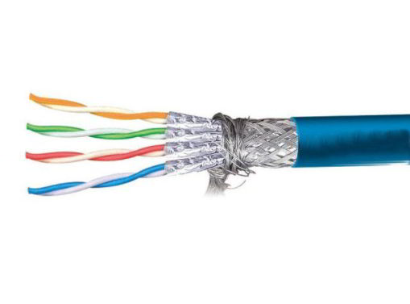
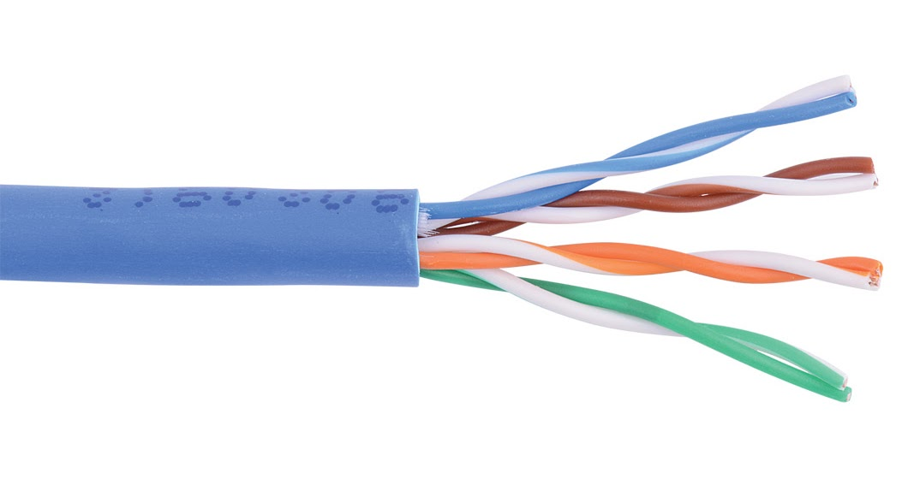
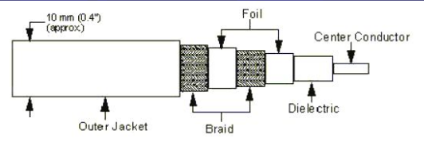
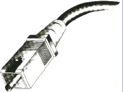
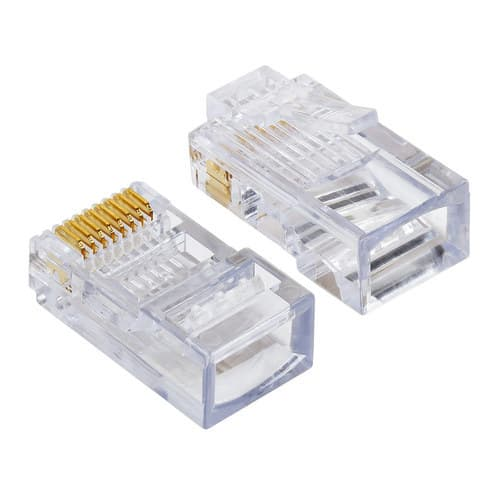
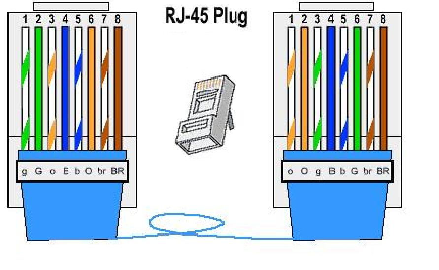
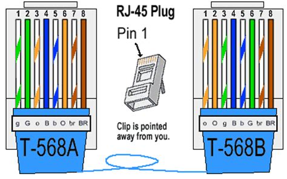

    <h1> MAKALAH TENTANG PENGKABELAN 

    
    
Disusun Oleh:

    
YUSRIL ARZAQI TK-P.21.2

    <h3> Universitas Sains & Teknologi Komputer </h3>

<h2 style="text-align: center;"> KATA PENGANTAR</h2>

 Alhamdulillah segala puja dan puji syukur kehadirat Allah SWT , yang telah melimpahkan Rahmat dan Hidayahnya kepada Kita semua.Sehingga saya sebagai Penulis berhasil menyelesaikan Tugas dengan Judul **“ PENGKABELAN”.**

Dalam hal ini saya sangat berterimakasih kepada Dosen Mata Kuliah , yang telah membimbing kita sehingga kita dapat mengerti apa  dan cara pengkabelan. Saya berterima kasih kepada Kedua Orang Tua saya yang
telah Mendukung Kegiatan saya

    <h2 style="text-align: center;"> PENDAHULUAN </h2>

A. **Latar Belakang Masalah**

Sebagai Bangsa yang modern tentu Mempunyai tekat untuk memajukan dunia teknologi. Sebagai bangsa yang Modern tentu mempunyai tekad untuk mencapai tujuan yang pada pokoknya . Adalah mewujudkan masyarakat yang adil dan makmur.serta sejahtera,baik secara lahir maupun secara batin yang berdasarkan Pancasila

Sebagai Realisasi masyarakat modern telah mewujudkan beberapa alat Elektonik. Misalnya Handphone,Komputer,Televisi,Laptop yang baru baru ini Muncul dikalangan masyarakat Awam,Radio,dll

Pada Makalah kali ini kita akan membahas tentang **“PENGKABELAN”.**

Komputer adalah serangkaian ataupun sekelompok mesin elektronik yang terdiri dari ribuan bahkan jutaan komponen yang dapat saling bekerja sama, serta membentuk sebuah sistem kerja yang rapi dan teliti.Sistem ini kemudian dapat digunakan untuk melaksanakan serangkaian pekerjaan secara otomatis, berdasar urutan instruksi ataupun program yang diberikan kepadanya. Definisi yang ada memberi makna bahwa komputer memiliki lebih dari satu bagian yang saling bekerja sama, dan bagian-bagain itu baru bisa bekerja kalau ada aliran listrik yang mengalir didalamnya. Istilah mengenai sekelompok mesin, ataupun istilah mengenai jutaan komponen kemudian dikenal sebagai hardware komputer atau perangkat keras komputer.

B. **Metode dan Tknik Penulisan** 

Untuk memperoleh data yang akurat serta Representatif perlu diupayakan adanya perumusan metode penulisan yang akan digunakan. Dalam penulisan ini,saya sebagai penulis Menggunakan metode sebagai berikut.

- Metode Browsing yang berupa “PENGKABELAN”,seperti : Internet.

## BAB 1 PENGKABELAN

### Pengertian Pengkabelan

**Istilah**

- kabel yg hanya mengirim satu sinyal dinamakan kabel baseband (BASE)
- Kabel yg dapat mengirim secara serentak sinyal yang berbeda dan pada frekuensi yg berbeda disebut kabel broadband.

Kabel medium melalui mana informasi biasanya bergerak dari satu perangkat jaringan ke yang lain. Ada beberapa jenis kabel yang umum digunakan dengan LAN. Dalam beberapa kasus, jaringan akan menggunakan hanya satu jenis kabel, jaringan lain akan menggunakan berbagai jenis kabel. Jenis kabel dipilih untuk jaringan berhubungan dengan jaringan topologi, protokol, dan ukuran. Memahami karakteristik berbagai jenis kabel dan bagaimana mereka berhubungan dengan aspek-aspek lain dari suatu jaringan diperlukan untuk pengembangan jaringan yang sukses.

Bagian berikut membahas jenis kabel yang digunakan dalam jaringan dan topik terkait lainnya.

- Unshielded Twisted Pair (UTP) Kabel.
- Shielded Twisted Pair (STP) Kabel.
- Coaxial
- Fiber Optic

### Cable

**Twisted Pair Cable**

- Terdiri dari 4 pasang kabel yang terpilih 
- Dapat menghubungkan komputer dengan jarak 4.8 Km, tanpa penguat sinyal.
- Dari 8 buah kabel yang ada, hanya 4 buah saja yang digunakan untuk mengirim dan menerima data.  
- Kecepatan transmisinya 64 Kbps.
- Lebar pitanya sempit sehingga mudah terpengaruh dari gangguan luar. Bila digunakan untuk topologi bus dan ring maka kecepatan transmisinya akan semakin turun, sehingga mudah disadap.
- Perangkat lain yang berkenaan dengan penggunaan kabel jenis ini adalah konektor RJ-45 dan hub/Switch. 
- Ada dua jenis pemasangan kabel UTP yang umum digunakan, ditambah satu jenis pemasangan khusus untuk cisco router, yaitu :
  - Straight Through Cable
  - Cross Over Cable
  - Roll Over Cable

**Cable Shielded Twisted Pair (STP)** 

 

**Cable Unshielded Twisted Pair (UTP)**

Kualitas UTP dapat bervariasi dari kelas kawat telepon untuk kabel berkecepatan sangat tinggi. Kabel ini memiliki empat pasang kawat di dalam jaket. Setiap pasangan twisted dengan nomor yang berbeda liku per inci untuk membantu menghilangkan gangguan dari pasangan yang berdekatan dan perangkat listrik lain. Semakin ketat memutar, semakin tinggi didukung transmisi rate dan semakin besar biaya per kaki /. The EIA TIA (Electronic Industry Association / Telecommunication Industry Association) telah menetapkan standar UTP dan peringkat enam kategori kawat (kategori tambahan yang muncul).

 

**Coaxial** 

- Lebar pita s/d 400 MHz dan sanggup menghantar data dengan kecepatan 20 Mbps.
- Dapat dipakai untuk LAN dengan sembarang topologi.
- Murah, aman dengan transmisi data tinggi.
- Terdapat 2 jenis coaxial kabel (thick coaxial dan thin coaxial/berdiameter kecil)

  

**Fiber Optic** 

- Ukuran setebal rambut dengan satu bundel terdapat 2,4, atau 8 kabel.
- Kebal dari gangguan luar karena sinyal berbentuk cahaya.
- Lebar pita panjang, sehingga dapat menghubungkan komputer dengan jarak 800 Km dengan kecepatan transmisi 500 Mbps.
- Topologi yang digunakan ring dan star

### Konektor

**Konektor RJ-45** 

Konektor standar untuk unshielded twisted pair adalah konektor RJ-45). Ini adalah plastik konektor yang terlihat seperti gaya besar telepon-konektor (Lihat gbr. 2. A slot allows the RJ-45 to be inserted only one way. slot A memungkinkan RJ-45 yang akan dimasukkan hanya satu cara. RJ singkatan dari Registered Jack, menyiratkan bahwa konektor mengikuti standar yang dipinjam dari industri telepon. Standar ini menetapkan yang kawat berjalan dengan masing-masing pin dalam konektor.

**Konektor RJ-45**

RJ 11 adalah konektor yang dipergunakan dalam jaringan telepon. Konektor ini biasanya disandingkan dengan kabel STP.Konektor RJ-11 adalah standar konektor dimanfaatkan pada pasangan 2-4 (kawat) kabel telepon.

 

### Membuat kabel Straight dan Cross Over

**Kode Color Straight** 

 

**Kode Color Cross Over** 

 

## Kesimpulan

### BAB 1 PENGKABELAN

Kabel medium melalui mana informasi biasanya bergerak dari satu perangkat jaringan ke yang lain.
Ada beberapa jenis kabel yang umum digunakan dengan LAN.
Dalam beberapa kasus, jaringan akan menggunakan hanya satu jenis kabel, jaringan lain akan menggunakan berbagai jenis kabel.
Jenis kabel dipilih untuk jaringan berhubungan dengan jaringan topologi, protokol, dan ukuran.
Memahami karakteristik berbagai jenis kabel dan bagaimana mereka berhubungan dengan aspek-aspek lain dari suatu jaringan diperlukan untuk pengembangan jaringan yang sukses.

