# IP Subnetting

- IPv4 hanya terdiri atas 32 bit sehingga pengalamatannya sangat terbatas, dengan makin bertambahnya jumlah pengguna jaringan dibuatlalah suatu metode untuk memperbanyak _Network ID_ suatu _Network ID_ yang telah ada.
- Metode ini disebut dengan istilah _Subnetting_, yaitu mengorbankan sebagian bit _Host ID_ untuk digunakan membuat _Network ID_ tambahan.
- Perhitungan _Subnetting_ meliputi 5 hal, yaitu **Subnetmask baru hasil subnetting. Jumlah subnet yang terbentuk, Jumlah host tiap subnet, Range alamat host tiap subnet, dan Alamat broadcast tiap subnet.**
- Subnetting dapat diterapkan pada alamat IP _Classful_ ataupun _Classless_ menggunakan notasi **CIDR** _Classless inter Domain Routing_.
- Penulisan IP address dengan mencamtumkan jummlah bit yang digunakan sebagai network ID menggunakan notasi _slash_ (/), misalnya `192.168.1.1/24`
- `/24` artinya sebanyak 24 bit (dari kiri) merupakan Network ID.
- Sehingga, sisa bit yang dapat digunakan untuk membuat host sebanyak 8 bit, yakni 32-24 = 8.
- Subnetmask dalam bentuk binernya : `1111111.1111111.1111111.0000000`
- Subnetmask dalam bentuk desimalnya: `255.255.255.0`

## Latar Belakang

- Jaringan Internet merupakan integrasi dari puluhan juta komputer (host) yang tersambung melalui ratusan ribu jaringan di seluruh dunia.

**Bagaimana caranya?**

- Komputer di rumah /kantor dapat berhubungan dengan komputer manapun di Internet, karena semuanya memiliki IP Address sebagai alat komunikasi.
- Alokasi IP Address untuk setiap komputer yang tersambung pada sebuah jaringan harus dilakukan dengan benar agar routing dapat berjalan dengan baik.

## Kosekuensi & Aturan

- Seluruh host (komputer) yang terhubung ke Internet dan ingin berkomunikasi via TCP/IP harus memiliki IP Address sebagai alat pengenal host pada network.
- Oleh karena itu, suatu IP Address harus bersifat unik untuk seluruh dunia.
- Untuk itu, penggunaan IP Address di seluruh dunia dikoordinasi oleh lembaga sentral Internet salah satunya adalah :

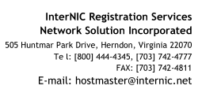

## Struktur IP Address

- IP Address terdiri dari bilangan biner sepanjang 32 bit yang dibagi atas 4 oktet dipisah dengan titik (format w.x.y.z).
- Tiap segmen terdiri atas 8 bit yang berarti memiliki nilai desimal dari 0 s/d 255. Range address yang bisa digunakan adalah dari : 0 s/d 255. Range address yang bisa digunakan adalah dari : `00000000.00000000.00000000.00000000` sampai dengan `11111111.11111111.11111111.11111111`
- Jadi, ada sebanyak 232 (lebih dari 4 milyar) kombinasi address yang bisa dipakai diseluruh dunia (termasuk untuk keperluan khusus).
- Untuk memudahkan pembacaan dan penulisan, IP Address biasanya direpresentasikan dalam bilangan desimal. Jadi, range address di atas dapat diubah menjadi address `0.0.0.0` sampai address `255.255.255.255`.

---

- IP address terdiri dari dua bagian :
  - Network ID (disingkat net-ID) atau Network Bit
    - Bagian yang menentukan identifikasi suatu segmen jaringan.
  - Host ID
    - Bagian yang menentukan alamat dari peralatan ( simpul ) dalam jaringan.
- Penggambarannya sama dengan metode alamat rumah kita; misalnya Jl. Patriot adalah net-ID sedangkan nomor-nomor rumah seperti H-16, H-17, H-18, dst adalah host-ID.

## Ilistrasi IP Address

- Contoh IP Address:
  - `202.146.243.90`
  - `167.205.9.35`
  - `192.192.168.141`
- IP Address dalam bilangan desimal & Biner:
  - 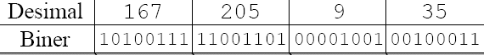

## Konversi Angka

- **Untuk memahami IP address, terlebih dahulu memahami bagaimana cara mengubah angka dari biner ke desimal dan sebaliknya**.

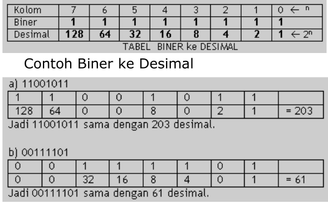

- **Contoh Konversi Desimal ke biner**

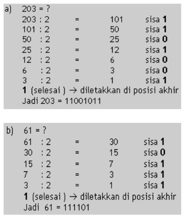

## Contoh Jaringan Net-ID 192.16.10.0

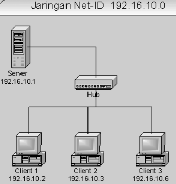

- IP Address 192.16.10.0 adalah net-ID.
- IP Address 192.16.10.1, 192.16.10.2, 192.16.10.3, 192.16.10.6 adalah host ID.
- IP Addres 192.16.10.255 tidak boleh digunakan sebagai host- ID, karena dipakai sebagai **broadcast** (pengirim pesan kepada semua host dalam jaringan 192.16.10.x).

IP Address dengan Net-ID diawali dengan oktet pertama 127 seperti 127.x.x.x tidak boleh digunakan, karena dipakai untuk proses **loopback**, seperti contoh 127.0.0.1

## Kelas IP Address

Untuk memudahkan pemahaman Net-ID, Host ID dan pemakaian IP Address, maka IP Address dibagi dalam 3 kelas umum, 2 kelas lainnya dipakai untuk kepentingan multicast dan penelitian

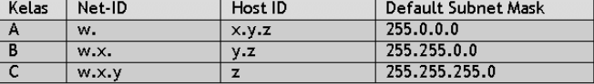

Rentang net-ID setiap kelasnya dapat dilihat dengan menggunakan oktet pertama dan default subnet mask.

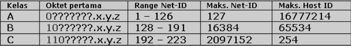

Oktet berisikan 255 berarti untuk net-ID, sedangkan jika berisi 0 berarti untuk host ID.

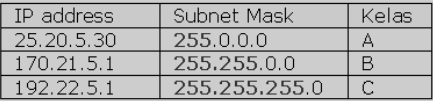

## Kelas IP Address Jaringan Lokal

- Untuk memudahkan mencari alamat website di Internet cukup ditulis DNS (Domain Name System), seperti: [www.cisco.com](www.cisco.com) yang merupakan translasi dari IP Address: [72.163.4.185](72.163.4.185)
- Tetapi untuk jaringan lokal _private network_, penamaan IP Address tidak memerlukan ijin dari InterNIC, karena hanya dapat digunakan untuk keperluan jaringan lokal saja.

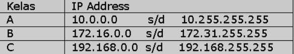

## Jaringan Lokal & Internet

- Bila ingin terhubung ke internet, maka router atau komputer harus memiliki IP Address internet (_public network_).

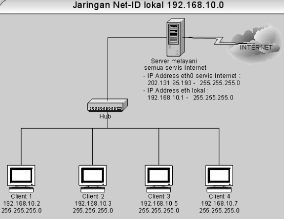

Pada gambar diatas sebuah komputer dapat melayani servis ke Internet : _Router, DNS Server, Mail & Pop Server, Web Server, FTP Server, Database Server, Print Server, Fax Server, dll._

## Pembagian IP Address Banyak Server

- Pemberian IP Addres Internet hanya diberikan kepada komputer server saja, karena sangat mengurangi beban kerja masing- masing.
- IP Internet dialokasikan oleh ISP.
- Misal, alokasi 16 IP dimulai dari 202.131.95.192 sampai dengan 202.131.95.207, maka hanya 14 IP saja yang dapat digunakan, yaitu dimulai dari 202.131.95.193 s/d 202.131.95.206.
- Untuk komputer client cukup diberi IP Adress lokal.

## Contoh Kasus

- ISP Mendapat alokasi IP Address denan spesifikasi:
  - **Net-ID** : 130.200.0.0
  - **Subnetmask** : 255.255.0.0
- Kemudian diinginkan agar menjadi dua Net-ID baru.
- Bagaimana cara subnetting-nya ?

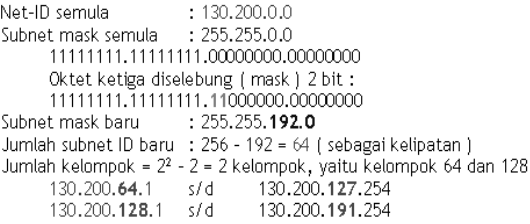

---

- ISP mendapat alokasi IP Address dengan spesifikasi:
  - **Net-ID** : 192.100.81.0
  - **Subnetmask** : 255.255.255.0
- Dinginkan empat Net-ID baru.
- Bagaimana cara subnetting-nya ?

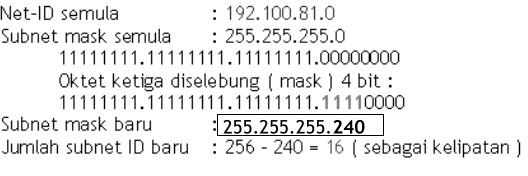

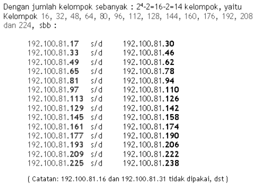

## Mengetahui Jumlah Host per Net-ID

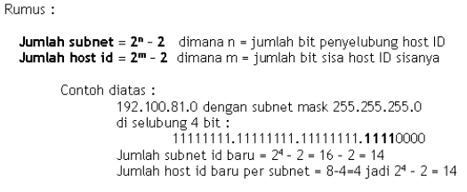

