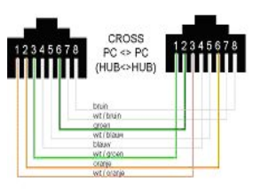

# Piranti Komputer Untuk Komunikasi Jaringan 

## OSI (Open System Interconnection)

Komunikasi antar Komputer dari vendor yang berbeda adalah sangat sulit dilakukan, karena mereka menggunakan protocol dan format data yang berbeda-beda.

Sehingga *International Organization for Standardization* (ISO) membuat suatu arsitektur komunikasi yang dikenal sebagai *Open System Interconnection* (OSI) model yang mendefinisikan standar untuk menghubungkan komputer-komputer dari vendor-vendor yang berbeda.

| Lapisan  | Nama   | Fungsi   |  Pelayanan/Protokol  |
|-------------- | -------------- | -------------- | | -------------- |
| 7    | Application     | Menyediakan pelayanan yang langsung mendukung aplikasi pemakai     |  File transfer, e-mail dan akses ke data base.    |
| 6    | Presentation    | Menerjemahkan, kompresi dan enkripsi data.    | ASCII, EBCDIC, MIDI, MPEG, TIFF, JPEG, Quick Time.    | 
| 5    | Session    | Mengkoordinasi komunikasi antara sistem.    | SQL, NETBEUL, RPC, XWINDOWS.    |
| 4    | Transport    | Memungkinkan paket data dikirim tanpa kesalahan dan tanpa dupkilat.    | TCP, UDP, SPX.    |
| 3    | Network    | Menentukan jalur pengiriman dan meneruskan paket ke alamat peralatan lain yang berjauhan.    | IP, IPX, ARP, RARP, ICMP, RIP, OSFT, BGP.    |
| 2    | Datalink    | Mengatur data biner (0 dan 1) menjadi logical group.    | SLIPP, PPP, MTU.    |
| 1    | Physical    | Transmisi  data biner melalui jalur komunikasi.    | 10BaseT, 100BaseTX, HSSI, V35, X21.    |

## Media Access Control (MAC)

Berfungsi membuat frame dari byte 1 dan yang diterima oleh lapisan *physical*, serta memberikan hardware address ke suatu interface.

**6 Heksadesimal untuk kode pabrik** |
**6 Heksadesimal untuk nomor serial unik hos** 

Contoh: MAC address *00660B06A8F3E* dimana **0060B0** adalah kode pabrik, sedangkan **6A8f3E** adalah nomor serial untuk host.

## Media Transmisi

Media transmisi dalam jaringan komputer dibedakan menjadi 3 macam yaitu:

- Media transmisi dengan kabel
- Media transmisi tanpa kabel/WiFi
- Media transmisi dengan satelit (VSAT)

### Pengkabelan

- Lakukan pemeriksaan terhadap kabel yang akan dipasang
- Gunakan pipa penutup agar rapi
- Pemberian tanda pada kabel sebaiknya diterapkan

#### Pemasangan Konektor

- Untuk kabel straight through

 

| Konektor 1   | Konektor 2    |
|--------------- | --------------- |
| Putih Orange   | Putih Orange   |
| Orange    | Orange    |
| Putih Hijau    | Putih Hijau    |
| Biru    | Biru    |
| Putih Biru    | Putih Biru    |
| Hijau   | Hijau   |
| Putih Coklat    | Putih Coklat    |
| Coklat    | Coklat    |

- Untuk Kabel Cross

 

| Konektor 1   | Konektor 2    |
|--------------- | --------------- |
| Putih Orange   | Putih Hijau   |
| Orange    | Hijau    |
| Putih Hijau    | Putih Orange    |
| Biru    | Biru    |
| Putih Biru    | Putih Biru    |
| Hijau   | Orange   |
| Putih Coklat    | Putih Coklat    |
| Coklat    | Coklat    |

#### Pemasangan kartu jaringan

- Buka casing komputer, baik untuk Server maupun untuk workstation
- Setelah casing terbuka, pasang (tancapkan) kartu jaringan ke soket atau slot PCI di komputer.
- Pasang mur di bagian atas sehingga kartu jaringan kokoh dan tidak goyang.
- Setelah selesai tutup casing dan rapikan letak komputer yang sudah dipasang kartu jaringan
- Tancapkan kabel yang telah dipasang konektor RJ45 ke port di Hub dan di komputer
- RJ45 Connector/UTP
- SC Connector (Push-pull locking) / Fiber-optic (untuk Perfect office)
- ST® Connector (Bayonet locking) / Fiber-optic (untuk High perfomans)

#### Fungsi Pin RJ45

 

#### Media Kabel

 

---

 

### WLAN (Insfrastructure)

 

---

 

#### AD-HOC

 

### Media satelit

Dipakai komunikasi jarak jauh (antar provinsi, antar negara, dan antar benua).

 

## Komponen pendukung jaringan  

- HUB (Concentrator).
- Switch.
- Repeater.
- Bridge.
- Router.
- PC
- Sistem operasi
- Protocol pendukung.

 

### HUB (Connector)

Hub akan mengirim paket ke semua komputer yang dihubungkan ke hub tersebut.

**sifat-sifat hub:**

- Aktif, juga menguatkan sinyal (repeater).
- Pasif, tidak menguatkan sinyal hanya meneruskan.
- Intelegent, mempunyai fungsi tambahan contohnya switch.

### Repeater

- Repeater adalah komponen dari suatu jaringan yang bertugas untuk menguatkan data/sinyal yang dilewatkan pada jalur tersebut.

 

### Bridge

- Bridge dan Switch adalah perangkat komunikasi data yang beroperasi secara prinsip pada lapisan kedua (data link layer) di model refrensi OSI.
- Ciri khusu dari jaringan itu adalah menggunakan protocol sama. *Manfaat adanya bridge juga meningkatkan kinerja jaringan karena dapat mengatur trafik jaringan dalam segmen yang kecil.* Dibandingkan dengan router, bridge mempunyai kecepatan yang lebih tinggi.

**Dua macam bridge:** 

- **Bridge Lokal** menghubungkan dua jaringan LAN secara langsung pada area yang sama secara fisik, misalnya bridgeing antar gedung yang berdekatan.
- **Bridge Remote** menghubungkan dua jaringan yang secara fisik berjauhan. Implementasi yang dilakukan biasanya menggunakan kabel telpon dan modem perangkat nirkabel.

 

### Switch

Prinsip-prinsipnya:

- Menggunakan alamat network yang sama pada semua port.
- Membuat tabel berdasarkan alamat MAC.
- Memfilter lalu lintas network berdasarkan informasi MAC.
- Memforward lalu lintas berdasarkan frame.
- Memforward lalu lintas broadcast.
- Bekerja di lapisan data link (OSI).

 

#### Implementasi switch dalam LAN

 

Merupakan hardware yang berfungsi sebagai menghubungkan dua network atau lebih yang berada network id atau arsitekturnya.

Prinsip Kerja:

- Menggunakan alamat network yang berbeda pada semua prot.
- Membuat table berdasarkan alamat layer network.
- memfilter lalu lintas network berdasarkan informasi network.
- Memblokir lalu lintas ke alamat yang tidak diketahui.

### Komputer

Terdiri dari hardware dan software.

Merupakan hardware yang berfungsi untuk menjalankan software sistem operasi (Windows, Linux, Free BSD, Open BSD, dll) dalam sistem jaringan komputer.

### Modem

1. Internal Modem 
  - Modem internal, dipasang pada slot enspansi PCI atau ISA pada sebuah mainboard komputer (tergantung teknologi card modemnya).
2. External Modem
  - Jenis modem ini dipasang diluar komputer dan terhubung pada salah satu port serial (COM port) baik port serial DB_9 atau DB_25 dan port USB. Bahkan sekarang telah keluar teknologi moem dengan kecepatan tinggi bisa menembus rate data 384 Kbps yaitu modem adsl.

- Software Lisensi
  - Salah satu software untuk network yang harus beli lisensinya seperti:
  - Microsoft Windows (Windows 97, Windows 98, Windows ME, Windows XP, Windows 2000P, Windows 2000 Server, Windows 2003 Server, Windows Vista, Windows NT, MikroTiKOS).
- Software non Lisensi
  - Linux, seperti: Slackware, Ubuntuk, Suse, Fedora, RedHat, Vecotor, Debian.
  - BSD : Free BSD, Open BSD.
- Merupakan sebuah aturan yang mendefinisikan beebrapa fungsi yang ada dalam sebuah jaringan komputer, misalnya mengirim pesan, data, informasi dan fungsi lain yang harus ditaati atau dipenuhi oleh sisi penerima (*receiver*) maupun sisi pengirim (*transmitter*) agar komunikasi antar komputer dapat berlangsung dengan benar.
- Contoh: TCP/IP, ICMP, PPP, SMTP, NetBEUI, dll.

#### Contoh protocol dalam Windows

 

## Pengujian

- `ipconfig` \ 
  melakukan verifikasi parameter-parameter konfigurasi TCP/IP pada sebuah melalui command prompt (mengetahui alamat IP)
- `ping` \
  Menguji konfigurasi-konfigurasi TCP/IP dan melakukan diagnosa kegagalan koneksi menggunakan protocol ICMP.

 

