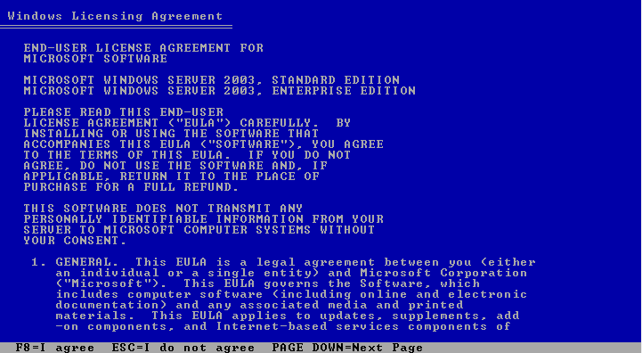

# Install Windows Server 2003 di Virtual box

## Membuat virtual Machine

1. Membuat Vritual Machine dengan kilik icon **new** 
2. Kemudian pada input nama diberikan windows server 2003 dan versinya disesuaikan lalu next 
3. Untuk memory berikan 1024Mb atau 1Gb 
4. Kemudian pilih _create virtual hardisk now_, itu akan membuat virtual hardisk 
5. Lalu untuk _hardisk file types_ pilih **VDI** 
6. Untuk _Storage on Physical hardisk_ pilih _Dynamic allocated_ ini berfungsi untuk gunakan memory yang dibutuhkan saja 
7. _File Location and size_ memilih lokasi file yang akan disimpan dan ukuran nya, untuk lokasinya biarkan saja default dan untuk size nya pilih 20Gb 

## Instalasi Windows server 2003

1. Sebelumnya, pergi ke setting dan pasangkan file iso kedalam Virtual Machine kita 
2. Setelah itu tekan start 
3. Tekan enter untuk melanjutkan setup 
4. Tekan F8 untuk mensetujui lisensi 
5. Tekan Enter untuk melanjutkan partisi 
6. Pilih format NTFS 
7. Tunggu format file system sampai selesai lalu reboot mesin 
8. Pada menu region 
9. Klik customize dan pilih `indonesia` lalu OK dan next
10. Pada menu Personalize 
11. Tuliskan nama dan organisasi kalian Kemudian next 
12. Untuk product key masukan yang telah kalian download pada google drive Kemudian next 
13. Pada menu Licensing models pilih saja `Per Server` 
14. Pada menu Computer name & Administrator Password input kan password kalian 
15. Pada menu Date & Time zone pilih time zone GMT +07.00 Jakarta kemudian next 
16. Pada menu Network setting pilih `Typical Setting` lalu next 
17. Pada menu Workgroup pilih saja default lalu next 
18. Setelah ini tekan `ctrl+alt+del` lalu sudah selesai Installasi windows server 2003 
