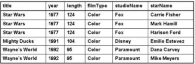

# Pengantar Bahasa Query

## Introduction

- Nama Lengkap : Moh, Muthohir
- Nama Panggilan : Tohir/toink
- Telephone : 081902222100
- Email : muthohir@stekom.ac.id

## Database

- Database
  - Data = Known fact about the real world.
  - Base = Waresouse.
- Database
  - Koleksi dari data yang saling berhubungan yang diorganisasi sedekimian rupa sehingga dapat dimanfaatkan kembali degan cepat dan murah untuk memenuhi berbagai kebutuhan tanpa terjadi pengulangan (redudansi) yang tidak perlu dan di simapan dalam media penyimpanan elektronis.
- Contoh, basis data Universitas berisi informasi
  - Entiti, semisal mahasiswa, fakultas, mata kuliah dan ruang kuliah.
  - Relasi antar entitas, seperti jadual, KHS, Transkip, Nilai dsb.
- Sebuah database dirancang dan dibuat dengna tujuan tertentu.
- Dalam sistem database relational, tabel-tabel database saling berhubungan satu sama lainnya.
- Dalam tabel database akan selalu memiliki.
  - *Attribute Names* (Nama-nama atribut)
  - *Relation Names* (Nama-nama relasi)
  - *Tuples* (Record-record)

## Contoh

- Diberikan tabel mahasiswa beserta data-datanya
-  

## Problem Database

Table Film

Is a **good** design?

----------

- ***Redudancy*** : pengulangan informasi dalam beberapa tuple yang sebenarnya tidak diperlukan.
- ***Update Anomalies*** : Pengubahan informasi dalam satu tuple yang tidak kompak ***Inkonsistensi***.

----------

- ***Deletion Anomalies*** : Kehilangan infomasi akibat penghapusan infromasi.

----------

- ***Insertion Anomalies*** : Penambahan tuple baru yang tidak konsisten.

