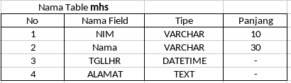

# Pengenalan Structured Query Language

> Apa itu SQL?
> Membuat, Menampilkan, Membuka dan Menghapus Database
> Menambah Record dengan INSERT
> Mengedit Record dengan UPDATE
> Menghapus Record dengan DELETE
> Menampilkan Record dengan SELECT

## Apa itu SQL ?

**SQL** merupakan singkatan dari _Structured Query Language_. SQL atu juga sering disebut sebagai qeury merupakan suatu bahasa (_language_) yang digunakan untuk mengakses database.
SQL dikenalkan pertama kali dalam IBM pada tahun 1970 dan sebuah standar ISO dan ANSII ditetapkan untuk SQL.
Standar ini tidak tergantung pada mesin yang digunakan (IBM, Microsoft atau Oracle).
Hampir semua software database mengenal atau mengerti SQL.
Jadi, perintah SQL pada semua software database hampir sama.

Terdapat 2 (dua) jenis perintah SQL, yaitu:

1. DDL atau Data Definition Language.

- DDL merupakan perintah SQL yang berhubungan dengan pendefinisian suatu struktur database, dalam hal ini _database_ dan _table_. Beberapa perintah dasar yang termasuk DDL ini antara lain:
- `CREATE`, `ALTER`, `RENAME`, `DROP`

2. DML atau Data Manipulation Language

- DML merupakan perintah SQL yang berhubungan dengan manipulasi atau pengolahan data atau _record_ dalam table. Perintah SQL yang termasuk dalam DML antara lain:
- `SELECT`, `INSTET`, `UPDATE`, `DELETE`

## Membuat, Menampilkan, Membuka dan Menghapus Database

### Membuat Database

Sintaks umum SQL untuk membuat suatu database adalah sebagai berikut:

```sql
CREATE DATABASE [IF NOT EXISTS] nama_database;
```

Bentuk perintah di atas akan membuat sebuah database baru dengan nama `nama_database`. Aturan penamaan sebuah database sama seperti aturan penamaan sebuah variable, dimana secara umum nama database boleh terdiri dari huruf, angka dan dan under-score (\_).
Jika database yang akan dibuat sudah ada, maka akan mucul pesan eerror.
Namun jika ingin otomatis menghapus database yang lama jika sudah ada, aktifkan option `IF NOT EXISTS`.
Setiap kita membuat database baru, maka sebenarnya MySQL akan membuat suatu folder (directory) sesuai dengan nama databasenya yang ditempatkan secara _default_ di `C:\mysql\data`.
Di dlam folder tersebut nantinya akan terdapat file-file yang berhubungan dengan table dalam database.

Berikut ini contoh perintah untuk membuat database baru dengan nama "**mahasiswa**" :

```sql
CREATE DATABASE mahasiswa;
```

Jika query di atas berhasil dieksekusi dan database berhasil dibuat, maka akan ditampilkan pesan sebagai berikut:

```
Query OK, 1 row affected (0.02 sec)
```

Untuk melihat database yang baru saja dibuat atau yang sudah ada, dapat menggunakan perintah sebagai berikut:

```sql
SHOW DATABASES;
```

Hasil dari perintah di atas akan menampilkan semua database yang sudah ada di MySQL. Berikut ini contoh hasil dari query di atas:

```
+--------------+
| Database     |
+--------------+
| mahasiswa    |
| mysql        |
| test         |
+--------------+
3 rows in set (0.02 sec)
```

### Membuka Database

Sebelum melakukan manipulasi table dan record yang berada di dalammnya, kita harus membuka atau mengaktifkan databasenya terlebih dahulu. Untuk membuka database "**mahasiswa**", berikut ini querynya:

```sql
USE mahasiswa;
```

Jika perintah atau query di atas berhasil, maka akan ditampilkan pesan sebagai berikut:

```
Database changed
```

### Menghapus Database

Untuk menghapus suatu datababse, sintaks umumnya adalah sbb:

```sql
DROP DATABASE [IF EXISTS] nama_database;
```

Bentuk perintah di atas akan menghapus database dengan nama `nama_database`. Jika databsenya ada maka database dan juga seluruh table di dalamnya akan dihapus. Jadi berhati-hatilah dengan perintah ini! Jika nama database yang akan dihapus tidak ditemukan, maka akan ditampilkan pesan error. Aktifkan option `IF EXISTS` untuk memastikan bahawa suatu database benar-benar ada.

Berikut ini contoh perintah untuk menghapus database dengan nama "**mahasiswa**":

```sql
DROP DATABASE mahasiswa;
```

## Membuat, Mengubah dan Menghapus Table

### Membuat Table

Bentuk umum SQL untuk membuat suatu table secara sederhana sebagai berikut:

```
CREATE TABLE nama_table (
  field1 tipe(panjang),
  field2 tipe(panjang),
  fieldn tipe(panjang),
  primary key(field_key)
)
```

Bentuk umum di atas merupakan bentuk umum pembuatan table yang sudah disederhanakan. Penamaan table dan field memiliki aturan yang sama dengan penamaan database.

MySQL menyediakan berbagai tipe data dengan spesifikasi dan panjan masing-masing. Tipe data untuk field dalam MySQL diantaranya ditampilkan pada table breikut ini:


Sebagai contoh, kita akan membuat table baru dengan struktur sebagai berikut:



Untuk membuat table tersebut di atas, Query atau perintah SQL-nya adalah sebagai berikut:

```sql
CREATE TABLE mhs (
  NIM VARCHAR(10) NOT NULL,
  NAMA VARCHAR(30) NOT NULL,
  TGLLHR DATE,
  ALAMAT TEXT,
  PRIMARY KEY(NIM)
)
```

Jika qeury untuk membuat table di atas berhasil dijalanakn, maka akan ditampilkan pesan sebagai berikut:

```
Query OK, 0 rows affected (0.16 sec)
```

Pada perintah di atas, beberapa hal yang perlu diperhatikan:

- `CREATE TABLE` merupakan perintah dasar dari pembuatan table.
- `mhs` merupakan nama table yang akan dibuat.
- `NIM`, `NAMA`, `TGLLHR`, dan `ALAMAT` merupakan nama field.
- `VARCHAR`, `DATE` dan `TEXT` merupakan tipe data dari field.
- `NOT NULL` merupakan option untuk menyatakan bahwa suatu field tidak boleh kosong.
- `PRIMARY KEY` merupakan perintah untuk menentukan field mana yang akan dijadikan primary key pada table.
- `10` dan `30` di belakang tipe data merupakan panjang maksimal dari suatu filed.
- Untuk tipe data `date` dan `TEXT` ( dan beberapa tipe data lainnya) panjang karakter maksimalnya tidak perlu ditentukan.
- Jangan lupa akhiri perintah dengan titik-koma (;).

Selanjutnya untuk melihat table mhs sudah benar-benar sudah ada atau belu, ketikan perintah berikut ini:

```sql
SHOW TABLES;
```

Perintah diatas akan menampilkan seluruh table yang sudah ada dalam suatu database. Contoh hasil dari perintah di atas adalah sebagai berikut:

```
+---------------------+
| Tables_in_mahasiswa |
+---------------------+
| mhs                 |
+---------------------+
1 rows in set (0.01 sec)
```

Untuk melihat struktur table "**mhs**" secara lebih detail, cobalah perntah atau qeury sebagai berikut:

```sql
DESC mhs;
```

`DESC` merupakan singkatan dari `DESCRIBE` dalam query bisa ditulis lengkap atau hanya 4 karakter pertama dan `mhs` adalah nama table yang akan dilihat strukturnya. Dari peintah di atas, akan ditampilkan struktur table `mhs` sebagai berikut:

```
+----------+-------------+------+-----+---------+-------+
| Field    | Type        | Null | Key | Default | Extra |
+----------+-------------+------+-----+---------+-------+
| nim      | varchar(10) |      | PRI |         |       |
| nama     | varchar(30) |      |     |         |       |
| tgllahir | date        | YES  |     | NULL    |       |
| alamat   | text        | YES  |     | NULL    |       |
+----------+-------------+------+-----+---------+-------+
4 rows in set (0.00 sec)
```

Dari struktur table mhs yang ditampilkan di atas, dapat diketahuii bahwa:

- Terdapat 4 (empat) field dengan tipe masing-masing.
- Primary key dar table `mhs` adalah `NIM`. LIhat kolom **KEY** pada filed `NIM`.
- Untuk field `NIM` dan `NAMA` defaultnya tidak boleh kosong. Lihatlah kolom **NULL** dan **DEFAULT** pada field `NIM` dan `NAMA`.
- Untuk field `TGLLHR` dan `ALAMAT` defaultnya boleh kosong. Lihatlah kolom **NULL** dan **DEFAULT** pada field `TGLLHR` dan `ALAMAT`.

### Mengubah struktur Table dengan ALTER

Untuk mengubah struktur suatu table, bentuk umum perintah SQL-nya sebagai berikut:

```
ALTER TABLE nama_table alter_options;
```

dimana:

- `ALTER TABLE` merupakan perintah dasar untuk mengubah table.
- `nama_table` merupakan nama table yang akan diubah strukturnya.
- `ADD definisi_field_baru` Option ini digunakan untuk menambahkan field baru dengan "**definisi_field_baru**" (namafield, tipe dan option lain).
- `ADD INDEX nama_index`Option ini digunakan untuk menamabahkan index dengan nama "**nama_index**" pada table.
- `ADD PRIMARY KEY (field_kunci)` Option untuk menambahkan primary key pada table.
- `CHANGE field_yang_diubah definisi_field_baru` Option untuk mengubah field_yang_diubah menjadi definisi_field_baru.
- `MODIFY definisi_field` Option untuk mengubah suatu field menjadi definisi_field.
- `DROP nama_field` Option untuk menghapus field nama_field.
- `RENAME TO nama_table_baru` Option untuk mengganti nama table.

Beberapa contoh variasi perintah `ALTER` untuk mengubah struktur suatu table antara lain:

1. Menambahkan field "**AGAMA**" ke table **mhs**

```
ALTER TABLE mhs ADD AGAMA VARCHAR(15) NOT NULL;
```

2. Menambahkan primary key pada suatu table:

```
ALTER TABLE mhs ADD PRIMARY KEY(NUM);
```

3. Mengubah **panjang field agama** menjadi 10 karakter dalam table **mhs**

```
ALTER TABLE mhs CHANGE agama agama VARCHAR(10);
```

4. Mengubah **tipe field agama** menjadi char(2) dalam table **mhs**.

```sql
ALTER TABLE mhs MODIFY agama char(2) NOT NULL;
```

5. Menghapus field **agama** dari table **mhs**.

```sql
ALTER TABLE mhs DROP agama;
```

### Menghapus Table

Untuk menghapus sebuah table, bentuk umum dari perintah SQL adalah sebagai berikut:

```sql
DROP TABLE nama_table;
```

Contohnya kita akan menghapus table dengan nama "**mahasiswa**" maka perintah SQL-nya adalah:

```sql
DROP TABLE mahasiswa;
```
