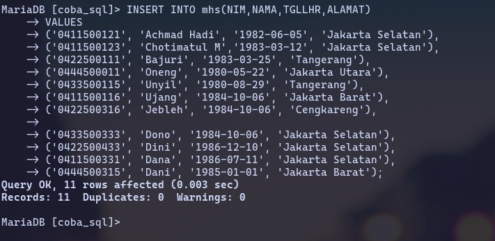
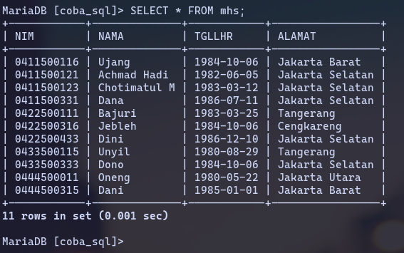

# Pembatasan (Penekangan) Nilai pada Data

**Tujuan**:

Mengatur berbagai pembatasan data dengan perintah `CREATE TABLE ...`, seperti : Mencegah data kosong (**NULL**), mencegah data kembar, mencegah pemasukan data dengan nilai yang tidak valid, mengatur nilai bawaan dsb.

## Mengatur Agar Data Selalu di isi

```sql
CREATE TABLE karyawan (
  nip CHAR(5) NOT NULL,
  nama_peg CHAR(20) NOT NULL,
  gaji INT,
  tgl_lahir DATE,
  kota CHAR(10),
  departemen CHAR(15)
);
```

**Catatan**: Klausa `NOT NULL` yang ditambahkan pada `nip` dan `nama_peg` menyatkan bahwa kedua kolom tersebut harus diisi (tidak bisa berupa `NULL`).

## Menentukan Kunci Primer

```sql
CREATE TABLE karyawan (
  nip CHAR(5) NOT NULL PRIMARY KEY,
  nama_peg CHAR(20) NOT NULL,
  gaji INT,
  tgl_lahir DATE,
  kota CHAR(10),
  departemen CHAR(15)
);
```

**Catatan:** Pada pencitpaan table diatas, kolom `nip` dijadikan sebagai kunci primer (`PRIMARY KEY`). Kunci primer menyatakan bahwa nilai tidak boleh berupa `NULL`. Implikasi dari kunci primer, kolom bertindak sebagai kunci primer tidak bisa mengandung data kembar.

## Membuat Kunci Komposit

```sql
CREATE TABLE karyawan (
  nip CHAR(5) NOT NULL ,
  nama_peg CHAR(20) NOT NULL,
  gaji INT,
  tgl_lahir DATE,
  kota CHAR(10),
  departemen CHAR(15),
  PRIMARY KEY(nip, nama_peg)
);
```

**Catatan:** Kunci komposit adalah kunci primer yang tersusun lebih dari satu kolom.

## Membuat Nilai unik

```sql
CREATE TABLE karyawan (
  nip CHAR(5) NOT NULL PRIMARY KEY,
  nama_peg CHAR(20) NOT NULL UNIQUE,
  gaji INT,
  tgl_lahir DATE,
  kota CHAR(10),
  departemen CHAR(15),);
```

**Catatan:** Penambahan kata `UNIQUE` pada kolom `nama_peg` menyatakan bahwa tidak boleh ada nama pegawai yang kembar.

**Perbedaan PRIMARY KEY dan UNIQUE**

| **PRIMARY KEY**                                         | **UNIQUE**                                                                                                                              |
| ------------------------------------------------------- | --------------------------------------------------------------------------------------------------------------------------------------- |
| Dlam sebuah table keberadaannya hanya dipakai satu kali | Sejumlah kolom yang unik bisa didefinisikan                                                                                             |
| Kolom yang menjadi kunci primer tidak boleh berisi NULL | Kolom yang didefinisikan sebagai kolom **UNIQUE** boleh berisi **NULL** sepanjang kolom tersebut tidak didefinisikan sebagai `NOT NULL` |

## Menambah Record dengan INSERT

Bentuk umum perintah SQL untuk menambahkan record atau data ke dalam suatu tabel adalah sebagai berikut :

```sql
INSERT INTO nama_tabel VALUES (‘nilai1’,’nilai2’,...);
```

tau dapat dengan bentuk sebagai berikut :

```sql
INSERT INTO nama_tabel(field1,field2,...) VALUES (‘nilai1’,’nilai2’,...);
```

tau dapat juga dengan bentuk sebagai berikut :

```sql
INSERT INTO nama_tabel SET field1=’nilai1’, field2=’nilai2’,...;
```

Sebagai contoh, kita akan menambahkan sebuah record ke dalam tabel `mhs` yang telah kita buat sebelumnya. Berikut ini perintah SQL untuk menambahkan sebuah record ke dalam tabel `mhs` :

```sql
INSERT INTO mhs VALUES ('0411500121','Achmad Hadi', '1982-06-05','Jakarta Selatan');
```

Jika perintah SQL di atas berhasil dieksekusi maka akan ditampilkan pesan sebagai berikut :

```
Query OK, 1 row affected (0.00 sec)
```

Setelah perintah SQL di atas berhasil dieksekusi, maka record atau data dalam tabel mhs akan bertambah. Jalankan perintah berikut ini untuk melihat isi tabel `mhs`!

```sql
SELECT * FROM mhs;
```

Dan berikut ini hasil dari perintah SQL di atas :

```
+------------+-----------------+------------+-----------------+
| nim        | nama            | tgllahir   | alamat          |
+------------+-----------------+------------+-----------------+
| 0411500121 | Achmad Hadi     | 1982-06-05 | Jakarta Selatan |
+------------+-----------------+------------+-----------------+
1 row in set (0.19 sec)
```

**Latihan**

Tambahkan 10 data (record) baru ke tabel mhs sehingga isi tabel `mhs` menjadi sebagai berikut !

```
+------------+-----------------+------------+-----------------+
| nim        | nama            | tgl_lahir  | alamat          |
+------------+-----------------+------------+-----------------+
| 0411500121 | Achmad Hadi     | 1982-06-05 | Jakarta Selatan |
| 0411500123 | Chotimatul M    | 1983-03-12 | Jakarta Selatan |
| 0422500111 | Bajuri          | 1983-03-25 | Tangerang       |
| 0444500011 | Oneng           | 1980-05-22 | Jakarta Utara   |
| 0433500115 | Unyil           | 1980-08-29 | Tangerang       |
| 0411500116 | Ujang           | 1984-10-06 | Jakarta Barat   |
| 0422500316 | Jebleh          | 1984-10-06 | Cengkareng      |
| 0433500333 | Dono            | 1984-10-06 | Jakarta Selatan |
| 0422500433 | Dini            | 1986-12-10 | Jakarta Selatan |
| 0411500331 | Dana            | 1986-07-11 | Jakarta Selatan |
| 0444500315 | Dani            | 1985-01-01 | Jakarta Barat   |
+------------+-----------------+------------+-----------------+
```





## Mengedit Record dengan UPDATE

Proses update bisa sewaktu-waktu dilakukan jika terdapat data atau record dalam suatu tabel yang perlu diperbaiki. Proses update ini tidak menambahkan data (_record_) baru, tetapi memperbaiki data yang lama. Perubahan yang terjadi dalam proses update bersifat permanen, artinya setelah perintah dijalankan tidak dapat di-cancel (_undo_).

Bentuk umum perintah SQL untuk mengedit suatu record atau data dari suatu tabel adalah sebagai berikut :

```sql
UPDATE nama_tabel SET field1=’nilaibaru’ [WHERE kondisi];
```

Pada perintah untuk update di atas :

- `UPDATE` merupakan perintah dasar untuk mengubah record tabel.
- `nama_tabel` merupakan nama tabel yang akan diubah recordnya.
- Perintah `SET` diikuti dengan _field-field_ yang akan diubah yang mana diikuti juga dengan perubahan isi dari masing-masing _field_. Untuk mengubah nilai dari beberapa field sekaligus, gunakan koma (,) untuk memisahkan masing- masing _field_.
- Perintah `WHERE` diikuti oleh kondisi tertentu yang menentukan record mana yang akan diedit (diubah). Perintah `WHERE` ini boleh ada boleh juga tidak. Jika WHERE tidak ditambahkan pada perintah update maka semua _record_ dalam tabel bersangkutan akan berubah.

Perhatikan beberapa contoh perintah `UPDATE` tabel `mhs` berikut ini !

1. Mengubah alamat menjadi “Tangerang” untuk mahasiswa yang mempunyai nim 0411500121

- `UPDATE mhs SET alamat='Tangerang' WHERE nim='0411500121';`
- Dan jika query di atas berhasil dieksekusi maka akan ditampilkan hasil sebagai berikut :
- `Query OK, 1 row affected (0.27 sec) Rows matched: 1 Changed: 1 Warnings: 0`

2. Mengubah tanggal lahir menjadi “12 Maret 1983” dan alamat menjadi “Bandung” untuk mahasiswa yang mempunyai nim 0422500316

- `UPDATE mhs SET tgllahir='1982-06-05', alamat='Jakarta Selatan' WHERE nim='0422500316';`

## Menghapus Record dengan DELETE

Proses _delete_ dilakukan jika terdapat data atau record dalam suatu tabel yang perlu dihapus atau dihilangkan. Perubahan yang terjadi dalam proses _delete_ bersifat permanen, artinya setelah perintah dijalankan tidak dapat di-cancel (_undo_). Jadi berhati-hatilah dengan perintah _delete_ !

Bentuk umum perintah SQL untuk menghapus suatu record atau data dari tabel adalah sebagai berikut :

```
DELETE FROM nama_tabel [WHERE kondisi];
```

Pada perintah untuk delete di atas :

- `DELETE FROM` merupakan perintah dasar untuk menghapus suatu record dari tabel.
- `nama_tabel` merupakan nama tabel yang akan dihapus _recordnya_.
- Perintah `WHERE` diikuti oleh kondisi tertentu yang menentukan _record_ mana yang akan dihapus (didelete). Perintah `WHERE` ini boleh ada boleh juga tidak. _Namun demikian_, jika `WHERE` tidak ditambahkan pada perintah delete maka semua _record_ dalam tabel bersangkutan akan **terhapus**.
- **_Jadi jangan lupa menambahkan WHERE jika kita tidak bermaksud mengosongkan tabel_**

Perhatikan beberapa contoh perintah `DELETE` dari tabel `mhs` berikut ini !

1. Menghapus data mahasiswa yang mempunyai nim 0411500331

- `DELETE FROM mhs WHERE nim='0411500331';`
- Dan jika query di atas berhasil dieksekusi maka akan ditampilkan hasil sebagai berikut :
- `Query OK, 1 row affected (0.11 sec)`

2. Menghapus semua mahasiswa yang beralamat di “Bandung”

- `DELETE FROM mhs WHERE alamat='Bandung';`

## Menampilkan Record dengan SELECT

Perintah `SELECT` digunakan untuk menampilkan sesuatu. Sesuatu di sini bisa berupa sejumlah data dari tabel dan bisa juga berupa suatu ekspresi. Dengan `SELECT` kita bisa mengatur tampilan atau keluaran sesuai tampilan yang diinginkan.

Bentuk dasar perintah `SELECT` data dari tabel adalah sebagai berikut :

```
SELECT [field | *] FROM nama_tabel [WHERE kondisi];
```

Perhatikan beberapa contoh perintah `SELECT` dari tabel `mhs` berikut ini !

1. Menampilkan seluruh data atau record (\*) dari tabel **mhs**

- `SELECT * FROM mhs;`
- Dan jika query di atas berhasil dieksekusi maka akan ditampilkan hasil sebagai berikut :

```
+------------+-----------------+------------+-----------------+
| nim        | nama            | tgl_lahir  | alamat          |
+------------+-----------------+------------+-----------------+
| 0411500121 | Achmad Hadi     | 1982-06-05 | Jakarta Selatan |
| 0411500123 | Chotimatul M    | 1983-03-12 | Jakarta Selatan |
| 0422500111 | Bajuri          | 1983-03-25 | Tangerang       |
| 0444500011 | Oneng           | 1980-05-22 | Jakarta Utara   |
| 0433500115 | Unyil           | 1980-08-29 | Tangerang       |
| 0411500116 | Ujang           | 1984-10-06 | Jakarta Barat   |
| 0422500316 | Jebleh          | 1984-10-06 | Cengkareng      |
| 0433500333 | Dono            | 1984-10-06 | Jakarta Selatan |
| 0422500433 | Dini            | 1986-12-10 | Jakarta Selatan |
| 0411500331 | Dana            | 1986-07-11 | Jakarta Selatan |
| 0444500315 | Dani            | 1985-01-01 | Jakarta Barat   |
+------------+-----------------+------------+-----------------+
```

2. Menampilkan _field_ `nim` dan `nama` dari seluruh mahasiswa dalam tabel `mhs`:

- `SELECT nim, nama FROM mhs;`
- Jika query di atas berhasil dieksekusi maka akan ditampilkan hasil sebagai berikut:

```
+------------+-----------------+
| nim        | nama            |
+------------+-----------------+
| 0411500121 | Achmad Solichin |
| 0411500123 | Chotimatul M    |
| 0422500111 | Bajuri          |
| 0444500011 | Oneng           |
| 0433500115 | Unyil           |
| 0411500116 | Ujang           |
| 0422500316 | Jebleh          |
| 0433500333 | Dono            |
| 0422500433 | Dini            |
| 0444500315 | Dani            |
+------------+-----------------+
10 rows in set (0.11 sec)
```

3. Menampilkan data mahasiswa yang mempunyai `nim` **0411500123**

- `SELECT * FROM mhs WHERE nim = '0411500123';`
- Hasil query di atas adalah sbb :

```
+------------+--------------+------------+-----------------+
| nim        | nama         | tgllahir   | alamat          |
+------------+--------------+------------+-----------------+
| 0411500123 | Chotimatul M | 1983-03-12 | Jakarta Selatan |
+------------+--------------+------------+-----------------+
1 row in set (0.06 sec)
```

4. Menampilkan data semua mahasiswa yang beralamat di luar **Jakarta Selatan**

- `SELECT * FROM mhs WHERE alamat != 'Jakarta Selatan';`
- Hasil query di atas adalah sbb :

```
+------------+--------+------------+---------------+
| nim        | nama   | tgllahir   | alamat        |
+------------+--------+------------+---------------+
| 0422500111 | Bajuri | 1983-03-25 | Tangerang     |
| 0444500011 | Oneng  | 1980-05-22 | Jakarta Utara |
| 0433500115 | Unyil  | 1980-08-29 | Tangerang     |
| 0411500116 | Ujang  | 1984-10-06 | Jakarta Barat |
| 0444500315 | Dani   | 1985-01-01 | Jakarta Barat |
+------------+--------+------------+---------------+
5 rows in set (0.02 sec)
```

Berikut ini operator **perbandingan** yang dapat digunakan untuk membandingkan dua buah nilai dalam MySQL :

- **Operator** `=`, akan bernilai TRUE jika nilai yang dibandingkan sama.
- **Operator** `!=` atau `<>`, akan bernilai TRUE jika nilai yang dibandingkan TIDAK SAMA (berbeda).
- **Operator** `>`, akan bernilai TRUE jika nilai yang pertama lebih besar dari nilai kedua.
- **Operator** `>=`, akan bernilai TRUE jika nilai yang pertama lebih besar atau sama dengan nilai kedua.
- **Operator** `<`, akan bernilai TRUE jika nilai yang pertama lebih kecil dari nilai kedua.
- **Operator** `<=`, akan bernilai TRUE jika nilai yang pertama lebih kecil atau sama dengan nilai kedua.

5. Menampilkan data semua mahasiswa yang beralamat di **Jakarta Selatan** dan lahir pada tahun **1982**.

- `SELECT * FROM mhs WHERE alamat = 'Jakarta Selatan' && YEAR(tgllahir) = '1982';`
- Hasil query di atas adalah sbb :

```
+------------+-----------------+------------+-----------------+
| nim        | nama            | tgllahir   | alamat          |
+------------+-----------------+------------+-----------------+
| 0411500121 | Achmad Solichin | 1982-06-05 | Jakarta Selatan |
| 0422500316 | Jebleh          | 1982-06-05 | Jakarta Selatan |
+------------+-----------------+------------+-----------------+
2 rows in set (0.00 sec)
```

Berikut ini operator **penghubung** yang dapat digunakan untuk menghubungkan antara dua kondisi dalam MySQL :

- **Operator** `&&` atau `AND`, akan menghubungkan dua kondisi dimana akan bernilai TRUE jika kedua kondisi bernilai TRUE.
- **Operator** `||` atau `OR`, akan menghubungkan dua kondisi dimana akan bernilai TRUE jika salah satu atau kedua kondisi bernilai TRUE.
- **Operator** `!`, akan _me-reverse_ nilai suatu kondisi logika.

**Keterangan**

Fungsi **YEAR** pada query di atas akan menghasilkan nilai TAHUN dari suatu tanggal. Selain fungsi YEAR, juga terdapat fungsi MONTH yang akan menghasilkan nama BULAN dari tanggal, fungsi DAY yang akan menghasilkanhari dari suatu tanggal, dan masih banyak fungsi lain yang berhubungan dengan tanggal.

6. Menampilkan `nim`, `nama` dan `umur` dari semua mahasiswa.

- `SELECT nim, nama, YEAR(now())-YEAR(tgllahir) AS umur FROM mhs;`
- Hasil query di atas adalah sbb :

```
+------------+-----------------+------+
| nim        | nama            | umur |
+------------+-----------------+------+
| 0411500121 | Achmad Solichin |   24 |
| 0411500123 | Chotimatul M    |   23 |
| 0422500111 | Bajuri          |   23 |
| 0444500011 | Oneng           |   26 |
| 0433500115 | Unyil           |   26 |
| 0411500116 | Ujang           |   22 |
| 0422500316 | Jebleh          |   24 |
| 0433500333 | Dono            |   22 |
| 0422500433 | Dini            |   20 |
| 0444500315 | Dani            |   21 |
+------------+-----------------+------+
10 rows in set (0.05 sec)
```

**Keterangan**

Pada query di atas terdapat fungsi `YEAR` yang akan mengambil tahun dari suatu tanggal. Selanjutnya fungsi `now()` akan me-return tanggal dan waktu sistem saat query dieksekusi. Proses perhitungan umur dialiaskan dengan nama ‘`umur`’. Untuk mengaliaskan gunakan perintah `AS` yang diikuti nama alias.

7. Menampilkan semua mahasiswa `jurusan TI`

- `SELECT * FROM mhs WHERE SUBSTRING(nim,3,2)='11';`
- Hasil query di atas adalah sbb :

```
+------------+-----------------+------------+-----------------+
| nim        | nama            | tgllahir   | alamat          |
+------------+-----------------+------------+-----------------+
| 0411500121 | Achmad Solichin | 1982-06-05 | Jakarta Selatan |
| 0411500123 | Chotimatul M    | 1983-03-12 | Jakarta Selatan |
| 0411500116 | Ujang           | 1984-10-06 | Jakarta Barat   |
+------------+-----------------+------------+-----------------+
3 rows in set (0.19 sec)
```

**Keterangan**

Pada query di atas terdapat fungsi `SUBSTRING` yang berguna untuk memotong suatu string. Format fungsi `SUBSTRING` adalah sebagai berikut : `SUBSTRING(field, awal, panjang)`

8. Menampilkan semua data mahasiswa secara urut berdasarkan `nama` dengan perintah `ORDER BY`

- `SELECT * FROM mhs ORDER BY nama;`
- Hasil query di atas adalah sbb :

```
+------------+-----------------+------------+-----------------+
| nim        | nama            | tgllahir   | alamat          |
+------------+-----------------+------------+-----------------+
| 0411500121 | Achmad Solichin | 1982-06-05 | Jakarta Selatan |
| 0422500111 | Bajuri          | 1983-03-25 | Tangerang       |
| 0411500123 | Chotimatul M    | 1983-03-12 | Jakarta Selatan |
| 0444500315 | Dani            | 1985-01-01 | Jakarta Barat   |
| 0422500433 | Dini            | 1986-12-10 | Jakarta Selatan |
| 0433500333 | Dono            | 1984-10-06 | Jakarta Selatan |
| 0422500316 | Jebleh          | 1982-06-05 | Jakarta Selatan |
| 0444500011 | Oneng           | 1980-05-22 | Jakarta Utara   |
| 0411500116 | Ujang           | 1984-10-06 | Jakarta Barat   |
| 0433500115 | Unyil           | 1980-08-29 | Tangerang       |
+------------+-----------------+------------+-----------------+
10 rows in set (0.01 sec)
```

9. Menampilkan semua data mahasiswa secara urut berdasarkan `nim` secara `DESCENDING`

- `SELECT * FROM mhs ORDER BY nim DESC;`
- Hasil query di atas adalah sbb :

```
+------------+-----------------+------------+-----------------+
| nim        | nama            | tgllahir   | alamat          |
+------------+-----------------+------------+-----------------+
| 0444500315 | Dani            | 1985-01-01 | Jakarta Barat   |
| 0444500011 | Oneng           | 1980-05-22 | Jakarta Utara   |
| 0433500333 | Dono            | 1984-10-06 | Jakarta Selatan |
| 0433500115 | Unyil           | 1980-08-29 | Tangerang       |
| 0422500433 | Dini            | 1986-12-10 | Jakarta Selatan |
| 0422500316 | Jebleh          | 1982-06-05 | Jakarta Selatan |
| 0422500111 | Bajuri          | 1983-03-25 | Tangerang       |
| 0411500123 | Chotimatul M    | 1983-03-12 | Jakarta Selatan |
| 0411500121 | Achmad Solichin | 1982-06-05 | Jakarta Selatan |
| 0411500116 | Ujang           | 1984-10-06 | Jakarta Barat   |
+------------+-----------------+------------+-----------------+
10 rows in set (0.00 sec)
```

10. Menampilkan 5 record (data) pertama dari tabel `mhs` secara urut berdasarkan `nim` dengan ``

- `SELECT * FROM mhs ORDER BY nim 0,5;`
- Hasil query di atas adalah sbb :

```
+------------+-----------------+------------+-----------------+
| nim        | nama            | tgllahir   | alamat          |
+------------+-----------------+------------+-----------------+
| 0411500116 | Ujang           | 1984-10-06 | Jakarta Barat   |
| 0411500121 | Achmad Solichin | 1982-06-05 | Jakarta Selatan |
| 0411500123 | Chotimatul M    | 1983-03-12 | Jakarta Selatan |
| 0422500111 | Bajuri          | 1983-03-25 | Tangerang       |
| 0422500316 | Jebleh          | 1982-06-05 | Jakarta Selatan |
+------------+-----------------+------------+-----------------+
5 rows in set (0.13 sec)
```

**Keterangan**

Pada query di atas bentuk digunakan untuk membatasi hasil tampilan. `LIMIT` banyak digunakan untuk menampilkan data yang relatif banyak. Format fungsi LIMIT adalah sebagai berikut :

`LIMIT awal, jumlah_record`
