# Normalisasi Tabel

## Definisi Normalisasi

- Normalisasi merupakan sebuah teknik dalam logical desain sebuah basis data, teknik pengelompokkan atribut dari suatu relasi sehingga membentuk struktur relasi yang baik (tanpa redudansi)
- Proses normalisasi adalah proses pengelompokan data element menjadi tabel-tabel yang menunjukkan entity dan relasinya.
- Normalisasi adalah proses perancangan sebuah database yang bertujuan untuk menormalkan database yang unormal atau tidak normal (dalam sebuah entitas masih terdapat field atau baris yang redundant)

### Fungsi

- Meminimalisir data yang sama
- Menghindari Anomali
- Memudahkan identifikasi entitas

### Anomasli

- Proses pada baris data yang memberikan efek samping yang tidak diharapkan (ketidakkonsistenan data karena adanya redudansi)

### Jenis Anomali

- Insert data
- update data
- delete data

## Tahap Normalisasi

1NF paling ringan
  |
  |       3NF
  |       BCNF
5NF Paling ketat

- Bentuk Tidak Normal
  - Menghilangkan atribut berrnilai ganda/multi value
- Bentuk Normal Pertama (1NF)
  - Menghilangkan dependensi parsial
- Bentuk Normal Kedua (2NF)
  - Menghilangkan dependensi transitif
- Bentuk Normal Ketiga (3NF)
  - Menghilangkan anomali-anomali hasil dari dependensi fungsional
- Bentuk Normal Byoece-codd (BCNF)
  - Menghilangkan ketergantungan Multivalue
- Bentuk Normal Keempat (4NF)
  - Menghilangkan anomali-anomali yang tersisa
- Bentuk Normal Kelima (5NF)

## Process Normalisasi

Data dalam bentuk tabel -> Pengujian pada beberapa apakah ada Anomali -> Bila ada kesulitan, tabel dipecah menjadi beberapa tabel

## Bentuk Normalisasi

- Bentuk tidak normal (Unnormalized Form)
- Bentuk normal Kesatu (1NF)
- Bentuk normal Kedua  (2NF)
- Bentuk Normal Ketiga (3NF)
- Boyce-Codd Normal Form (BCNF)
- Bentuk Normal KeEmpat (4NF)
- Bentuk Normal KeLima (5NF)

## First Normal Form (1NF)

Table : Sales

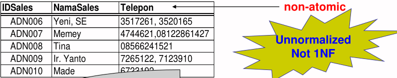 

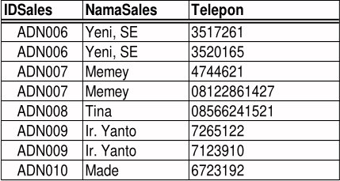 

---

Table : Buku

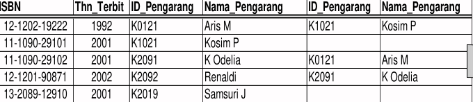 

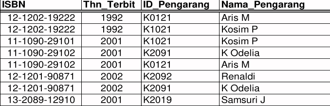 

## Second Normal Form (2NF)

- Suatu relasi disebut memenuhi bentuk normal kedua (2NF) jika dan hanya jika:
  1. Memenuhi 1NF
  2. Setiap atribut yang bukan kunci utama tergantung secara fungsional terhadap semua atribut kunci dan bukan hanya sebagian atribut kunci (fully functional dependent).
- Untuk normalisasi ke bentuk 2NF, maka 1NF didekomposisi menjadi beberapa tabel yang masing-masing memenuhi 2NF.
- Bila terdapat ketergantungan parsial maka : eliminate.
- Tujuan membentuk 2NF:
  - Semantik tabel 2NF menjadi lebih eksplisit (fully FD)
  - Mengurangi update anomali yang masih mungkin terjadi pada 1NF

---

Diketahui Workshop = (NIM, Modul, Biaya, Grade)

Peserta Workshop 

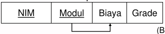 

Key : NIM + Modul
FD  : Modul -> Biaya (Biaya ditentukan oleh Modul yang diambil mahasiswa)

- 1NF 
- Not 2NF, Sebab dalam tabel ini, Biaya tidak bergantugng penuh pada atribut kunci (Nim, Modul)

Tabel Biaya Peserta Workshop

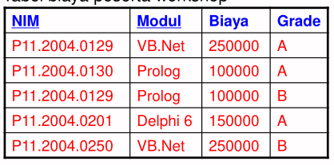 

---

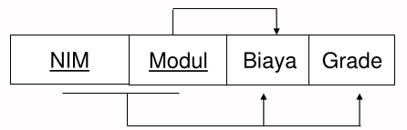 

(NIM, Modul) = Key
(Modul)     -> Biaya (partial)      <= **Eliminate**
(NIM, Modul)-> Grade (Full)

 

**Make Decomposition :** 
Works 1 = (NIM, Modul, Grade)
Works 2 = (Modul, Biaya)

**Fully Dependency** 

---

Workshop

 

menjadi

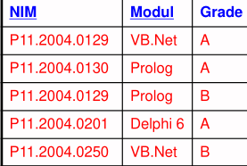 

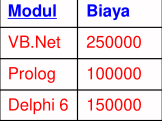  

## Third Normal Form (3NF)

- Suatu relasi disebut memenuhi bentuk normal ketiga (3NF) jika dan hanya jika:
  1. Memenuhi 2NF
  2. Setiap atribut yang bukan kunci tidak tergantung secara fungsional terhadap atribut bukan kunci yang lain dalam relasi tsb (tidak terdapat ketergantungan transitif pada atribut bukan kunci).

**Another Definition :** 

- Suatu relasi disebut memenuhi bentuk normal ketiga (3NF) jika dan hanya jika setiap FD nontrival : X -> A, dimana X dan A atribut (atau kompositnya), memenuhi salah satu kondisi:
  1. X adalah superkey atau
  2. A merupakan angota candidate key

---

- Jika suatu relasi sudah memenuhi 2NF tapi tidak memenuhi 3NF, maka untuk normalisasi ke bentuk 3NF, tabel 2NF didekomposisi menjadi beberapa tabel hingga masing-masing memenuhi 3NF.
- Tujuan membentuk 3NF:
  - Semantik tabel 3NF menjadi lebih eksplisit (fully FD hanya pada primary key).
  - Menghindari update anomali yang masih mungkin terjadi pada 2NF.

**Note:** 

> Jika suatu relasi memenuhi 2NF dan hanya memiliki 2NF dan hanya memiliki tepat satu atribut yang bukan kunci utama maka relasi tersebut memenuhi 3NF

---

Misal Diketahui struktur informasi dari suatu dokumen supplier:

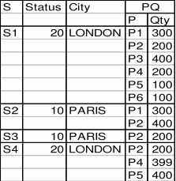 

Akan dibentuk suatu tabel dengan skema TPS = (S, Status, City, P, Qty) dengan (S, P) = primary key dan berlaku FD:\
  S -> Status
  S -> City
  City -> Status

Lakukan normalisasi dari 1NF hingga 3NF

---

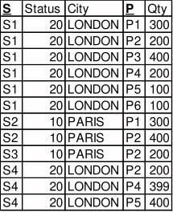 

- 1NF
- Not 2NF

Problem:

- Redudansi -> inconsistency low speed process
- Anomaly: **S** -> (Status, City) tapi kita tidak bisa insert data (S5, 30, Jakarta) tanpa diikuti data P (Khususnya) dan Q. Menghapus 1 baris data akan juga merusak keutuhan informasi.
- Solusi: Dekomposisi menjadi TPS1 dan TPS2

---

TPS1

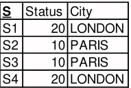 

- 1NF
- 2NF
- Not 3NF (trans.) S->City City->Status
- Sekarang kita dapat menambah data (S5, 30, Jakarta) dengan aman 
- Tapi masih ada anomaly: Karena City -> Status maka kita tidak bisa entry data City baru sebelum Status punya nilai. Penghapusan 1 baris sebagian data city juga bisa merusak keutuhan informasi S.
- Selain itu, masih ada redudansi pada Status dan City

TPS2

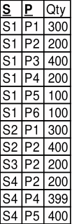 

- 1NF
- 2NF
- 3NF, redudansi partial -> not potensial -> better then previsous redundant 

We may not eliminate all redundant but we make it's minimize

---

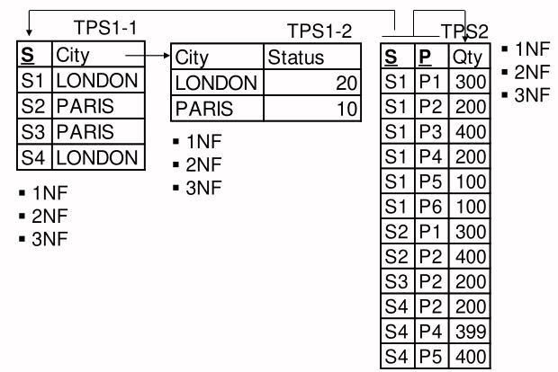 

## Boyce Codd Normal Form (BCNF)

**Contoh :** 
Diketahui tabel R=(A, B, C)
dengan FD : AB -> dan C -> B. apakah:

- 3NF
- BCNF
- R memenuhi 3NF karena:
  - AB->C; maka AB->ABC, atau A->R. Jadi AB superkey dari R.
  - C->B; maka AC->AB, atau AC->ABC dan AC->R.
  - Jadi AC juga superkey (sekaligus juga candidate key) dari R Karena AB superkey dan C subnet candidate key maka.
- R bukan BCNF karena:
  - AB superkey tetapi C bukan superkey

---

**Studnets** 

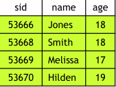 

Students = (sid, name, age)
FD       = sid -> name, age

- BCNF, sebab sid superkey

**Pinjam**

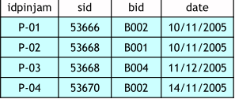 

**Books** 

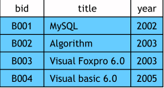 

Books = (bid, title, year)
FD    = bid -> title, year

- BCNF, sebab bid superkey

Pinjam = (idpinjam, sid, bid, date)
FD     = idpinjam -> bid, date

- Bukan BCNF, sebab idpinjam bukan superkey idpinjam -> sid

---

**Pinjam** 

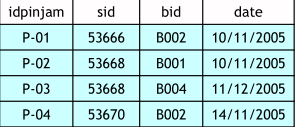 

didekomposisi menjadi:

**Pinjam 1** 

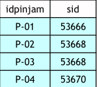 

FD trival -> BCNF

**Pinjam 2** 

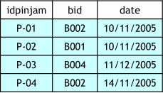 

idpinjam -> bid, date
idpinjam superkey -> BCNF

