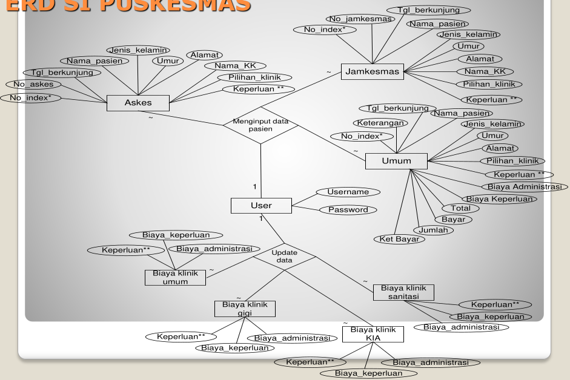

# Entity Relation Diagram (ERD)

## Entity Relation Diagram Model

**Tujuan** 

1. Memahami konsep dasar ER Model.
2. Mengenal notasi ER Diagram.
3. Memahami Entity, Attribute, Entity Set dan Key (Primary Key dan Foreign Key)
4. Memahami relasi dan himpunan relasi.
5. Memahami rasio kardinalitas (1-1, 1-N, M-N)
6. Memahami Participation Constraint (total & partial).

## Lessons

1. ER Data Model.
2. Jenis atribut dan Notasi ER Diagram.
3. Relasi dan Rasio kardinalitas.
4. Participation Constraint Dependencies.

### ER Data Model

- Pemodelan sistem database dapat dilakukan melalui pendekatan perancangan secara **konsepsual** yaitu **Entity Relationship Diagram (ERD) atau ER Diagram**.
- ER Diagram menggambarkan tipe objek mengenai **Data** itu di manajemen, serta **relasi** antara objek tersebut.
- ER Diagram digunakan oleh seorang **System Analyst** dalam merancang database.
- ER Model dibuat berdasarkan  <u>presepsi</u> atau <u>pengamatan dunia nyata</u> yang terdiri atau **entitas** dan **relasi** antar entitas-entitas tersebut.
- Sebuah **database** dapat dimodelkan sebagai:
  - Kumpulan **Entity/Entitas**,
  - **Relationship/Relasi** diantara entitas.
- **Entitas** adalah sebuah objek yang ada (exist) dan dapat dibedakan dengan objek yang lain.
- Entitas ada yang bersifat **konkrit**, seperti: orang (pegawai, mahasiswa, dosen, dll), buku perusahaan; dan ada yang bersifat **abstrak**, saperti: kejadian, mata kuliah, pekerjaan, status dan sebagianya.
- Setiap **entitas** memiliki **atribut** sebagai keterangan dari entitas, misal. Entitas mahasiswa, yang memiliki atribut: nim, nama dan alamat.
- Setiap atribut pada entitas memiliki **Kunci atribut** (**key atribut**) yang bersifat **unik**.
- Beberapa atribut juga dapat diterapkan sebagai **Calon Kunci (candidate key)**.
  <u>Misal</u>
  - Entitas **Mahasiswa** dengan atribut **NIM** sebagai key Attribut.
  - Entitas **Dosen** dengna **NID** sebagai key atribut, dan sebagainya.
- Beberapa entitas kemungkinan tidak memiliki atribut kunci sendiri, entitas demikian disebut **Entitas Lemah (Weak Entity)**.

### Jenis atribut dan Notasi ER Diagram

- Ada beberapa notasi yang digunakan untuk membuet ER Diagram. Misal. notasi **Chen** , **Martin** , **El Masri** dan **Korth**, akan tetapi pada umumnya adalah sama.
- Perbedaannya adalah pada pemilihan simbol-simbol yang digunakan.
- Pada materi ini, digunakan notasi **El Masri** karena lebih umum banyak digunakan dan mudah dibaca dan dimengerti.

 

### ER Data Model 

- **Entitas Lemah (Weak Entity)** adalah entitas yang keberadaannya sangat bergantungan dengan entitas lain.
  - Tidak memiliki **Key Attribute** sendiri.
  - Entitas tempat bergantung disebut **Identifying Owner/Owner.**
  - Entity lemah tidak memiliki identifier-nya sendiri.
  - Atribut entitas lemah berperan sebagai **Partial Identifier** (identifier yang berfungsi secara sebagian )

 

**Jenis-Jenis Atribut:** 

- **Simple / Atomic Attribute:** adalah atribut yang **tidak dapat dibagi-bagi lagi** menjadi atribut yang lebih mendasar.
- **Composite Attribute:** atribut yang terdiri dari beberapa atribut yang lebih mendasar/lebih kecil lagi.
  <u>Contoh</u>
  - Atribut `ALAMAT`, terdiri atas atribut `JALAN`, `KOTA`, `KODE_POS`.
  - Atribut `NAME`, terdiri atas atribut `FNAME`, `MNAME`, dan `LNAME` pada suatu entitas (`EMPLOYEE`).
- **Single-Valued Attribute:** atribut yang hanya memiliki satu harga/nilai.
  <u>Contoh</u>
  - Atribut `UMUR` pada entitas `PEGAWAI`
  - Atribut `LOCATIONS` pada entitas `DEPARTEMENT`
- **Null Values Attribute:** adalah atribut dari entitas yang tidak memiliki nilai.
  <u>Contoh</u>
  - Attribute `PENDIDIKAN` `TINGGI` untuk tamtan `SMP`.
- **Derived Attribute:** adalah atribut yang nilainya dapat diisi atau diturunkan dari perhitungan atau algoritma tertentu.
  <u>Contoh</u>
  - Atribut `UMUR`, dapat dihitung dari atribut `TGL_LAHIR`.
  - Atribut `LAMA_KULIAH`, dapat dihitung dari `NIM` yang merupakan kombinasi antara digit tahun dan digit yang lain (26**96** 100...).
  - Atribut `INDEX_PRESTASI`, dapat dihitung dari `NILAI` yang diperoleh `MAHASISWA`.
  - 

### Relasi dan Rasio kardinalitas.

Menjelaskan batasan jumlah keterhubungan satu entity dengan entity lainnya.
Jenis Cardinality Ratio

- **1 : 1 (One-To-One)** 
  - Sebuah entity A diasosiasikan pada sebuah entity B, dan sebuah entity B diasosiasikan dengan paling banyak sebuah entity A.
  -  
  -  
- **1 : N (One-To-Many)** 
  - Sebuah entity A diasosiasikan dengan sejumlah entity B, tetapi entity B dapat diasosiasikan paling banyak satu entity
  -  
- **N : 1 (Many-To-One)** 
  - Suatu entity A dapat diasosiasikan dengan paling banyak sebuah entity B, tetapi entity B dapat diasosiasikan dengan sejumlah entity di A.
  -  
- **M : N (Many-To-Many)** 
  - Suatu entity A dapat diasosiasikan dengan sejumlah entity B dan entity B dapat diasosiasikan dengan sejumlah entity di A.
  -  

---

- **Relasi** adalah hubungan antar entitas.
- **Relasi** dapat memiliki **atribut**, dimana adi adanya transaksi yang menghasilkan suatu nilai tertentu.

 

**Penjelasan**

- Bentuk ER diatas antara Mahasiswa Mengambil Mata_Kuliah, tentunya ada Nilai yang dihasilkan.
- Dimana atribut `Nilai` ditempatkan?
- Jika atribut `Nilai` ditempatkan pada entitas `Mahasiswa` (dimana `Nilai` merupakan salah satu atribut dari entitas `Mahasiswa`), maka semua mata kuliah yang diambil oleh seorang mahasiswa menghasilkan nilai yang sama (**tidak realistis**).
- Jika atribut `Nilai` ditempatkan pada entitas `Mata_Kuliah` (dimana `Nilai` merupakan salah satu atribut dari entitas `Mata_Kuliah`) maka semua mahasiswa yang mengambil mata kuliah tertentu akan memiliki nilai yang sama (**tidak realistis**).
- Atribut `Nilai` harus ditempatkan pada relasi `Mengambil`,  yang berarti seorang mahasiswa tertentu yang mengambil mata kuliah tertentu, akan mendapatkan nilai tertentu pula.

---

**Derajad Relasi** 

- **Derajat Relasi** adalah jumlah entitas yang berpartisipasi dalam suatu relasi.
- Derajat Relasi berupa:
  - Unary Relationship (Relasi Berderajat 1)
  - Binary Relationship (Relasi Berderajat 2)
  - Ternary Relationship (Relasi Berderajat 3)

**Unary Relationship (Relasi Berderajat 1)** 

- adalah relasi dimana entitas yang terlibat hanya 1.
- Sering disebut relasi rekursif (recursive relationship).

<u>Contoh</u>

 

**Binary Relationship (Relasi Berderajat 2)**

- Atau relasi **Biner** adalah relasi yang melibatkan 2 entitas.

<u>Contoh</u>

 

**Ternary Relationship (Relasi Berderajat 3)**

- adalah relasi tungal yang menghubungkan 3 entitas yang berbeda.

<u>Contoh</u>

 

### Participation Constraint Dependencies.

- Menunjukan apakah **keberadaan** suatu **entitas** bergantung **penuh / tidak** dengan entitas relasinya.
- Batasan (*constraint*) adalah jumlah **minimum** relasi dimana tiap entitas dapat ikut berpartisipasi.
- Ada **2 jenis Participation Constraint**:
  1. Partisipasi **Total ( == )** adalah bentuk partisipasi yang menunjukan ketergantungan **penuh** suatu entitas (**semua dan harus**).
  2. Partisipasi **Parsial ( -- )** adalah bentuk partisipasi yang mnujukkan ketergantungan **tidak penuh** suatu entitas (**beberapa, tidak harus semua**).

---

| Rasio kardinalitas   | Participation Constraint    |
|--------------- | --------------- |
| **1:1 One-To-One**   |    |
| **N:1 Many-To-One**   |   |
| **M:N Many-To-Many**   |   |

---

**ERD Si Rawat Inap** 

---

**ERD Si Penjualan Handphone** 

 

---

**ERD Si Akademik** 

 

---

**ERD Si Puskesmas** 

 

## Latihan A

Buat rancangan ER Diagram untuk sistem database **Perpustakaan Kampus** dengan deskripsi sebagai berikut:

1. Sistem database perpustakaan kampus yang melibatkan anggota perpustakaan, koleksi buku, dan pegawai perpustakaan. 
2. Dalam sistem, digambarkan anggota dapat meminjam buku, sedangkan pegawai melayani anggota dan menajemen buku-buku perpustakaan.
3. Seorang anggota dapat meminjam buku lebih dari 1, begitu juga sebaliknya.
4. Seorang pegawai melayani semua anggota perpustakaan, tapi tidak sebaliknya.
5. Dan seorang pegawai juga harus memanajemen semua koleksi buku perpustakaan.
6. Setiap anggota yang datang ke perpustakaan belum tentu datang untuk meminjam buku (mungkin karena hal lain: pingin baca, buku tidak ada/masih dipinjam, dll), begitu juga sebaliknya.
7. Seorang pegawai perpustakaan, harus melayani anggota (spt: resigtrasi, pelayanan, dll), begitu juga sebaliknya.
8. Dan pegawai juga harus memanajemen koleksi buku perpustakaan, begitu juga sebaliknya.
9. Pada anggota, yang harus dicatat yaitu id anggota, nama, status (dosen, mahasiswa), id status (NIP, NIM), alamat, no telepon.
10. Pada buku yang harus dicatat adalah id buku, judul, pengarang, penerbit
11. Pada pegawai, yang harus dicatat adalah id pegawai, nama, alamat, no telepon.
12. Setiap terjadi peminjaman buku, harus dicatat tanggal meminjam, tanggal kembali dan jumlah buku yang dipinjam.
13. Setiap pegawai memanajemen buku, tercatat tanggal buku saat pertama kali di-entry.
14. Dan pegawai juga harus mencatat tanggal registrasi anggota perpustakaan saat melayani anggota / pengunjung (calon anggota).

**Soal** 

Buat rancangan ER Diagram dari deskripsi diatas, sertakan pula relasi kardinalitas beserta Key

## Latihan B

Sebuah perusahaan jasa sewa mobil **“CV. Sewo Car”**, memiliki spesifikasi database sebagai berikut:

1. Sebuah rental mobil yang disewakan kepada pelanggan.
2. Tiap pelanggan dapat menyewa labih dari satu mobil dalam sekali transaksi, akan tetapi tidak sebaliknya dan sewaktu-waktu mobil juga tidak dapat disewakan karena kemungkinan keterbatasan kendaraan.
3. Setiap kali transaksi, terjadi sebuah perjanjian kontrak antara kedua belah pihak dengan adanya catatan kode kontrak, batas tanggal sewa, jumlah mobil yang disewa, dan harga total.
4. Pada pelanggan yang harus dicatat adalah nomor pelanggan, nama, alamat, no telepon (rumah, HP, kantor, dll), no KTP.
5. Pada mobil yang harus dicatat adalah Id mobil, no plat mobil, tahun pembuatan, merk (Toyota, Honda, Daihatsu, Suzuki, Nissan, dll), jenis (Kijang, Innova, Altis, Vios, Xenia, Katana, dll), tipe (LX, LGX, V-VTI, dll), jumlah penumpang, jumlah armada, bahan bakar dan harga sewa.

**Soal** 

Buat rancangan ER Diagram dari deskripsi diatas, sertakan pula relasi kardinalitas beserta batasan partisipasi total/parsialnya.

