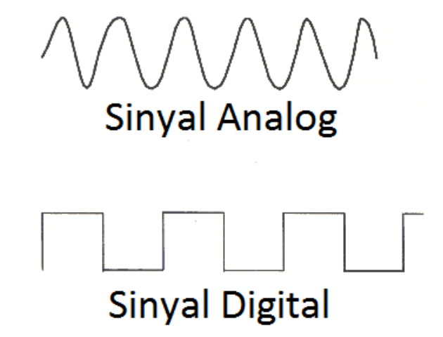
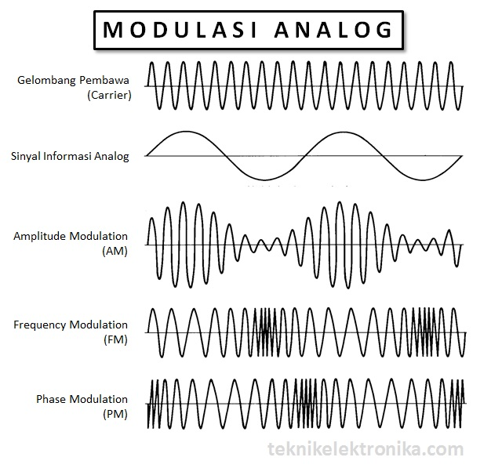
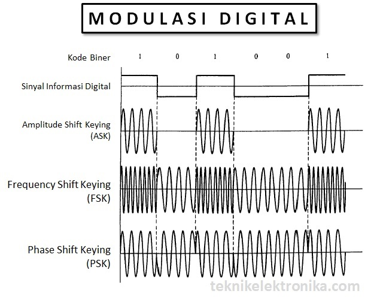

# Pengeolahan Signal

## Bentuk Sinyal

### Analog Signal

**Bentuk Sinyal gelombang sinusioda/*sinus wave*** 

### Digital Signal

**Bentuk Sinyal *discret* berbentuk gelombang kotak/ *squere wave*** 

 

## Modulasi Singal

 

- Sound
- Video
- Radio Broadcast
- Sinyal HP gsm cdma
- Sinyal navigasi
- Sinyal televisi
- Sinyal black box
- Dll

## Penerapannya

- CD
- LD
- VCD
- MD
- DVD
- BLD
- MP3
- MP4
- WAV
- ***Logical control H/L*** 

## Quiz

1. Buatlah Gambar macam macam bentuk sinyal dan namanya!
2. Jelaskan perbedaan antara sinyal FM dan AM, Bluetooth, Wifi!
3. Sebutkan terapan sinyal tersebut digunakan dimana!

Dikirim email

email = bambang@stekom.ac.id
subject = Sinyal_1_YusrilArzaqi_TKP21.2
