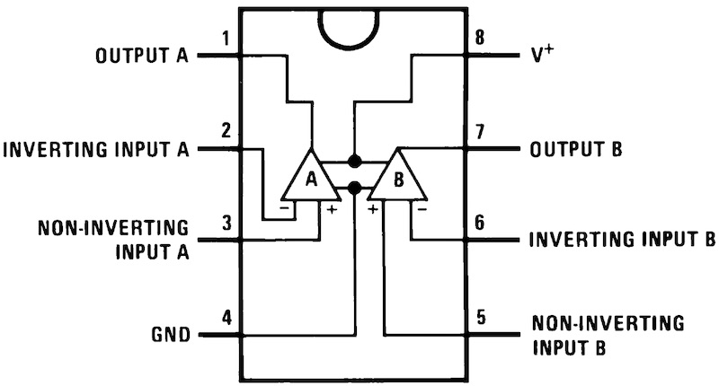
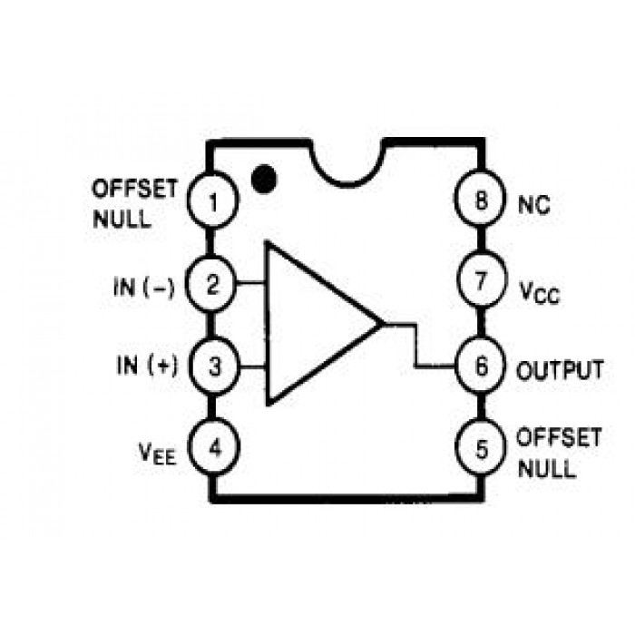
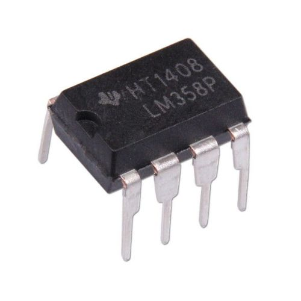

# IC OP AMP

## Deskripsi IC OP AMP

 

 

## Bentuk Fisik IC OP AMP

 

 

## Quiz

1. Gambarlah Simbol OP-AMP
2. Definisikan Pin Diagram IC LM741 dan fungsi masing masing pin.
3. Bagaimana cara memberikan suply pada IC OP-AMP?

