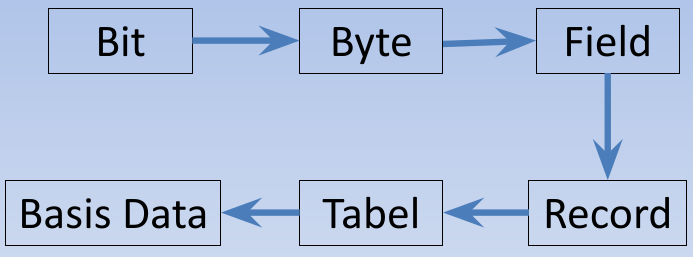

# Basis Data

## Definisi Basis Data

- Himpunan kelompok data yang saling berhubungan dan diorganisasi supaya dapat dimanfaatkan kembali dengan cepat dan mudah.
- Kumpulan data yang berhubungan dan disimpan sedemikian rupa untuk memenuhi berbagai kebutuhan.
- Kumpulan file/tabel/arsip yang saling berhubungan dan disimpan dalam media penyimpanan elektronik.

## Konsep Basis Data

- **BASE** 
  * Kumpulan / Gudang
- **Data**
  * Catatan kumpulan object seperti manusia, barang, hewan, peristiwa, dan sebagainya yang diwijutkan dalam mebtuk huruf, angka, simbol, gambar atau kombinasinya.

## Hirarki Basis Data

- **Bit**
  * Bit merupakan unit data terkecil yang disimpan dalam komputer dan diwakili oleh 0 dan 1.
- **Byte (Karakter)**
  * Byte atau karakter berupa huruf, angka atau simbol yang merupakan gabungan dari beberapa bit.
- **Field**
  * Merupakan unit data yang terdiri dari satu atau beberapa karakter.
  * Unit terkecil dari informasi dalam database.
  * Memiliki nama field yang sesuai dengan data pada field tersebut.
  * Memiliki type data sesuai dengan jenis data yang disimpan.
  * Contoh : Nim, Nama, Tgl Lahir
- **Record**
  * Merupakan kumpulan beberapa field yang berhubungan.
  * Setiap record menyimpan informasi dari suatu entitas.
- **Table**
  * Merupakan kumpulan beberapa record yang sejenis.
  * Contoh : Mahasiswa, Mata Kuliah.

## Penerapan Basis Data

- Kepegawaian : Perusahaan yang memiliki banyak pegawai..
- Inventory : Perusahaan manufaktur>
- Reservasi : Pemesanan kamar/tiket.
- Akutansi : Keuangan.
- Perbankan : Tabungan dan pinjaman.
- Asuransi : Pembayaran premi.
- Pendidikan : Jadwal kuliah dan nilai.
- Rumah sakit : Data perawatan pasien.

