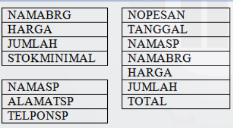
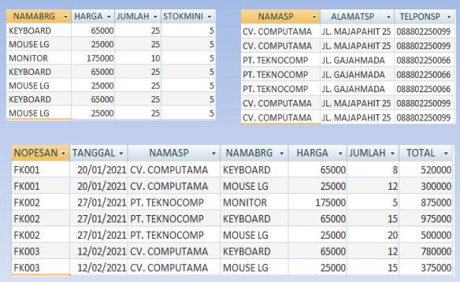
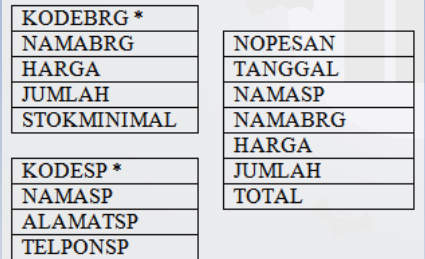
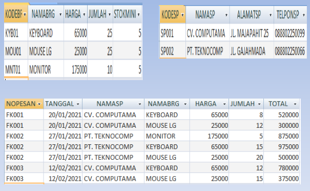
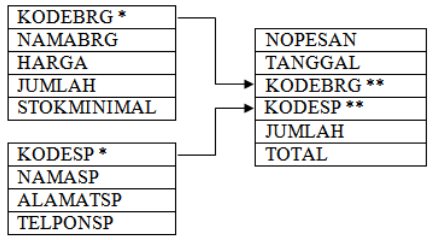
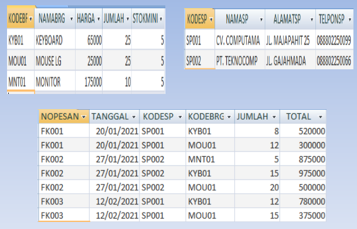
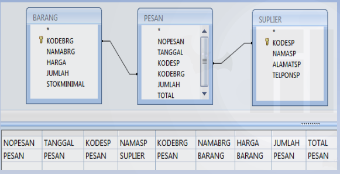
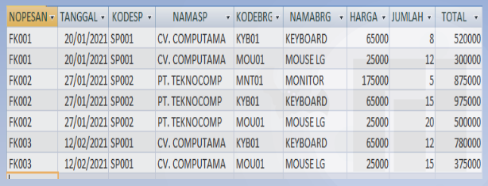

# Normalisasi

**Normalisasi** untuk menentukan apakah relasi sudah baik atau masih melanggar aturan-aturan standar yang berlaku pada suatu relasi yang normal.

**Normalisasi** merupakan proses pengelompokan data kedalam bentuk tabel untuk menyatakan entitas dan hubungan antar entitas dalam bentuk database yang mudah dimodifikasi.

## BENTUK TIDAK NORMAL

Bentuk tidak normal adalah bentuk tabel yang menampilkan semua field yang ada didalam sistem.

| x           | x       |
| ----------- | ------- |
| HARGA       | TANGGAL |
| JUMLAH      | NAMASP  |
| STOKMINIMAL | NAMABRG |
| NAMASP      | HARGA   |
| ALAMATSP    | JUMLAH  |
| TELPONSP    | TOTAL   |

## DATA TIDAK NORMAL

| NAMABRG  | HARGA  | JUMLAH | STOKMINIMAL | NAMASP       | ALAMATSP        | TELPONSP   | NOPESAN | TANGGAL    | NAMASP1      | NAMABRG1 | HARGA1 | JUMLAH | TOTAL  |
| -------- | ------ | ------ | ----------- | ------------ | --------------- | ---------- | ------- | ---------- | ------------ | -------- | ------ | ------ | ------ |
| KEYBOARD | 65000  | 25     | 5           | CV.Computama | JL.Majapahit 25 | 0880224009 | FK001   | 20/01/2021 | CV.Computama | KEYBOARD | 65000  | 8      | 520000 |
| MOUSELG  | 25000  | 25     | 5           | CV.Computama | JL.Majapahit 25 | 0880224009 | FK001   | 20/01/2021 | CV.Computama | MOUSELG  | 25000  | 12     | 300000 |
| MONITOR  | 175000 | 10     | 5           | PT.TEKNOCOM  | JL.GajahMada    | 0880220066 | FK002   | 27/01/2021 | PT.TEKNOCOM  | MONITOR  | 175000 | 5      | 875000 |
| KEYBOARD | 65000  | 25     | 5           | CV.TEKNOCOM  | JL.GajahMada    | 0880224009 | FK002   | 27/01/2021 | PT.TEKNOCOM  | KEYBOARD | 65000  | 15     | 975000 |
| MOUSELG  | 25000  | 25     | 5           | CV.TEKNOCOM  | JL.GajahMada    | 0880224009 | FK002   | 27/01/2021 | PT.TEKNOCOM  | MOUSELG  | 25000  | 12     | 300000 |
| KEYBOARD | 65000  | 25     | 5           | CV.Computama | JL.Majapahit 25 | 0880224009 | FK003   | 12/02/2021 | CV.Computama | KEYBOARD | 65000  | 12     | 780000 |
| MOUSELG  | 25000  | 25     | 5           | CV.Computama | JL.Majapahit 25 | 0880224009 | FK003   | 12/02/2021 | PT.Computama | MOUSELG  | 25000  | 15     | 375000 |

## Bentuk Normalisasi 1

Memindahkan attribut / field yang memiliki kemungkinan data terduplikasi ke tabel yang terpisah

## Data Normalisasi 1

## Bentuk Normalisasi 2

Menentukan tabel Master dan tabel Transaksi. Memberi Primary Key untuk menghendari duplikasi data.

## Data Normalisasi 2

## Bentuk Normalisasi 3

Menentukan relasi antar tabel Master dan tabel Transaksi. Ganti field pada tabel Transaksi yang datanya tergantung pada tabel Master dengan field kunci tabel Master.

## Data Normalisasi 3

## Relasi Tabel Master dan Transaksi

## Data Relasi Tabel

## Tugas

Buat database berisi Tabel Master, Tabel Transaksi dan Relasi Tabel.
