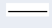

# Entity Relational Diagram (ERD)

## ERD (Entity Relational Diagram)

Entity RElational Diagram berisi komponen-komponen himpunan Entitas dan himpunan Relasi yang masing-masing dilengkapi dengan _atribut-atribut_ yang dilengkapi dengan _atribut-atribut_ yang mempersentasikan seluruh fakta dari dunia nyata.

Relasi antara dua Entitas bisa berupa _One to One Relationship_, _One to Many Relationship_ atau _Many to Many Relationship_.

## Simbol ERD

| Simbol                        | Nama    | Fungsi                    |
| ----------------------------- | ------- | ------------------------- |
|    | Entity  | Objek atau Table          |
|   | Relasi  | Hasil relasi antar Entity |
|  | Atribut | Bagian dari Entity        |
|      | Garis   | Penghubung antar Entity   |

## ERD Pemesanan Barang

Tabel Barang dan Suplier relasi dengan table Pesan menggunakan kardinalitas _Many to Many_ yang berati beberapa Barang bisa di Pesan dari beberapa Suplier.

### Strukutr Table Barang

### Strukutr Table Suplier

### Strukutr Table Pesan

## Perancangan Antar Muka

