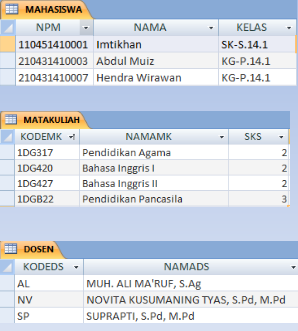
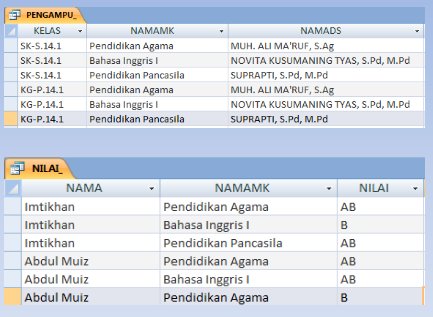

# Basis Data Relasional

- Model basis data antara lain Basis Data Hirarki, Basis Data Jaringan dan Basis Data Relasional
- Basis Data Relasional paling banyak dipakai karena kemudahan dalam penerapannya di dunia nyata
- Pada model Relasional, basis data terdiri dari beberapa tabel 2 dimensi yang terdiri dari lajur mendatar disebut Record dan lajur vertikal disebut Field

## Tabel Master

## Tabel Transaksi

