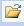
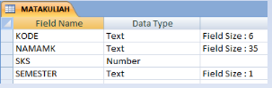
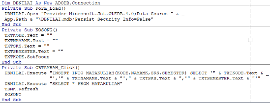
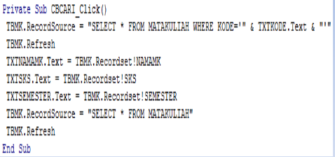
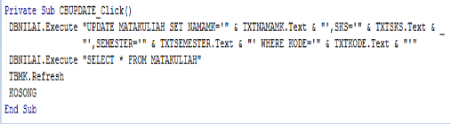
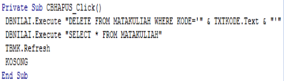
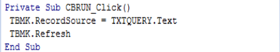

# Perintah Query Di Program Visual Basic

## TUGAS

Membuat Form Mata Kuliah menggunakan Visual Basic

1. Database menggunakan **MS Access**
2. Bahasa pemrograman menggunakan **Visual Basic** 
3. Project diberi nama NamaMhsKelas (contoh: **RizkiSKS201**)
4. Buat folder **RizkiSKS201** (contoh)
5. Tugas dikumpulkan di **Classroom** 

## Membuat File Database Menggunakan Program MS Access

1. Klik tombol **Start -> All Prgram -> Miscosoft Office -> Miscosoft Office Access**.
2. Klik icon **Blank Database** untuk membuat database baru.
3. Klick icon **Browse** .
4. Ketik nama database **DBNILAI** pada kotak **File Name**.
5. Klik **droplist** pada **Save as type**.
6. Klik **Miscosoft Office Access Database (\*.mdb)**
7. Tentukan lokasi penyimpanan file, klik tombol **OK**.
8. Klik tombol **Create** untuk membuat file database.
9. Klik kanan tab **Table1**, klik **Close**.

## Membuat Struktur Table

1. Klik menu **Create**, Klik icon **Table Design**.

2. Klik nama field pada kolom **Field Name**.

3. Tentukan type data pada kolom **Data Type**.

4. Tentukan propertie field.

5. Ulangi langkah 2 s/d 4 untuk field yang lain.

6. Klik icon **Save**, ketik nama tabel **MATAKULIAH**.

7. Klik tombol **OK**.

8. Tampil pesan "There is no ...", klik tombol **NO**.

9. Klik kanan nama table **MATAKULIAH**, klik **Close**.

## Program Visual Basic

### Mengaktifkan Program Visual Basic

1. Buka Windows Explorer, klik drive C:

2. Klik folder Program Files => Microsoft Studio => VB98

3. Doubel klik file **VB6.EXE**

4. Klik tombol **Open,** Klik menu **File => Save Project**

5. Ketik nama form **RIZKISKS201**

6. Klik droplist pada **Save In**

7. Tentukan drive dan folder penyimpanan (**RIZKISKS201)**

8. Klik tombol **Save**

9. Ketik nama project **RIZKISKS201**

10. Klik tombol **Save**

11. Klik propertie Name, ketik **RIZKISKS201**

### Menampilkan Data MATA KULIAH

1. Klik menu **Project => Components**

2. Klik kotak di sebelah kiri **Microsoft DataGrid Control 6.0**

3. Klik tombol **OK**

4. Klik komponen **DataGrid** 

5. Buat kotak dengan draging mouse pada area form

6. Klik propertie **DataSource**

7. Klik **droplist**

8. Klik nama object AdoDc **TBMK**

9. Klik kanan objek DataGrid pada form

10. Klik **Retrieve Fields**

11. Klik tombol **Yes**

12. Klik menu **Run => Start**

### Menambah Data

1. Buat empat objek **TextBox** dengan nama `TXTKODE`, `TXTNAMAMK`, `TXTSKS`, dan `TXTSEMESTER`.

2. Buat objek **CommandButton** beri nama `CBTAMBAH`.

3. Klik **Propertie  Caption**, ketik `TAMBAH`.

4. Klik **Menu View => Code**, ketik kode program berikut:
   
   

5. Klik **menu Start => Run**.

6. Isikan `data Kode`, `Nama Mata Kuliah`, `SKS`, dan `Semester`.

7. Klik tombol `TAMBAH`.

### Mencari Data

1. Buat objek **CommandButton*** beri nama `CBCARI`.

2. Klik **propertie Caption***, ketik `CARI`.

3. Klik **Menu View => Code**, ketik kode program berikut:
   
   

4. Kilk **menu Start => Run**.

5. Isikan data `Kode Mata Kuliah` yang dicari.

6. Klik tombol `CARI`.

### Update Data

1. Buat objek **CommandButton** beri nama `CBUPDATE`.

2. Klik **propertie Caption**.

3. Ketik `UPDATE`.

4. Klik **Menu View => Code**, ketik kode program berikut:
   
   

5. Klik **menu Start => Run**.

6. Isikan Kode yang mau diedit, klik tombol `CARI`.

7. Edit data `Nama`, `Mata Kuliah`, `SKS` , dan `Semester`.

8. Klik tombol `UPDATE`.

### Hapus Data

1. Buat objek **CommandButton** beri nama `CBHAPUS`.

2. Klik **propertie Caption**.

3. Ketik `HAPUS`.

4. Klik Menu **View => Code**, ketik kode program berikut:
   
   

5. Klik **menu Start => Run**.

6. Isikan data `Nim` yang mau dihapus.

7. Klik tombol `CARI`.

8. Klik tombol `HAPUS`.

### Menampilkan Data Tertentu

1. Klik komponen **TextBox**.

2. Buat kotak dengan **draging mouse pada area form**.

3. Klik propertie Name, ketik `TXTQUERY`.

4. Klik komponen **CommandButton**.

5. Buat kotak dengan **draging mouse pada area form**.

6. Klik propertie Name, ketik `CBRUN`.

7. Klik propertie `Caption`, ketik `RUN`.

8. Klik **Menu View => Code**, ketik kode program berikut:
   
   

9. Klik menu **Run => Start**.

10. Ketik perintah Query pada text box `TXTQUERY`.

11. Klik tombol **RUN**.
