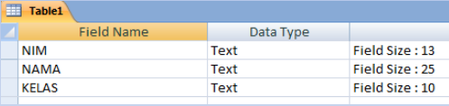
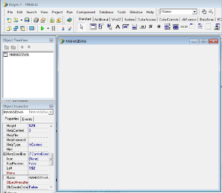
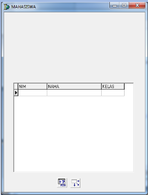
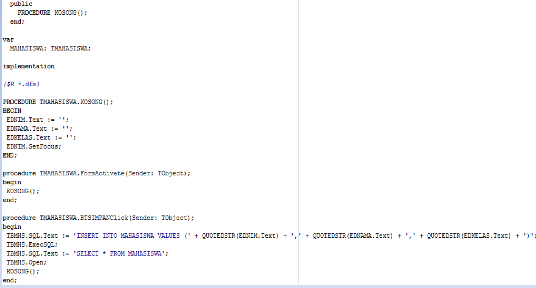
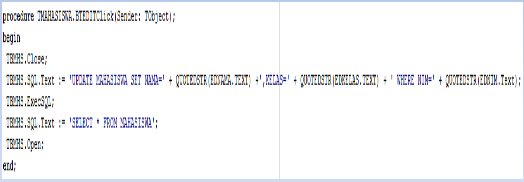
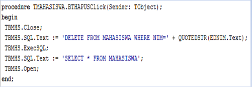

# Perintah Query Di Program Delphi

## Tugas

**Membuat Form Mahasiswa menggunakan Delphi**

1. Database menggunakan **MS Access**.

2. Bahasa pemrograman menggunakan **Delphi**.

3. Project diberi nama NamaMhsKelas (contoh : **RIZKISKS201**)

4. Simpan di folder **RIZKISKS201** (contoh)

5. Tugas dikumpulkan di **Classroom** paling lambat tanggal **27 Januari 2021**

## Membuat Struktur Table

1. Double klik file **DBNILAI.MDB**

2. Klik menu **Create**, Klik ikon **Table Design**

3. Buat struktur tabel di bawah ini:
   
   

4. Klik ikon **Save**, Ketik nama tabel **MAHASISWA**

5. Klik tombol **Ok**

6. Tampil pesan “There is no .....”, klik tombol **No**

7. Klik kanan nama tabel **MAHASISWA**, klik **Close**

## Membuat Project Delphi

1. Klik drive C:

2. Klik folder **Program Files => Borland => Delphi6 => Bin**.

3. Doubel klik file **DELPHI32.EXE**

4. Klik propertie Name, ketik **MAHASISWA**

5. Klik **propertie Position**.

6. Klik droplist, klik `poScreenCenter`.

7. Klik menu **File => Save All**.

8. Klik **droplist** pada Save In

9. Tentukan drive dan folder lokasi penyimpanan

10. Ketik nama unit **UMAHASISWA** pada kotak File Name

11. Klik tombol Save

12. Ketik nama project **RIZKISKS201** pada kotak File Name

13. Klik tombol Save

### Tampilan Program Delphi

### Menampilkan Data Mahasiswa (1)

1. Klik tab `ADO`.

2. Klik komponen `ADOQuery`, klik pada **area form**.

3. Klik **propertie Name**, ketik `TBMHS`.

4. Klik **propertie Connection String**.

5. Klik **tombol browse**, klik tombol `Build`.

6. Klik **Microsoft Jet 4.0 OLE DB Provider**.

7. Klik **tombol Next**.

8. Ketik nama file database **DBNILAI.MDB**.

9. Klik tombol **OK => OK**.

10. Klik **propertie SQL**, **klik tombol browse**.

11. Ketik `SELECT * FROM MAHASISWA`.

12. klik tombol **OK**.

13. Klik **propertie Active**.

14. Klik **droplist**, klik **True**.

### Menampilkan Data Mahasiswa (2)

1. Klik tab Data Access

2. Klik komponen DataSource

3. Klik area for

4. Klik propertie Name

5. Ketik DSMHS

6. Klik propertie DataSet

7. Klik droplist, klik TBMHS

8. Klik tab DataControl

9. Klik komponen DbGrid

10. Buat kotak dengan draging mouse pada area form

11. Klik propertie Name, ketik DBGMHS

12. Klik propertie DataSource

13. Klik droplist, klik DSMHS

### Tampilan Data Mahasiswa

### Menambahkan Data Mahasiswa (1)

Membuat input data dan tombol perintah

1. Klil tab Standard

2. Klik komponen Edit

3. Klik area kosong pada form

4. Klik propertie Name

5. Ketik EDNIM

6. Ulangi langkah 2 s/d 5 untuk membuat TextBox dengan nama EDNAMA dan EDKELAS

7. Klik komponen Button

8. Klik area kosong pada form

9. Klik propertie Name

10. Ketik BTSIMPAN

11. Klik propertie Caption

12. Ketik SIMPAN

### Menambahkan Data Mahasiswa (2)

1. Ketik kode program dibawah ini:
   
   

2. Klik **menu Run => Run**.

3. Isikan data `Nim`, `Nama`, dan `Kelas`.

4. Klik tombol `SIMPAN`.

### Mengedit Data Mahasiswa

1. uat objek **Button** beri nama `BTEDIT`.

2. Klik **propertie Caption**, ketik `EDIT`.

3. Klik **tab Events**.

4. Klik **event OnClick**, Double klik kotak sebalah kanannya

5. Ketik kode program berikut:
   
   

6. Klik menu **Run => Run**.

7. Isikan data `Nim`  yang dimau diedit, klik tombol `CARI`.

8. Edit data `Nama` dan `Kelas`, klik tombol `EDIT`.

### Menghapus Data Mahasiswa

1. Buat objek **Button** beri nama `BTHAPUS`.

2. Klik **propertie Caption**, ketik `HAPUS`.

3. Klik **tab Events**.

4. Klik **event OnClick**, Double klik kotak sebalah kanannya

5. Ketik kode program berikut:
   
   

6. Klik **menu Run => Run**.

7. Isikan data `Nim` yang mau dihapus.

8. Klik tombol `CARI`, klik tombol `HAPUS`.

