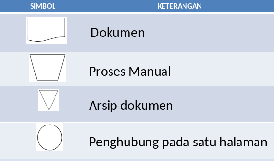
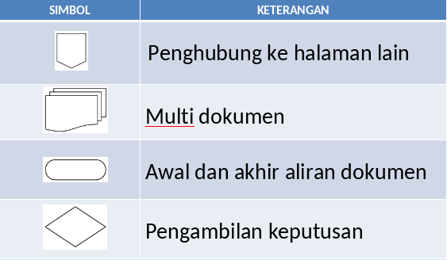
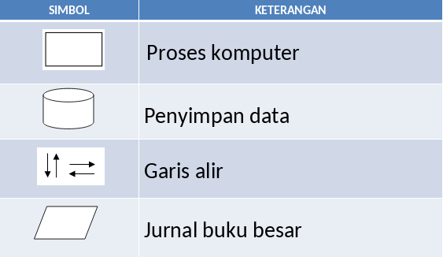
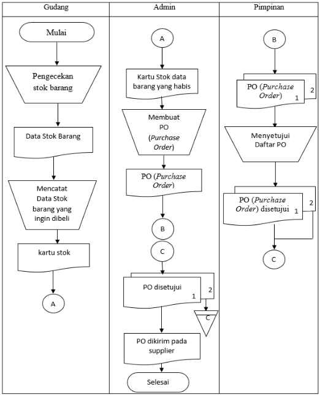

# Flow Of Document

- Bagian-bagian yang mempunyai arus yang mengambarkan langkah-langkah penyelesaian suatu masalah.
- Menggambarkan model sistem informasi secara fisik yang melibatkan beberapa departemen atau pihak yang berhubungan dengan suatu perusahaan.
- Alat bantu untuk mendefinisikan kegiatan.
- Menunjukan awal dan akhir kegiatan.

## Simbol Flow Of Document

## Narasi Persedian Barang

- Bagian Gudang mengecek stok barang menghasilkan dokument stok barang.
- Bagian Gudang mencatat barang yang mau dibeli dan memberikan dokumen ke Administrasi.
- Administrasi membuat dua dokumen PO diberikan kepada pimpinan.
- Pimpinan menyetujui dokumen PO diberikan kepada Administrasi.
- Administrasi mengarsip satu dokumen PO dan mengirimkan dokumen PO ke Suplier.

## Contoh Flow Of Document

## Narasi Peminjaman Buku

- Peminjam apakah sudah angota atau belum, jika belum mendaftar kepada petugas perpustakaan
- Peminjam mencari buku yang akan dipinjam
- Peminjam menyerahkan buku kepada petugas perpustakaan dan buku yang dipinjam dari admin
- Petugas mengkonfirmasi buku yang dipinjam
