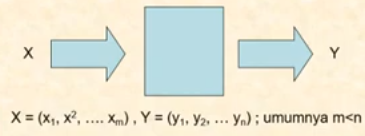
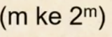
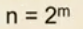
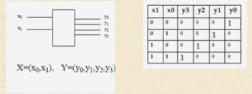
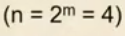
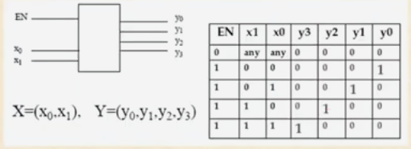
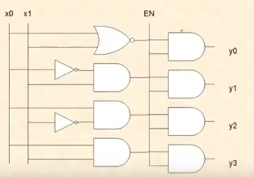

# Rangkaian Logika Kombinasional

## Decoder

- Banyak input dan banyak output
- Untuk mengubah input terkodekan ke output terkodekan (kondisi input dan output berbeda )

### Decoder Biner 

- Set input diterjemahhkan sebagai angka biner.
- Output adalah sebuah "1 dari n" yang dalam kasus ini 

### Decoder Biner  dengan input Enable (EN)

- Decoder biner untuk 2 bit input (m=2) dan output "satu dari n"  dengan input Enable

## Rangkaian Gerbang

Didapatkan fungsi

- y0 = /x0./x1=/(x0+x1)
- y1 = x0./x1
- y2 = /x0.x1
- y3 = x0.x1

