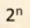
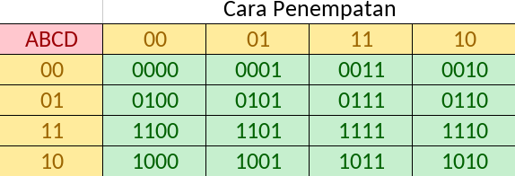

# Karnaugh Map (K-MAP)

- **Karnaugh Map (K-MAP)** merupakan suatu cara berbentuk grafis yang digunakan untuk menyederhanakan persamaan logika atau mengkonversi table kebenaran dalam bentuk yang sederhana dan terstruktur.
- Layaknya table kebenaran, K-MAP bertujuan untuk memperlihatkan hubungan antara input dan output sirkuit logic.

## K-MAP dengan dua variable

- 
- Minterm pada dua kotak yang saling bersinggungan, baik pada baris atau kolom yang sama, dapat dikombinasikan untuk nilai _f_ yang sama.
- Jumlah kotak yang dilingupi 
- K-MAP dengan dua variable input.
- 

## K-MAP dengan Tiga Variable input

## K-MAP dengan Empat Variable input

