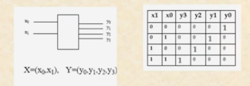

# System Kombinasional (Rangkaian Logika Kombinasional)

## Decoder

- Banyak input dan banyak output.
- Untuk mengubah input terkodekan ke output terkodekan (kondisi input dan output berbeda).
- 

## Decoder Biner (m ke 2m)

- Set input diterjemahkan sebagai angka biner.
- Output adalah sebuah `"1 dari n"` yang dalam kasus ini = 
- 

## Rangkaian Gerbang

Didapatkan fungsi

- y0 = /x0./x1=/(x0+x1)
- y1 = x0./x1
- y2 = /x0.x1
- y3 = x0.x1

### Decoder Biner  dengan input Enable (EN)

- Decoder biner untuk 2 bit input (m=2) dan output "satu dari n"  dengan input Enable

## Contoh : decoder 3 bit menggunakan 2 decoder 2 bit

- Terdapat 3 input, jika  LOW, maka decoder ke 1 aktif (enable) dan decoder. 2 tidak aktif, salah satu output decoder 1 akan HIGH sesuai kombinasi  dan 
- Begitu juga jika  HIGH, output HIGH akan didapatkan dialah satu kakli ouput decoder 2.
- Dengan cara yang sama kita bisa membuat 4 bit decoder (4 ke 16).

## Seven Segment

