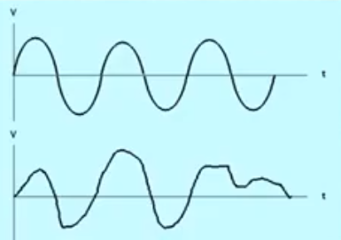
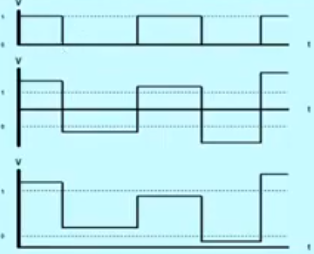

# Sistem Digital

## My Curriculum Vitae

- Full Name : Laksamana Rajendra Haidar A.F
- Nick Name : Haidar
- Address   : Jl.Pemuda No 71 B Jepara
- Phone Number : +(62) 85784091597
- Email Address: admiral.haidar@gmail.com

## Index Value

- Mid Test    : 35%
- Final Test  : 35%
- Exercise    : 30%

## Pendahuluan Konsep dasar Analog dan Digital

### Analog

- Tegangan  (listrik)
- Berat     (massa)
- Suhu      (panas)
- Panjang   (ukuran)
- Kecepatan
- dll

sifatnya kontinyu

### Digital

sudah paten / nilainya sudah ditentukan, sifatnya diskrit

- Pulsa
- 0 dan 1
- Digit
- Biner
- bit
- dll

Keuntungan Rangkaian Digital

- Perancangan sistem digital mudah dilakukan.
- Penyimpanan informasi relatif mudah.
- Ketepatan dan ketelitian lebih tinggi
- Kerja Rangkaian Digital dapat diprogram

Kelemahan Rangkaian Digital

- Besaran Alam umumnya merupakan Besaran Analog.
- Manusia (Tanpa Sadar) Melakukan pendekatan diskrit terhadap nilai-nilai analog.
- Terutama pada tahap awal dan tahap akhir dari rangkaian digital, dimana besaran-besaran analog harus diubah menjadi Besaran digital pada tahap awal, dan sebaliknya pada tahap akhir.

Pengertian-pengertian yang bisa dipakai dalam peralatan digital

- Pulsa <-> Bit (Binary Digit)
- Desimal <-> Biner (basis 2)\
           -> Oktal (basis 8)
           -> Hexa desmal (basis 16)
- High <-> Low
- 1 <-> 0

Gerbang / Gate -> Flip Flop -> Register, Counter, Multiplexer, Demux, Enkoder, Dekoder, dsb -> Komputer -> Alu, Interface, I/O, Memory, Byte

### Sinyal kontinyu

### Sinyal Diskrit

 

### 5 Tahap Pemrosesan dalam suatu sistem digital

- Berdasarkan analog Non elektrik diubah menjadi besaran analog elektrik
- Besaran **Analog elektrik** Diubah menjadi besaran digital
- **Tahap pemrosesan secara digital** 
- Besaran **Digital** diubah kembali menjadi besaran **Analog Elektrik** 

