# Gerbang Logika

## Jenis Jenis Gerbang Dasar

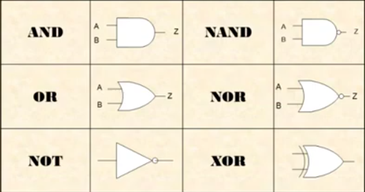 

### Gerbang AND

Gerbang **AND** akan mempunyai output bernilai 1 apabila semua inputnya bernilai 1, selain itu outputnya akan bernilai 0

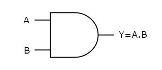 

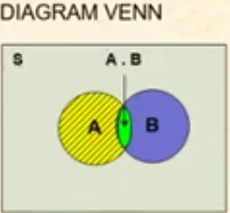 

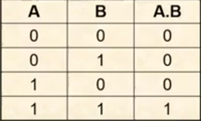 

### Gerbang OR

Gerbang **OR** akan mempunyai output bernilai 0 apabila semua inputnya bernilai 0, selain itu outputnya akan bernilai 1 

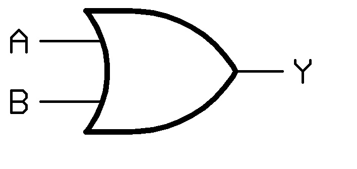 

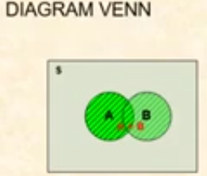 

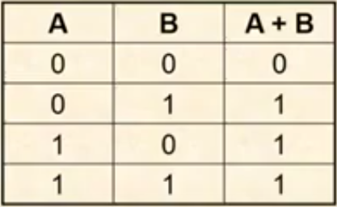 

### Gerbang NOT

Output gerbang **NOT** adalah kebalikan dari inputnya.
Jika inputnya **High**, maka outputnya **Low**, dan Kebalikannya.
Gerbang **NOT** sering disebut **INVERTER** 

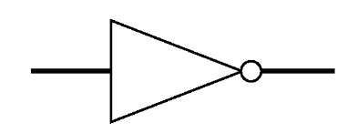 

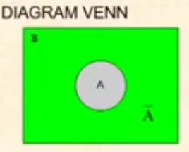 

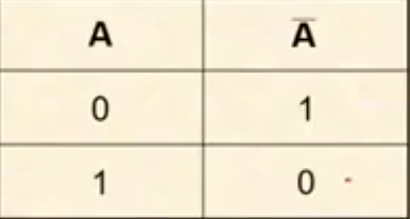 

### Gerbang NAND

Gerbang **NAND** merupakan gabungan gerbang **AND** dan Gerbang **NOT**.
Keluaran gerbang **NAND** adalah Keluaran gerbang **AND** yang diinversikan (di-**NOT**-kan)

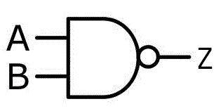 

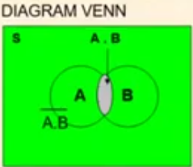 

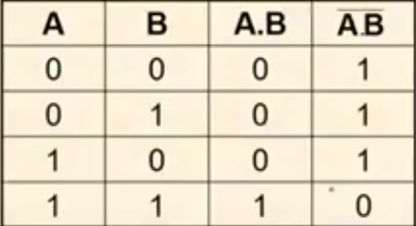 

### Gerbang NOR

Gerbang **NOR** adalah gabungan gerbang **OR** dan gerbang **NOT**.
Keluaran gerbang **NOR** adalah Keluaran gerbang **OR** diinversikan (di-**NOT**-kan)

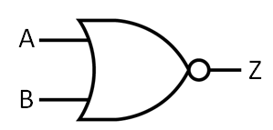 

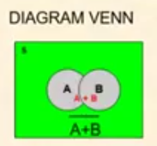 

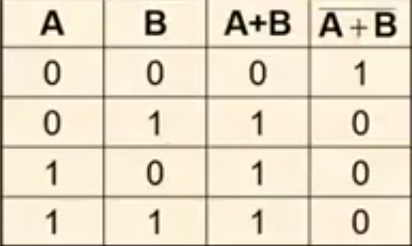 

### Gerbang XOR

Gerbang **XOR** akan mempunyai nilai output 0 apabila nilai inputnya sama.

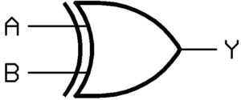 

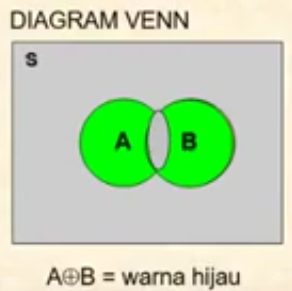 

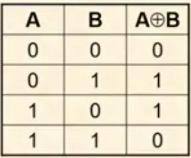 

## Gerbang Dasar dengan Input Lebih dari 2

- Gerbang **AND**, **OR**, **NAND**, dan **NOR** bisa mempunyai input lebih dari 2 (3, 4, dst)
- Sifat yang dimiliki tetap

### Gerbang AND dan OR dengan 3 input

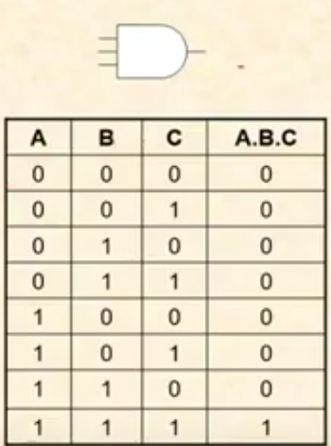

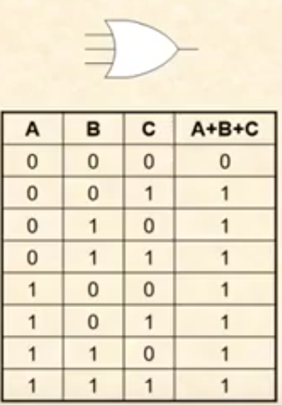 

## Contoh Rangkaian Sederhana

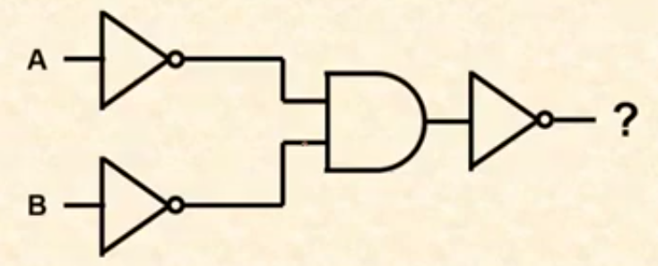 

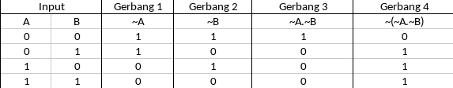 

## Chips / IC Digital Dasar

- Implementasi diagram logik dilakukan dengan menggunakan Rangkaian elektronik digital yang biasanya berbentuk chips/ICJenis 
- Jenis Chip logika yang ada di pasaran biasanya berbentuk IC TTL (Transistor-transistor Logic) atau MOS
- Chip tersebut diidentifikasi dengan part number atau model number.
- Seri IC rangkaian digital standar diawali dengan 74, 4, or 14.
  - 7404 is an inverter
  - 7408 is an AND
  - 7432 is an OR
  - 4011B is a NAND

### Chips

- Chip logika dasar biasanya berbentuk DIP (dual in package) dengan jumlah pin genap. Umumnya adalah 14-pin 
- Pin 1 ditandai dengan adanya titik atau setengah lingkaran.
- Nomor pin urut dibaca dari pin 1 berlawanan arah dengan jarum jam.

