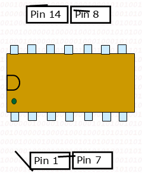
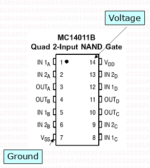
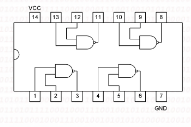
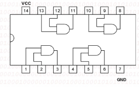
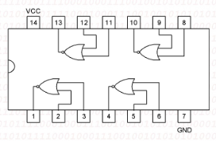
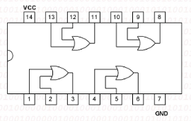
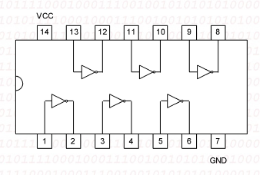
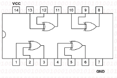

# Integrated Circuit

## Chips / IC Digital Dasar

- Implementasi diagram logik dilakukan dengan menggunakan Rangkaian elektronik digital yang biasanya berbentuk chips/ICJenis 
- Jenis Chip logika yang ada di pasaran biasanya berbentuk IC TTL (Transistor-transistor Logic) atau MOS
- Chip tersebut diidentifikasi dengan part number atau model number.
- Seri IC rangkaian digital standar diawali dengan 74, 4, or 14.
  - 7404 is an inverter
  - 7408 is an AND
  - 7432 is an OR
  - 4011B is a NAND

### Chips

- Chip logika dasar biasanya berbentuk DIP (dual in package) dengan jumlah pin genap. Umumnya adalah 14-pin 
- Pin 1 ditandai dengan adanya titik atau setengah lingkaran.
- Nomor pin urut dibaca dari pin 1 berlawanan arah dengan jarum jam.

 

- Chips memerlurkan tegangan untuk beroperasi
- Vcc yang digunakan biasanya adalah 5 volts dan pin Vcc umumnya pada nomor pin terakhir (untuk DIP 14 berati pada pin 14).
- Pin Ground biasanya pada  pin terakhir yang sejajar dengan pin 1 (pada DIP14 maka no pin GRD biasanya adalah no 7).

 

## Contoh IC TTL Gerbang Dasar

- 74LS00 : Quad 2 input NAND Gate 
   
- 74LS08 : Quad 2 input AND Gate 
   
- 74LS02 : Quad 2 input NOR Gate 
   
- 74LS32 : Quad 2 input OR Gate 
   
- 74LS04 : Hex Inverter 
   
- 74LS86 : Quad 2 input XOR Gate 
   

