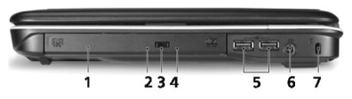
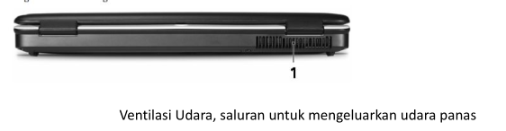
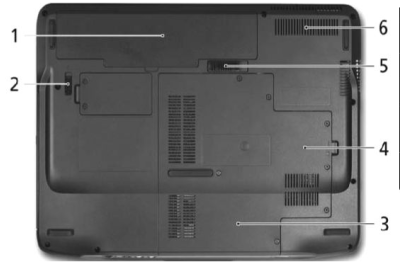

# Analisa Kerusakan Hardware

## Laptop

Komputer sekarang hampir tidak dapat dipisahkan lagi dengan kehidupan kita seharai-hari terutama menyangkut dalamhal pekerjaan, komputer jinjing atau sering disebut laptop, notebook, dan yangterbaru Netop,banyak alasan masyarakat memilih laptop diantaranya karena mudah di bawa kemana-mana atau memiliki mobolitas yang tinggi dan harganyapun sangat terjangkau.

Laptop bisamembantu kitadalam melakukan berbagai hal mulai dari pekerjaan, hiburan, komunikasi dan sebagian orang menganggap laptop sebagai temandekatnya karena mulai banguntidur sampai mau tidur selalu menggunakan laptop. Sebagai pengguna atau user laptop sudah seharusnya mengetahui fitur dan spesifikasi laptop yang dimiliki, mengapa demikian karena apabila ada masalah maka akan lebih mudah untuk menanganinya sendiri.

## Mengenal Bagian-Bagian Laptop

> narnya pada saat anda membeli laptop baru pasti ada buku manual user, nah disitu biasanya dicantumkan langkah-langkah memasang laptop,dan bagian-bagian umum dari laptop.Untuk lebih jelasnya berikut bagian-bagian laptop dan jeroannya:

1. Web Camera
2. Display screen (LayarLCD)
3. Power button
4. Status Indikator
5. Speakers
6. Keyboard
7. Palmrest
8. Touchpad
9. Clickbuttons(left, center and right)
10. Status indicators
11. Empowering key
12. Easy-launch buttons
13. Microphone

|  C  |               Nama Alat               |                               Keterangan                                |
| :-: | :-----------------------------------: | :---------------------------------------------------------------------: |
|  1  |           Acer Crystal Eye            |                 Web Kamera untuk komunikasi lewat video                 |
|  2  |       Display screen (LayarLCD)       |  Biaasadi sebut Liquid crystal display (LCD), untuk menampilkan gambar  |
|  3  |             Power Button              |                              Tombol On/Off                              |
|  4  |           Status Indikator            |    Lampu LED akan menyala untuk menampilkan keadaan apa yang sedang     |
|  5  |               Speakers                |          Speaker Internal kiri dan kanan (stereo audo output)           |
|  6  |               Keyboard                |                    Untuk input data kedalam komputer                    |
|  7  |               Palmrest                |                Tempat telapak tangan pada saat mengetik                 |
|  8  |               Touchpad                | Touch-sensitive pointing device yang mempunyai fungsi sama dengan mouse |
|  9  | Click buttons (left center and right) |      Tombol kilk kanan dan kiri sama dengan fungsi yang jadi mouse      |
| 10  |           Status Indicators           | Lampu LED akan menyala menampilkan setatus Komponen, fungsi pada laptop |
| 11  |           Empo Wireing key            |                  Launching Acer Empowering Technology                   |
| 12  |          Easy-launch buttons          |            Tombol untuk menjalankan aplikasi secara langsung            |
| 13  |              Microphone               |                 Internal microphone untuk merekam audio                 |

## Komonen Laptop

### Bagian Dari Samping kanan

| No  |         Nama Alat          |                              Keterangan                               |
| :-: | :------------------------: | :-------------------------------------------------------------------: |
|  1  |       Optical Drive        |            Internal optical drive, untuk CDsor DVDs blank             |
|  2  |      Optical di akses      |           Lamlu indcator akan menyala apabila sedang aktif            |
|  3  | Optical drive eject button |                   Tombol untuk membuka (_Eject_) CD                   |
|  4  |    Emergency eject Hole    |         Digunakan untuk membuka (_Eject_) CD pada saat Laptop         |
|  5  |       2 USB 2.0 port       |      Sambungan ke USB 2.0 devices (e.g., USB mouse, USB camera)       |
|  6  |         DC-in jack         |                        Sambungan ke AC adapter                        |
|  7  |    Kensington Lock Slot    | Sambungan Kesington-compatible computer security lock. (Kunci Laptop) |

### Bagian Dari Belakang

### Bagian Dari Bawah

| No  |      Nama Alat      |               Keterangan               |
| :-: | :-----------------: | :------------------------------------: |
|  1  |     Battery bay     |             Tempat Battery             |
|  2  |    Battery Lock     |     Mengemci posisi tempat battery     |
|  3  |    Harddisk bay     |            Tempat harddisk             |
|  4  |       Memory        |             Tempat memory              |
|  5  | Battery release 1th |    Tempat untuk melepaskan baterai     |
|  6  |  Ventilationslots   | Supaya Laptop tetap dingin cooling fan |

### Bagian Dari Atas

1. Kamera (Webcam) Kamera berfungsi untuk menambil foto, capture video, dan digunakan untuk video komunikasi atau Teleconference. Camera pada laptop mempunyai resulisi atau ketajaman berbeda-beda. Apabila pada laptop kita tidak ada camera kita bisa membeli usb webcam.
2. LCD Screen (Layar LCD), Setiap laptop menggunakan LCD, beda dengan PC biasa ada yang menggunakan monitor Tabung (CRT) ada pula yang menggunakan LCD.
3. Keyboard merupakan peripheral yang digunakan untuk perintah input, keyboard laptop dan computer desktop hampir sama, perbedaanya hanya terdapat pada susunan angka, kalau pada keyboard PC ada dibagian kanan kalau key board laptop ada ditengah dan untuk mengaktifkannya dengan menekan tombol Fn.
4. Lampu Indicator Lampu led ini berfungsi untuk menunjukkan tanda kepada pengguna hardware apasaja yang sedang bekerja, atau memudahkan pengguna untuk memantau apakah laptopkita dalam keadaan normal atau tidak.
5. Touch Pad Touch pad ini berfungsi untuk menggerakkan pointing device padalayar system operasi atau samaseperti mouse.
6. Tombol power (On/Off), berfungsi atau digunakan untuk menghidupkan dan mematikan laptop, selain tombol power juga terdapat tombol lain misalnya tombol berlogo“e”dan lain-lain.
7. Speaker berfungsi untuk mengeluarkan suara dari software/aplikasi yang dijalan kandari laptop.
8. Audio Port Sebagai speaker output, jadi apabila kita tidak puas atau tidak ingin menggunakan speaker internal pada laptop kita bisa menggunakan port ini untuk menyambungkan amplifier, speaker yang memiliki kapasitas watt dan suara lebih kencang.
9. USB Port, Merupakan media input dan output biasanya digunakan untuk usb mouse,Flash disk, usb modem, printer, dan lain sebagainya.
10. Colokan untuk power adaptor, berfungsi untuk menyalurkan tegangan/arus atau sumbaer daya dari adaptor ke laptop, selain itu juga berfungsi sebagai charger bateray laptop, apabila kita colokkan maka lampu indicator akan menyala.
11. Optical Drive (CD/DVD R/RW) Berfungsi untuk membaca data audio video yang ada pada keeping CD/DVD, selain membaca hardware ini juga bisa digunakan untuk merekam/menulis kedalam kepingan CD/DVD
12. Monitor Output Selain tampilan pada layar LCD laptop kita juga bisa menampilkannya kemedialain seperti Layar monitor CRT, LCD Projecktor dengan menggunakan port ini.
13. Modem Port Setiap laptop rata-rata sudah memiliki modem untuk menghubungkan pengguna ke internet, modem internal pada laptop bisanya berupa modemdial up menggunakan telpon rumah sebagai media koneksi keinternet. Apabila kita ingin berinternet kita tinggal mencolokkan terminal konektor kabel telpon kemodem laptop kemudian setting menggunakan teknonet@instan.
14. LAN Port, diggunakan untuk koneksi ke Jaringan, apabila dikantor atau ditempat kerja kita sudah terdapat jaringan dan kita ingin tergabung keja ringan tersebut maka kita tinggal mencolokkan kabel jaringan ke laptop kita. Selain bisa sharing data kita juga bisa ber internet melalui port ini apabila dalam jaringan sudah terhubung ke internet.
15. Slot PCMICA, Sebuah slot yang digunakan untuk menambah fasilitas lain misalnya PCMCIA Modeom 3d, PCMCIATV, dll.
16. Battery Laptop, Sebagai sumber daya (energi) agar laptop teap menyala.
