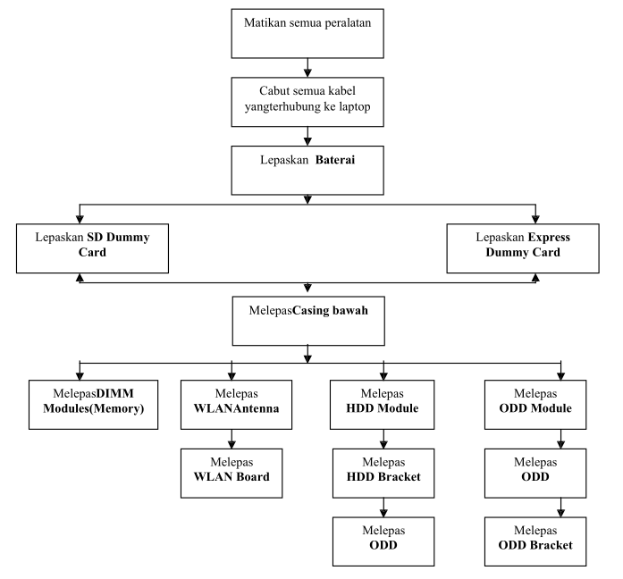

# BAB II (Membongkar Laptop)

## Membongkar Laptop

Setelah kita mengenal bagian luar laptop bagaimana kalau kita mengenali isi laptop.
Kalau kita tidak mengetahui lebih jauh atau secara detaul laptop maka sudah dipastikan kita akan kesulitan untuk melakukan perawatan dan perbaikan secara detail laptop.
Sebelum memulai membongkarr laptop ada beberapa hal yang sebaiknya diketahui, ini berguna untuk kebaikan bersama.

1. Jangan pernah membongkar laptop yang masih garansi (merusak segel) karena bisa menyebabkan hilang jaminan / garansi dari service center.
2. Lepaskan semua AC Adaptop dari laptop.
3. Letakkan di tempat yang rata dan elastis, dan lepaskan batterai dari laptop.
4. Gunakan obeng yang sesuai dengan baut (_screw_) laptop, ada obeng bntang (\*), obeng Plus (+), dan obeng minus (-).
5. Segala kerusakan akibat kelalaian anda bukan tanggung jawab kami.

Membongkar Laptop yang benar dibagi menjadi 3 tahapan penting yaitu :

1. Tahapan (1) bagian luar (External Disassembly).
2. Tahapan (2) dalam / utama (Main Unit Disassembly).
3. Tahaan (3) bagian LCD (LCD Module Disassembly).

### Tahapan 1 Bagian Luar (External Disassembly)

Berikut adalah alur / langkah membongkar bagian laptop (**External Disassembly**)

