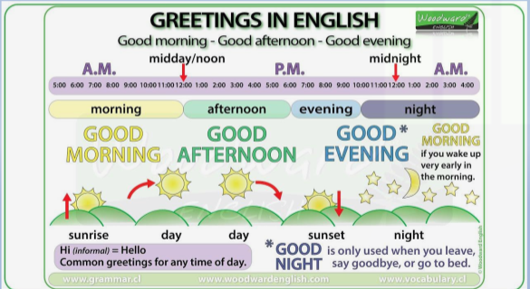

# Greeting and introduction in English

In English, there are numerous ways to say hello.
When you're passing someone, you might say a short hello.
A greeting might also lead to conversation.
There are two kinds of greeting in English, formal greetings and informal greeting.
Friends and family members exchange informal greetings.
Business greetings are more formal than personal greetings.

## Greetings In English

### Formal Greetings

- Good morning, Good afternoon, Good evening.
- It's nice to meet you, Pleased to meet you.
- How have you been ?
- How do you do ?

---

**It's nice to meet you or pleased to meet you**

> These are formal and polite greetings.
> When you use it to greet someone for the first time you meet, it will help you look more respectful to others.
> You have to remember that you only use these greetings the first time you meet someone.
> Then, next time when you meet the same person you can say "It's nice to see you again" to remember him or her or her you have to meet before.

**How have you been ?**

> This pharse is only used by people who have already met before.
> When someone ask, "How have you been ?" they want to know if you've been doing well since they last saw each other.
> Silvia : How have you been ?
> Andriana : I've been finishing my research paper. How about you ?

---

**How do you do ?**

> "How do you do" is very formal and quite uncommon, but it still used by some older people.
> "I'm doing well" is the proper response for this greets.
> Some people alse say "how do you do ?" as the answer for this greeting.

### Informal Greetings

- Hey, Hey man, Hi and Greeting a stranger.
- How's it going ?, How are you doing ?
- What's up ?, What's new ?, What's going on ?
- How's everything ?, How are things ?, How's life ?

---

**Hey, Hey man, Hi and Greeting a stranger**

> The word "hey" and "hi" are commonly used to greet someone among young people instead of "hello".
> You can used "hi" in any casual situation while "hey" is used for people who have already met before.
> You can not used "hey" to a stranger, it will make he/she confused because he/she will remember when you met before.
> The word "hey" doesn't always mean "hello".
> It can be used to call for someone's attention.
> For example, when you talk to your friend but he/she busy with his/her work, you can say "hey" to catch his/her attention.

---

**How's it going ? or How are you doing ?**

> These are informal ways to say, "How are you ?" Stick with "how are you ?" if you're trying to be extremly polite.
> Otherwise, these pharases can be used to greet almost everyone.
> The term "going" is often shortened, making it sound more like "go-in.".
> Depending on the question, you can respond with "it's going well" or "I'm doing well".
> Although it is not grammatically correct, most people simply response "good" - and you can as well.
> When responding to the question "how are you ?" you can also ask "and you ?".

---

**What's up ?, What's new ?, What's going on ?**

> These are some other informal ways of asking, "How are you ?" that are commonly used to greet someone you have met before.
> The majority of people response with "nothing" or "Not much".
> Alternatively, if it feels appropriate to make small talk, you could briefly describe anything new or intersting that is happending in you life before asking, "What about you ?" to continue the conversation.

---

**How's everything?, How are things?, How's life?**

> These are some other ways to ask, "How are you" They can be used to greet anyone, but they are most commonly used to greet someone you already know.
> You can response "good" or "not bad" to these questions.
> Again, if small talk is appropriate, you could share any interesting news about your life and then ask the person "how about you?" or another greeting question.

---

**How's your day?, How's you day going?**

> if you want to ask someone about what happend throughout the day, you can use these greetings, "how's your day?" and "how's you day going?".
> These greetings would be used later in the day and with someone you see frequently.
> You could, for example, ask a co-worker one fo these questions in the afternoon, or a cashier at the greocery store every every evening.
> The grammatically correnct response is "it's going well", but many people simply respond with "fine," "good", or "alright".

---

**Long time no see or it's been a while**

> If you want to greets someone that you haven't seen in a time, form instance, you meet that person unexpectedly, you can used "long time no see" or "it's been a while"
> "How much is a long time ?" It depends on how often you normally see that person.
> For example, you could use one of these greetings if you normally see the person every week, but then don't see them for a few months or more.
> Usually, these English pharases are followed with a question like "how are you", "how have you been?" or "what's new?"

## Expressions to introduce yourself and others

### Introduce your age

**Question** : How old are you ?

**Answer**

- I'm ... years old.
- I'm ...
- I'm over / almost / nearly ...
- I am around your age.
- I'm in my early rwenties / late thirties.

### Introduce your family

**Questions**

- How many people are there in your family ?
- Who do you live with ?
- With whom do you live ?
- Do you have any siblings ?

**Answer**

- There are ... (number) people in my family. There are ...
- There are ... (number) of us in my family.
- My family has ... (number) people.
- I live with my ...
- I am the only child.
- I don't have any siblings.
- I have ... brothers and ... (number) sister.

### Introduce your Birthday / Phone number

**Questions**

- What is your date of birth ?
- When is your birthday ?
- What is your phone number ?

**Answer**

- My birthday is on ...
- My phone number is ...

### Introduce your jobs

**Questions**

- What do you do ?
- What do you do for living ?
- What sort of work do you do ?
- What line of work are you in ?

**Answer**

- I am a/ an ...
- I work as a/ an ...
- I work for (company) ... as a/ an ...
- I'm unemployed,/ I am out of work./ I have been made redundant/ I am between jobs.
- I earn my living as a/ an ...
- I am looking for a job./ I am looking for work.
- I'm retired.
- I would like to be a/ an .../ I want to be a/ an ...
- I used to work as a/ an ... at ... (places).
- I just started as ... in the departement.
- I work in / at a ... (place)
- I have been working in ... (city) for ... yours.

### Introduce Your Hobbies

**Questions**

- What's your hobby ?
- What do you like ?
- What do you like to do ?
- What's your favorite ... ?

**Because : (self-introduction sample)**

- There are many things to see and do.
- This is one of the most beautiful places I have been visited.
- I can relax there.
- It's relaxing / popular / nice

**Answer**

- I like / love / enjoy / ... (sports / moveies / ... )
- I am intersted in ...
- I am good at ...
- My hobby is .../ I am intersting in ...
- My hoobies are .../ My hobby is ...
- I have a passion for ...
- My favirite place is ...
- I sometimes go to ... (places), I like it because ...

### Introduce Your Educations

**Questions**

- Where do you study ?
- What do you study ?
- What is your major ?

**Answer**

- I'm a student at ... (school)
- I study at .../ I am at .../ I go to ... (school)
- I study ... (major).
- My major is ...

### Introduce Your Marital Status

**Questions:**

- What is your martial status ?
- Are you married ?
- Do you have a boyfriend/girlfriend ?

**Answer**

- I'm married/ single / engaged / divorced.
- I'm not ready for a serious relationship.
- I'm going out with a ... (someone).
- I'm in a relationship./ I'm in an open relationship.
- It's complicated.
- I have a boyfriend/ girlfriend / lover
- I have a husband / wife.
- I'm a happily married man/woman.

### Introduce Your Personal Traits

- I am a ... person / I'm ... (character & personality).
- My best quality is ... (character & personality)

**Character & Peronality for self-introduction:**

brave, calm, gentle, courteous, creative, hard-working, rude, unfriendlym unreliable, lazy, stingy, insensitive, ...

### Percakapan

**Two Students (at University)**

|  Name   |                                      conversation                                      |
| :-----: | :------------------------------------------------------------------------------------: |
| Barbara |                 Hello, my name is Barbara. Welcome to our University.                  |
| Chintya |                                   Hi, I am Chintya.                                    |
| Barbara |                                   Nice to meet you.                                    |
| Chintya |                                 Nice to meet you too.                                  |
| Barbara |                            Where do you come from Chintya ?                            |
| Chintya |                          I am from Introduce, how about you ?                          |
| Barbara |                                    I'm from Spain.                                     |
| Chintya |                           Is this your firs time in London ?                           |
| Barbara |               No, I have been living in London for about five yours now.               |
| Chintya |                 I see, have you been studying here for all that time ?                 |
| Barbara |            Yes, this is my third year here, I have got one more year to go.            |
| Chintya |                                What are you studying ?                                 |
| Barbara |       I'm studying Computer Program. I want to be a programmer. How about you ?        |
| Chintya |                         Sound cool. I want to be a journalist.                         |
| Barbara |                                     That's great!                                      |
| Chintya |               I have always wantet to study abroad, so I came to London                |
| Barbara | I see, well good luck to you, I have to go to class now, it was nice talking with you. |
| Chintya |                       Thank you! You too, and have a good class.                       |
| Barbara |                                       Good-bye!                                        |
