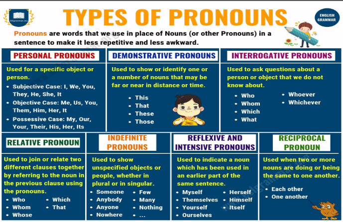
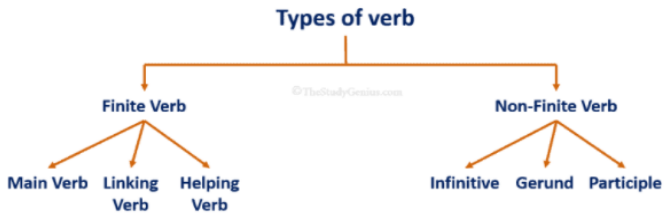

# Parts ot Speeches

## Noun

A noun is a word that names something, such as a person, place, thing, or idea.
In a sentence, nouns can play the role of suject, direct object, subject complement, object complement, appositive, or adjective.

**The way of recognizing a noun is by its:**

- ending.
- position.
- function.

### Noun ending

There are certain world endings that show that a word is noun, for example:

- ity - nationality.
- ment -> applointment.
- ness -> happiness.
- ation -> relation.
- hood -> childhood.

But this is not true of the word endings of all nouns.
For example, the noun "snpoonful" ends in _ful_, but thhe adjective "careful" also ends in _ful_.

### Noun position

We can often recognize a noun by its position in the ssentence.
Nouns often come after a determiner (a determiner is a word like a, an, the, this, my, such):

- a relief.
- an afternoon.
- the doctor.

Nouns often come after oone or more adjectives:

- a great relief.
- a peaceful afternoon.

### Function in a sentence

Nouns have certain functions (jobs) in a sentence, for example:

- subject of verb : Doctor work hard.
- object of verb : He likes coffee.
- subject and object of verb : Teachers teach students.

But the subject or object of sentence is not always a noun.
It could be a pronoun or a phrase.
In the sentence "My doctor works hard", the noun is "doctor" but the subject is "My doctor".

## Types of noun

|                                                                                                                                                                      |                                                                                                                                                                 |
| :------------------------------------------------------------------------------------------------------------------------------------------------------------------: | :-------------------------------------------------------------------------------------------------------------------------------------------------------------: |
|                             **Common noun**, A noun that refers to people or thing in general, e.g. boy, country, bridge, pen, city etc.                             | **Proper noun**, A noun that identifies a particular person, place or things, e.g. Saif, Islamabad, Sunday, in written Proper noun begins with captial letters. |
|                          **Countable noun**, A noun that refers to something that can be counted. e.g. pen, mobile, glass, cup, chair etc.                           |    **Uncountable noun**, A noun that refers to something that cannot be Counted and so they do not regularly have a plural form. e.g. milk, water, air etc.     |
| **Concrete noun**, A noun that refers to people and to things that Exist physically and can seen, touched, smelled heard, or tasted. e.g. coffee, flower, tune, etc. | **Abstract noun**, A noun that refers to ideas, qualities, and condition that connot be seen or touched and Which do not exist physically. e.g. time, love etc. |
|             **Compound noun**, Sometime two or three noun create a new noun that are joined with hypen or seprate e.g. son-in-law, snowfall, mailbox etc             |      **Collective noun**, A noun that refres to group of people or things e.g. audience, family, army, etc. Collective noun can be singular & plural both       |

## Pronoun

Pronouns are the words you substitute for specific nouns when the reader or listener knows which specific noun you're referring to.

You might say "Jennifer was supposed to be here at eight," then follow it with "she's always late; next time I'll tell her to be here a half-hour earlier".

Instead of saying Jennifer's name three times in a row, you substituted she and her and your sentences remained grammatically correct. Pronouns are divided into a range of categories, and we cover them all in our guide to pronouns:

### Types of Pronouns

## Verb

Verbs are wors that describe specific actions, like running, winning, and being amazing.

Not all verbs refer to literal actions, though. Verbs that refer to feelings or states of being, like to live and to be, are known as nonaction verbs. Conversely, the verbs that do refer to literal actions are known as action verbs.

### Types of verb

### Finite verb

A finite verb is a verb that changes its forms according to the tense (present, past, future) of the sentence, the number, and person of the subject. It is the main verb of the sentence or a clause.

Finite verb inclues main verb, linking verb, and helping / auxiliary verb.

Example:

- Alan **went** to school.
- Alex **plays** hockey.
- He **is playing** for india.
- He **is** one of thhe best players. (Here, the verb '**is**' directly refers to the subject itself.)

### Non Finite verb

The verb that is not affected by the person or number of the subjet and the tense of the sentence if called non-finite verb. It acts as a noun, adjective, and adverb.

Non-finite verbs are not actually verbs, the verbs include-infinive, geround, and participle.

Example:

- Rahul went abroad **to play**.
- **Playing** hockey is his only job.
- I have a broken table.
- This chair is **broken**.

### Main Verb

The main verb is the verb that provides information and is used to express action. These are the action verbs that describe the actions of the subject. Main verb tells us about the subject's action means what the subject is doing. These verbs are also called principle verbs or lexical verbs.

Example:

- The sub **shines**.
- Rohan **eats** his diner quickly.
- He **sings** a song.
- Ronny **cooks** food.
- He **ran** across the street.

### Linking Verb

This is a lingking verb which connects the subject to a word of a pharse of the sentence and fives information about the subject.

- **Subject -> Lingking verb -> Subjective compplement**

Some lingkin verbs : is, am, are, was

###
