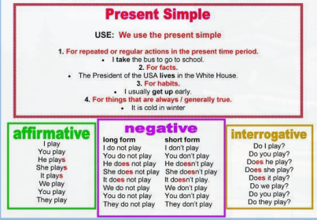
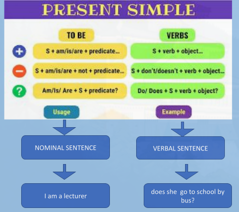
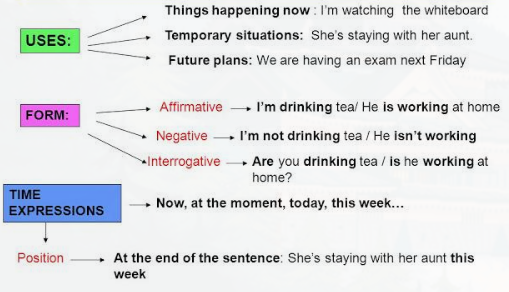
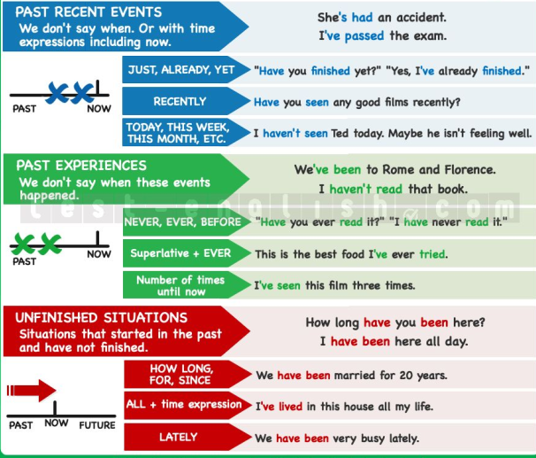

# Daily Activities (Simple present, present continuous & present Perfect tense)

## Present Tense

## Present Continuous

---

**You use Present Continuous for _actions happening at or around the moement of speaking_**

> Hi is looking for a better job.
> Why are you crying?
> Don't distrub her! She is preparing for the exam.

---

**You use Present Continuous for _temporary situations_**.

> We are styling at the Grand Hotel at present. _it's our temporary place for living_
> He is working as a barman during the summer. _it's his temporary job - only is summer_
> I am currently living with my sister. _it's only for some perod of time - temporary_

---

**You use Present Continuous for _fixed arrangements in the near future (definite future plans)_**

_You use Present Continuous for fixed arrangements in the near future, especially with the verbs of movement such as: to come, to fly, to go, to arrive, etc_

> I am meeting my friends tonight. _I have the arrangement to meet with my friends tonight_
> They are flying to Madrid next week. _it's fixed, they have tickets_
> When is she coming back ? _with this question. I want to find out her plans for the near future_

---

**You use Continuous _with the word ALWAYS to express annoying habits._**

_Annoying means something that makes you feel angrey of impatient._

_Annoying habit - something that somebody often does without intending to or withoutrealizing that what he/she is doing can annoy other people_

> She is always lying to her friends. _it's her annoying habit - to lie_
> They are always getting late. _it's their annoying habit - to get late_
> Wiliam is always trying to cheat on the exam. _it's his annoying habit - to cheat_

## Present Perfect

## Julia's daily routine

Hello. I am Julia. I get up early, at 7. I get dressed in the bedroom - my favourite green sweater. I have breakfast in the kitchen, I like orange juice and a sandwich for breakfast. I brush my teeth in the bathroom. My teeth are white! I go to school at 8. At school I have lunch - rice and tomatoes and some chicken or fish. After school I go to the park and play with my friends - Kate and Mary. I have dinner at 7. I eat salad. I go to bed at 8.
