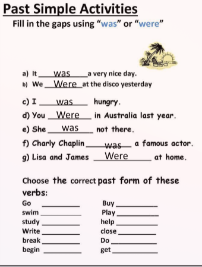
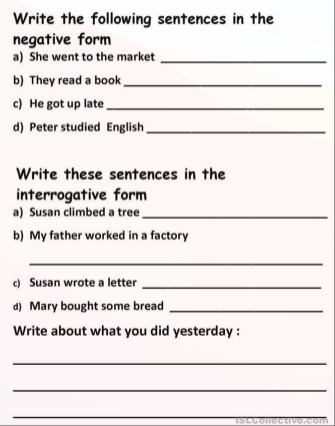

# Last Activities (Past Tense)

## Past Tenses: Structures

- **Past Simple**: **Subject + Verb**-ed (or irregular form)
  - Negative: Subject + did not/didn't Verb(basic form)
  - Interrogative: Did + Subject + Verb (basic form)
- **Past Continuous**: Subject + was/were + Verb-ing
  - Negative: Subject + was/were + not (wasn't/weren't) + Verb-ing
  - Interrogative: Was/Were + Subject + Verb-ing ?
- **Past Perfect Simple**: Subject + had + Verb-ed (or irregular form)
  - Negative: Subject + had + not (hadn't) + Verb-ed (or irregular form)
  - Interrogative: Had + Subject + Verb-ed (or irregular form)

## Simple Past Tense (Subject + V2)

- **We can use it for a series of completed actions in the past.**
  - I visited my grandmother, styped for 1 or 2 hour, chatted with her and went to my home.
  - My bother woke up, washed my face, got dressed and left home.
- **We can use it for completed actions in the past**
  - He went to Paris two days ago.
  - We saw him Last Sunday.
  - I heard a terrible explosion last night.
- **We can use it for single period with time expression**
  - He had a girlfriend for 3 years.
  - My father talked on the phone for 5 minutes.
  - She chose to stay with her mother all day.
- **We can use it for the past if it is used adverbs of frequency**
  - I always did my homework on time when I was a student.
  - My Father often read me tales before I went to bed.
  - When I was a young, I walked 10 miles to workplace everyday.

## Past Continuous Tense

<b>(SUBJECT + BE (WAS/WERE) + Ving)</b>

- **Interrupted actions in the past**
  - <b>Ex:</b> When I arrived, Lisa **was reading** newspaper.
- **Specific time as an interruption**
  - <b>Ex:</b> Last night at 11 o'clock, I **Was sleeping**
- **A series of parallel actions**
  - <b>Ex:</b> When I came to the school, the school bell **Was ringing**, many students **were running** towards the garden, teachers **were going** out from classrooms.
- **Parallel actions**
  - <b>Ex:</b> My family **was eating** the dinner while I **was working**.
- **arragements in the past**
  - <b>Ex:</b> I was upset because I **was leaving** this place that morning.

## Past Perfect Tense

- **It is used for the past action, already finised when another past action happened.**
  - After the film **head started**, we arrived.
- **For the past action that started in the past and continued up to a given time in the past**
  - I **had never seen** him for 5 days.
- **For unreal or imaginary things, wishes in the past**
  - We wish we **hadn't eaten** so much.
- **In reported speech after verbs like said, told, asked, etc.**
  - She said she **had swum**.

## Contoh

> During my last holiday, I made a lot of handcrafts. At that time, I was crazy
> about art and creativity. Many ideas had come to my mind three months before.
> All of the ideas were written on my note book so I could read them again. Also, I
> searched other ideas from internet. Yap, I googled it. I watched tutorial videos
> and read many art blogs.

> My parents helped me to prepare the materials. They also gave me money to buy
> things I needed. On the first day, I painted on some rocks. People call it rock
> art. It was so fun. My siblings joined me on the third day. Then, my siblings and I
> made paper crafts from used newspapers and magazines. Papers were rolled,
> shaped and glued together to create decorative designs. Many beautiful crafts
> were created.

> The last activity was sewing. My mother is a tailor so I learn how to sew from
> her. My mother helped me too. Sewing used clothes and towels was very fun. We
> produced many useful things. Finally, I really enjoyed my last holiday.
