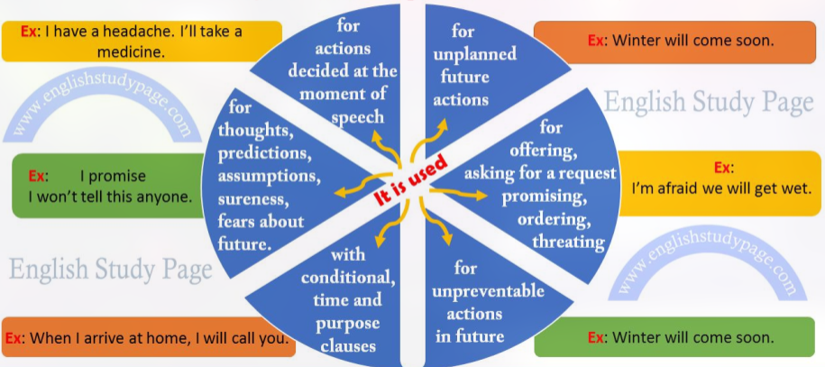
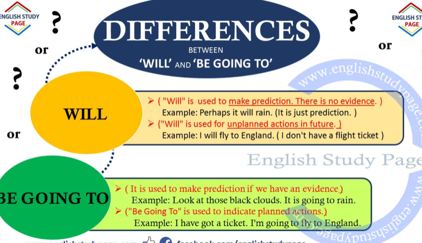
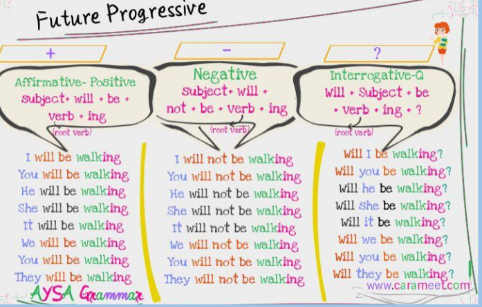
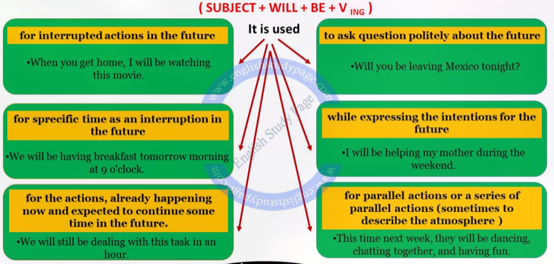
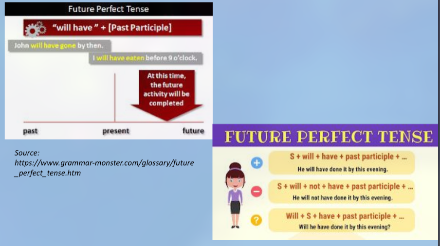

# Future Plan (Simple Future, Future Continuous Tense and Future Perfect Tense)

## Will + [Base Form]

- Past -> "I will dance"
- Future -> "David will be late"
- Simple Future Tense is used to construct sentences about future time (time after now)
- In other words, Future Tense indicates the actions which will occur in the future, "**will**", "**shall", "**be going to\*\*" are auxiliary verbs of simple future tense.
- (The use of shall as an auxiliary verbs has been greatly reduced in recent times. We see it only in formal writings)

**_STRUCTURE_**

- **POSITIVE FORM (+)**: Subject (I, You, He, She, It, We, You, They) + will + v1 (First Form of Verb)
- **NEGATIVE FORM (-)**: Subject (I, You, He, She, It, We, You, They) + will not / won't + v1 (First Form of Verb)
- **QUESTION FORM (?)**: Will + Subject (I, You, He, She, It, We, You, They) + v1 (First Form of Verb)
- **NEGATIVE QUESTION FORM (?)**: Will not / Won't + Subject (I, You, He, She, It, We, You, They) + v1 (First Form of Verb)
- **SHORT ANSWER FORM (+/-)**: YES / NO + Subject (I, You, He, She, It, We, You, They) + will / will not (won't) (First Form of Verb)

## Simple Future Tense

### Will

**USING OF SIMPLE FUTURE TENSE**:

1. Simple Future Tense expresses future (time after now) actions.
   - There is no planning.
   - It is used when talking about the actions that will take place due to future conditions.
   - (uncertaion actions sthat)
   - Examples :
     - We will (We'll) see him.
     - Marry will go out.
     - I will (I'll) stay at home.
2. It is used for the action taht is decided at the moment of speech. (Decisions taken at the moment of speaking)
   - Examples :
     - I'm afraid we're lost.
     - I'll stopp and ask the way.
     - This book is really intersting.
     - Really? I'll read it.
3. It is used for the facts that are related to the future and we can not prevent them.
   - Examples :
     - Winter will come soon.
     - Summer will come again.
     - My son will be 3 next week.
4. Future Tense is used for someone's thoughts, hopes, predictions, assumptions, sureness, fears, about future events.
   - Examples :
     - I think this election will be a very important turning point in the history of the country. (thought)
     - The weather will probably be hot. (prediction).
     - I hope you'll win the prize. (hope)
     - I suppose it'll be easy. (assumption)
     - I'm afraid we will get wet. (fear)
5. Future Tense is used while offering, promising, ordering threating, asking for a request.
   - Examples:
     - A. The subject is very complicated.
     - B. I will helpyou understand it. (offer)
     - I promise I won't tell this anyone. (promise)
     - You will your daughter if you do not leave your gun. (threat)
     - Will you close the window ? (request) - (Will you ? form of the question for request)
6. It is used with conditional, time and purpose clauses.
   - Examples:
     - If you marry me, I will make you happy for a lifetime. (conditional clause)
     - When I arrive at home, I'll call you. (time clause)
     - After he eats something, he'll start to study. (time clause)
     - I'm calling firstly you so that you'll hear it first. (purpose clause)

### Shall

The use of shall as an auxiliary verb has been greatly reduced in recent times. We see it only in formal writings. However, we can use or see "shall" as stated below.

"Shall" is mainly used to make an offer and a suggestion of or ask for advice with subjects "I" and "We" in questions.

Examples:

- Shall I open the window? (offer)
- Shall we go to the theatre tonight ? (suggestion)
- What shall I wear ? (advice)
- What shall I tell her? (advice)

### Be Going To

- **POSITIVE FORM (+)**: Subject + be (am / is / are) + going to + v1 (First Form of Verb)
- **NEGATIVE FORM (-)**: Subject + be (am / is / are) + not + going to + v1 (First Form of Verb)
- **QUESTION FORM (?)**: be (am / is / are) + Subject + going to + v1 (First Form of Verb)
- **SHORT ANSWER FORMS (+/-)** YES / NO + Subject + be (am / is / are) or be (am / is / are) going to + not

1. It is used to make prediction, especially when we can see something is about to happen.
   - Examples:
     - Clark and Lisa are engaged. They are going to marry next month.
     - He is a student. He is studying English at a university. He is going to be a English teacher next year.
     - Mary is pregnant. She's going to have a baby soon.
2. It is used to indicate planned actions.
   - Examples:
     - They have made reservations for their summer holiday. They are going to marry next month.
     - The boss waits reports about incomes every month. So he is going to write a report report the day after tomorrow for this month.

## Future Progressive Tense

- Past -> I will be fishing tomorrow.
- Future -> Ian will be singing later

## Future Continuous Tense

**USING OF FUTURE CONTINUOUS TENSE**

1. **_Future Continuous Tense is used for interrupted actions in the future._**
   - In such sentences, it is not emphasized how long the action has continues.
   - On the other hand, it is emphasized that the action will continue.
   - Examples:
     - When their daughter arrive in London, they will be waiting for her.
     - When you get home, I will be watching this movie.
2. **_It is used for specific time as an interruption in the future._**
   - Specific time interrupts the action
   - Examples :
     - They will be playing tennis at 5 o'clock.
     - We will be having breakfast tomorrow morning at 9 o'clock.
     - I will be talking with him time tomorrow.
3. **_It is used for parallel actions or a series of parallel actions (sometimes to describe the atmosphere)_**
   - Examples:
     - While you are cleaning your room, I will be going shopping.
     - He will be discussing the issue while are watching TV.
4. **_Future Continuous Tense is used with "still" for the actions, which are already happening now and expected to continue some time in the future_**
   - Examples:
     - We will still be dealing with this task in an hour.
     - In 50 years, many animal species will still be disappearing.
5. **_It is used to ask question politely about the future._**
   - Examples:
     - you be leaving Mexico tonight?
     - they be staying at the hotel during their vacation?
     - I be using the machine all day tomorrow?
6. **_It is used while expressing the intentions for the future._**
   - Examples:
     - will be helping my mother during the weekend.
     - After the meal, we will be drinking a coffee.
     - We will be having dinner with you in the evening.

**Differences Between Simple Future Tense and Future Continuous Tense**

- Actually, both tenses show that the action will happen in the future. And the sentences made with them have approximately the same meaning. However, there is a slight difference.
- If we simply want to state that the action will happen in the future, we use simple future tense.
- But, if we want to emphasize that the action will be in progress at some time, we use future continuous tense.

Examples :

- I will stay at the hotel tonight. ( we just want to state what we will do )
- I will be staying at the hotel tonight. ( we want to emphasize the continuation of the action )

**Using of Future Perfect Tense**

1. Future Perfect Tense is used to express an action, which will have finished or completed before a certain( or specific ) time in the future.
   - Examples:
     - You will have graduated from high school by July.
     - By 5 o'clock, I will have finished my work.
     - They will have sent an email until tomorrow.
2. It is used to express an action, which will have finished or completed before another action in the future.
   - Examples:
     - She will have cooked dinner by the time we arrive.
     - I will have seen him before the police comes.
     - By the time Alice reads this, John will have gone to London.
3. It is used to express an action which began before and will continue up until another action in the future.
   - ( Duration in the future with Non-Continuous-Verbs )
   - ( \* It express an action that starts before and continues up to another action or time in the future. In such sentences, It is emphasized that how long the action has continued. )
   - ( \*We use Future Perfect Tense with stative verbs / non-continuous verbs / mixed verbs in such sentences)
   - ( \*"for" is used with time in such sentences )
   - Examples:
     - They will have been in California for 10 years by the time they retired.
     - By the next week, we will have been married for 20 years.
